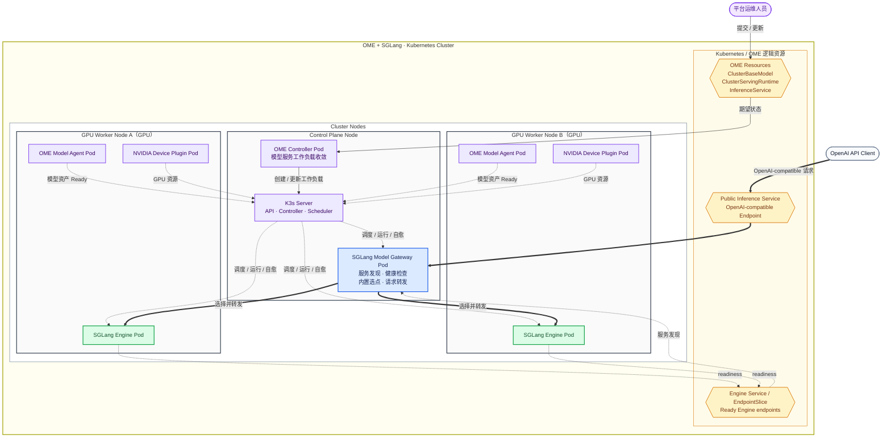

# AlayaJet-MaaS

> **项目目标：向下承接算力基础设施，统一管理多机异构算力；向上提供标准推理接口与用量计量。**

AlayaJet-MaaS 是模型工程与推理服务平台。平台以内置的 Kubernetes 资源管理能力组织多机异构算力，
通过 AlayaJet Inference Engine 将模型资产部署为稳定、可度量、可规模交付的推理服务。

## 逻辑架构总图

总图按逻辑角色划分 Control Plane Node 和多个 GPU Worker Node。OME Controller 维护模型服务期望状态；K3s 负责 Pod 调度、运行和自愈；Worker 上的 Model Agent 与 NVIDIA Device Plugin 分别上报模型资产和GPU 资源；SGLang Model Gateway 发现 Ready Engine，并在内部完成选点和请求转发。具体机器、地址、GPU型号和 Pod 映射见[OME + SGLang-native 集群部署](docs/deployment/sglang_native.md)；平台目标架构见
[系统架构](docs/architecture/overview.md)。

## 平台核心能力

该系统围绕“模型如何变成服务”回答四个问题，这四条关系就是平台的核心能力：

**① 可用算力**：新节点经过运维人员在 Control Plane 核对资源类型、数量和设备身份后，才进入可部署资源视图。NVIDIA DRA Driver 将每张 GPU 的原始型号、显存、UUID 和拓扑发布给 Kubernetes；运维人员可将 `H200_SXM_141GB` 等原始型号关联为 `H200` 等调度别名，Profile 按别名和数量申请资源。节点准入和 Profile 到 Kubernetes 设备申请的转换见[资源发现与调度架构](docs/architecture/resource_discovery_and_scheduling.md)。

**② 部署与可用**：平台运维人员通过 Control Plane 发起模型服务发布操作，Model Service Controller将模型资产、运行 Profile 和副本要求转换为 Kubernetes 期望态；当前 OME + SGLang-native 实现由 OME Controller 创建并维护 Engine、Router 和 Service 等工作负载。Kubernetes 负责调度、运行和自愈AlayaJet Inference Engine Pods，Pod 内资源由 AlayaJet Inference Engine 管理。模型服务从发布请求到Kubernetes 工作负载的转换见[模型服务部署架构](docs/architecture/model_service_deployment.md)。

**③ 推理访问**：当前实现使用 SGLang Model Gateway 提供 OpenAI-compatible 入口、Kubernetes 标签发现、Engine 健康检查、选点和请求转发；目标架构将 KV/Prefix、全局负载、队列和优先级选点抽取为独立 Request Scheduler/EPP，Gateway 获得目标 endpoint 后直接把请求发送给对应的 AlayaJet Inference Engine Pod。当前服务发现链路见[OME + SGLang-native 集群部署](docs/deployment/sglang_native.md#router-与-engine-服务发现)，目标选点机制见[推理请求调度架构](docs/architecture/inference_request_scheduling.md)。

**④ 用量记录**：Gateway 汇总请求身份、实际 Engine、重试、流式交付和 Token 事实，Metering 将一次逻辑请求幂等持久化为最终用量记录，并向上层 MaaS 或业务平台投递用量事件。用量字段、重试合并、流式交付和Ledger 语义见[用量计量架构](docs/architecture/usage_metering.md)。

AlayaJet-MaaS 使用 Kubernetes 管理资源和工作负载。Control Plane、SGLang Model Gateway、Request Scheduler、Metering 和 AlayaJet Inference Engine 等应用工作负载统一运行在 `alayajet-maas`namespace，并使用独立的 Kubernetes 对象分别部署和扩缩。

## 文档

1. [文档总览与阅读顺序](docs/README.md)：文档分层、完整阅读顺序、任务路径和维护规则；
2. [系统架构](docs/architecture/overview.md)：平台组成、Pod 拓扑、状态来源和关键流程；
3. [资源发现与调度架构](docs/architecture/resource_discovery_and_scheduling.md)：节点准入、逐 GPU 发现、DRA 设备申请和资源视图；
4. [模型服务部署架构](docs/architecture/model_service_deployment.md)：Profile、发布请求、实例映射、状态与更新；
5. [推理请求调度架构](docs/architecture/inference_request_scheduling.md)：KV/Prefix-aware、负载均衡、队列和优先级协同；
6. [用量计量架构](docs/architecture/usage_metering.md)：用量形成、重试、流式交付、幂等与投递；
7. [服务契约](docs/contracts/service_contract.md)：标准推理、模型服务管理和用量计量语义；
8. [模型服务评测](docs/evaluation/framework.md)：性能、质量、容量和成本的统一测试方法；
9. [行业实现调研与选型依据](docs/research/maas_implementation_landscape.md)：现有 MaaS 实现、方案对比和演进建议；
10. [OME + SGLang-native 集群部署](docs/deployment/sglang_native.md)：从节点配置、环境准备、K3s 建群、OME 安装到模型发布和服务验收的完整流程；
11. [SGLang-native 集群、模型与请求管理](docs/operations/sglang_native_model_service.md)：机器配置、节点增删、模型发布、扩缩、日志与请求；
12. [集群状态与控制面恢复](docs/operations/cluster_and_model_status.md)：查看 K3s、OME、模型资产、Engine、Router、日志与接口，并执行控制面备份和故障恢复；
13. [第一期计划](docs/planning/phase1.md)：首期范围、技术基线、里程碑和验收门槛。
