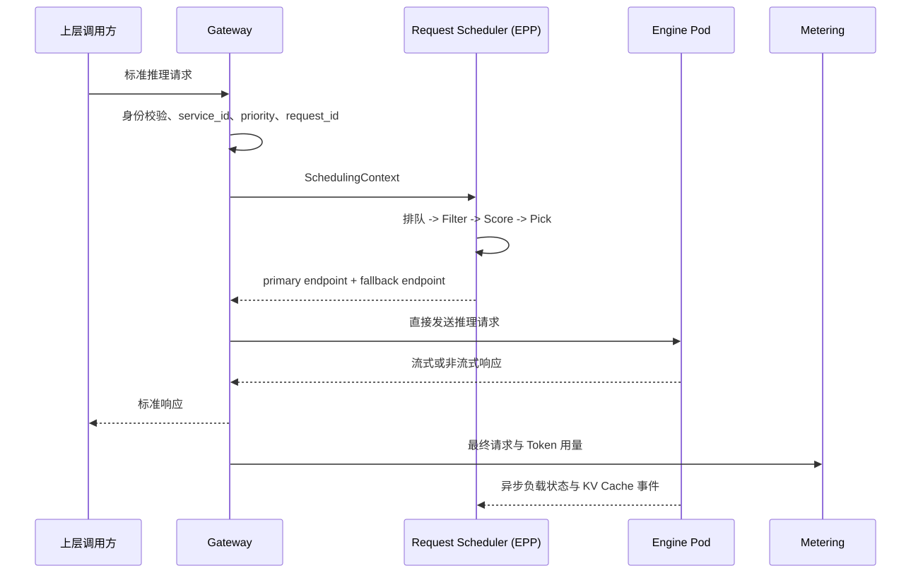

# 推理请求调度架构

## 1. 目标

推理请求调度回答一个问题：

> 一个请求到达 Gateway 后，应当在什么时间发送给哪个 AlayaJet Inference Engine Pod？

该能力属于 AlayaJet-MaaS 的核心在线路径，需要从一开始兼容：

- KV Cache / Prefix-aware 路由；
- Engine 队列、活动请求和 Token 负载感知；
- 请求优先级、公平排队和过载保护；
- readiness、draining、重试和故障回退；
- 后续的延迟预测、prefill/decode 分离和多模型路由。

它不替代 Kubernetes Scheduler。Kubernetes Scheduler 负责把 Engine Pod 放到合适节点；推理请求调度器
负责把一次请求发送给合适的 Engine Pod。

### 1.1 EPP 是什么

Gateway API Inference Extension 将负责智能选点的组件称为 Endpoint Picker（EPP），Gateway 与该组件
之间遵循 Endpoint Picker Protocol。

在 AlayaJet-MaaS 中：

- `Request Scheduler` 是组件名称，负责队列、过滤、评分和 endpoint 选择；
- `EPP` 是 Request Scheduler 对 Gateway 扮演的标准角色和接口；
- 两者对应同一个 `Deployment + Service`，不是两个串联组件；
- EPP 只向 Gateway 返回 primary/fallback endpoint；完整请求和响应流量始终由 Gateway 与 Engine Pod
  直接传输。

因此真实调用关系是：

```text
Gateway -- EPP 选点请求 --> Request Scheduler
Gateway <-- selected endpoint -- Request Scheduler
Gateway -- 推理请求 --> selected Engine Pod
```

## 2. 核心决策

1. 使用 Gateway API Inference Extension 的 `InferencePool` 和 Endpoint Picker Protocol 作为组件边界；
2. Gateway 负责协议、身份、请求上下文、转发、重试和流式连接，不内置具体调度算法；
3. Request Scheduler 以 EPP 兼容服务的形态运行在 Pods 中，执行请求排队和 `Filter -> Score -> Pick`；
4. AlayaJet Inference Engine 提供标准化负载状态和 KV Cache 事件，不把 Runtime 私有指标直接暴露给 Gateway；
5. `InferencePool` 是 Gateway 的主要模型服务后端，普通 Kubernetes Service 只承担内部组件的稳定访问；
6. Request Scheduler 选择具体 endpoint 后，Gateway 直接访问该 Engine Pod，不能再经过会重新选择后端的
   ClusterIP Service；
7. 调度状态是可重建的软状态。Kubernetes readiness 决定实例是否可用，Engine 的实际 KV Cache 和执行队列
   是运行事实，Request Scheduler 只维护用于决策的派生视图。

第一阶段可以基于现有 EPP 实现扩展 AlayaJet 策略，不从零实现 Gateway 数据面或 endpoint 发现协议。

### 2.1 为什么独立于 Gateway 部署

Endpoint 选择可以内置到 Gateway，独立 Request Scheduler 不是协议上的强制要求。AlayaJet-MaaS 默认将其
部署为独立服务，原因是 KV/Prefix 索引、Engine 负载、Pool 级队列和优先级需要在多个 Gateway 副本之间
共享；若内置到每个 Gateway Pod，各副本会形成不同的调度视图，并增加状态同步、策略升级和故障隔离成本。

Gateway 保留不依赖 Request Scheduler 的基础选点能力。Request Scheduler 不可用时，Gateway 仍可从
InferencePool 的 Ready endpoints 中选择实例，但暂时不使用 KV/Prefix、全局负载和优先级策略。

部署边界不改变接口边界：未来若 Gateway 原生支持同等的状态共享和调度策略，可以将 Request Scheduler
内置，而不改变 Engine 状态协议、InferencePool 或上层推理接口。

### 2.2 Gateway 与 Scheduler 的数量关系

Gateway 与 Request Scheduler 没有固定比例，也不是一一对应：

| 组件 | 多副本方式 | 扩缩依据 |
| --- | --- | --- |
| Gateway | 所有副本 active-active | 请求吞吐、并发连接、流式响应带宽和 CPU |
| Request Scheduler | 每个 InferencePool 第一阶段使用 1 active + 1 standby | Pool 数量、调度 QPS、队列规模和高可用要求 |

例如，六个 Gateway Pods 可以共同调用某个 InferencePool 的一组 Scheduler Pods：



同一个 InferencePool 同一时刻只由 active Scheduler 负责选点和排队。Kubernetes Lease 负责主备选举，
只有 active 副本进入 EPP Service 的 Ready endpoints；standby 持续接收可重建的 Engine 状态，active
失效后接管。

因此，增加 Gateway 副本不要求同步增加 Scheduler 副本。未来调度吞吐需要横向扩展时，优先按
InferencePool 分片，让不同 Scheduler 副本负责不同 Pool，而不是让多个副本无协调地调度同一个 Pool。

## 3. 总体架构



Request Scheduler 是独立的在线决策组件，只返回 primary endpoint、可选 fallback endpoint 或拒绝原因。
Gateway 获得 endpoint 后直接访问 Engine Pod，并维护完整的请求和响应流。

## 4. 组件职责

| 组件 | 形态 | 职责 |
| --- | --- | --- |
| Gateway | `Deployment` + `Service` | 解析标准请求，生成可信调度上下文，调用 EPP，访问选定 endpoint，维护流式连接并形成最终用量事实 |
| Request Scheduler | `Deployment` + `Service` | 实现 EPP；负责请求排队、候选过滤、打分、endpoint 选择和回退决策 |
| InferencePool | Kubernetes 资源 | 通过 label 和端口声明基础模型、Engine 配置和加速器类型一致的候选 Pods，并引用 EPP |
| Control Plane / Model Service Controller | `Deployment` + `Service` | 根据 Profile 创建 Engine 工作负载、InferencePool 和路由配置 |
| AlayaJet Inference Engine | GPU Pod | 加载模型、执行推理、维护本地执行队列和 KV Cache，并输出标准化状态 |
| Kubernetes | 集群能力 | Engine Pod 的资源调度、生命周期、readiness 和 endpoint 成员关系 |
| Metering | `Deployment` | 持久化 Gateway 汇总后的最终请求和 Token 用量 |

普通 Kubernetes Service 仍用于 Gateway、Request Scheduler、Controller 等组件的稳定访问。模型推理
主路径由 `InferencePool + Request Scheduler` 选择具体 Engine endpoint；Scheduler 不可用时，Gateway
在 InferencePool 的 Ready endpoints 中做不带 KV/负载策略的基础选择。

## 5. 在线请求流程



流式响应开始后固定在当前 Engine Pod 上完成。只有响应开始前的失败可以使用 fallback endpoint 重试；
重试必须沿用同一个 `request_id`，并在调度上下文中排除已经失败的 endpoint。

## 6. Gateway 与 Request Scheduler 的内部契约

Gateway 向 Request Scheduler 提交的 `SchedulingContext` 至少包含：

| 字段 | 作用 |
| --- | --- |
| `request_id` | 调度、执行、重试和用量的统一关联键 |
| `service_id` | 确定逻辑模型服务，并通过路由解析目标 InferencePool |
| `model_id` / `model_revision` | 防止请求进入错误模型或 revision |
| `priority` | 可信的内部请求优先级 |
| `routing_payload` | Tokenizer Adapter 生成前缀块所需的请求内容，只在调度热路径使用 |
| `input_length` / `max_output_tokens` | 估算请求成本和 Token 负载 |
| `attempt` | 当前执行尝试次数 |
| `excluded_endpoints` | 重试时不得再次选择的实例 |
| `deadline` | 排队与执行允许使用的剩余时间 |

`priority` 由 Gateway 根据可信上层身份和平台策略生成，不接受普通客户端任意提高优先级。

Request Scheduler 返回：

| 字段 | 作用 |
| --- | --- |
| `primary_endpoint` | 本次请求选中的 Engine Pod IP 与端口 |
| `fallback_endpoint` | 响应开始前失败时可使用的备用实例 |
| `queue_wait_ms` | 请求在调度队列中的等待时间 |
| `routing_mode` | `prefix-aware`、`load-aware` 或 `basic-fallback` |
| `decision_id` | 调度决策日志关联键 |
| `reject_reason` / `retry_after_ms` | 无可用容量时的稳定拒绝语义 |

该契约是平台内部接口，不进入对外 Inference API。`routing_payload` 不写入调度决策日志；日志只保存长度、
摘要和派生的 prefix block 标识。

## 7. Engine 状态协议

每个 Engine Pod 输出两类内部状态。

### 7.1 负载状态

| 字段 | 语义 |
| --- | --- |
| `endpoint_id` / `pod_uid` | 实例身份；Pod 重建后必须变化 |
| `model_revision` / `profile_id` | 当前实际加载的模型与运行配置 |
| `state` | `ready`、`draining` 或 `unavailable` |
| `running_requests` | 当前正在执行的请求数 |
| `queue_depth` | Engine 本地等待队列长度 |
| `active_input_tokens` | 当前活动请求的输入 Token 总量 |
| `active_output_tokens` | 当前活动请求的已生成或预算输出 Token |
| `kv_used_blocks` / `kv_total_blocks` | KV Cache 压力 |
| `updated_at` / `sequence` | 判断状态新鲜度与乱序更新 |

这些状态仅用于请求路由。Pod 成员关系、生命周期和 readiness 以 Kubernetes 为准。

### 7.2 KV Cache 事件

Engine 在 KV block 创建、淘汰或整体重置时产生事件：

| 字段 | 语义 |
| --- | --- |
| `endpoint_id` / `pod_uid` | KV block 所属实例 |
| `epoch` | Engine 重启或 KV Cache 重置时递增 |
| `sequence` | 检测丢失和乱序事件 |
| `action` | `add`、`evict` 或 `reset` |
| `block_hashes` | 与 Tokenizer、模型 revision 和 block size 绑定的前缀块标识 |

Engine 的实际 KV Cache 是权威来源；Request Scheduler 中的 KV Index 是可重建索引。索引过期只会降低
命中率，不能影响推理正确性。

## 8. KV Cache / Prefix-aware 路由

精确 Prefix-aware 路由按以下步骤工作：

1. Model Service Profile 固定模型 revision、Tokenizer revision 和 KV block size；
2. Request Scheduler 的 Tokenizer Adapter 使用相同 Tokenizer 将输入转换为 Token IDs；
3. Token IDs 按 block 切分并生成 `prefix_blocks`；
4. Engine 持续发送 KV block 的 `add`、`evict` 和 `reset` 事件；
5. KV Index 维护 `prefix block -> Engine endpoints` 的派生映射；
6. Prefix Scorer 计算每个 endpoint 的已命中前缀长度；
7. Load Scorer 同时计算排队和执行成本，避免为了缓存命中把请求继续压到过载实例。

Tokenizer Adapter 是 Request Scheduler 内部模块，可以进程内加载或作为同 Pod sidecar，不形成对外服务。

Prefix affinity 不是硬粘滞。调度器必须设置 load gate：当命中带来的 prefill 节省小于额外排队成本时，
选择负载更低的实例。

EPP 多副本运行时，每个副本必须获得一致的 KV 事件流，或读取共享 KV Index。不能让各副本只根据自己曾经
调度过的请求维护独立近似索引，否则同一前缀会被分散到不同实例。近似前缀索引可以用于协议联调和降级，
精确事件驱动索引是正式验收路径。

## 9. 调度算法

每次请求执行以下流水线：

```text
候选 endpoints
  -> Filter
  -> Score
  -> Pick primary + fallback
```

### 9.1 Filter

硬过滤至少包括：

- Kubernetes endpoint 为 Ready；
- Engine 状态不是 `draining` 或 `unavailable`；
- `model_revision` 和 `profile_id` 匹配；
- 状态更新时间未超过阈值；
- endpoint 未包含在本次请求的 `excluded_endpoints` 中。

### 9.2 Score

第一版采用可解释的组合评分：

```text
score(endpoint) =
    w_prefix * prefix_hit_ratio
  - w_queue  * normalized_queue_cost
  - w_load   * normalized_active_token_load
  - w_kv     * normalized_kv_pressure
  + jitter
```

- `prefix_hit_ratio`：已缓存前缀块占请求前缀块的比例；
- `queue_cost`：本地等待请求与预计排队时间；
- `active_token_load`：比单纯请求数更接近实际计算负载；
- `kv_pressure`：避免继续压入接近满载且容易淘汰缓存的实例；
- `jitter`：候选分数接近时避免所有调度器同时选择一个 endpoint。

权重属于版本化内部配置。每次决策必须记录各评分分量，避免只记录一个无法解释的总分。

### 9.3 Pick

- 返回一个 primary endpoint；
- 返回一个次优且不同故障域的 fallback endpoint；
- 相同分数使用带随机性的选择，避免惊群；
- 没有候选实例时进入有界队列或返回稳定的过载错误。

## 10. 优先级、队列与公平性

请求优先级必须在三个位置保持一致：

```text
Gateway 生成可信 priority
  -> Request Scheduler 按 priority 排队与选择实例
  -> Engine 本地队列按 priority 调度执行
```

队列分为两层：

| 队列 | 作用 |
| --- | --- |
| Request Scheduler 调度队列 | 在整个 InferencePool 饱和时做准入、优先级和公平控制 |
| Engine 本地队列 | 形成 batching，并按本地资源状态安排实际执行 |

第一版采用少量稳定的内部优先级，不为每个租户创建独立 Kubernetes 对象。高优先级可以获得更大的调度权重
或保留并发，但必须使用 weighted fair queuing 或 aging，保证低优先级请求最终获得执行机会。

优先级不抢占已经开始的流式生成。第一版只影响：

- 是否进入调度队列；
- 在调度队列中的顺序；
- Engine 本地尚未开始执行的请求顺序；
- 过载时优先拒绝哪类请求。

Kubernetes `PriorityClass` 只决定 Pod 调度和抢占，与这里的请求优先级相互独立。

## 11. 故障与降级

| 故障 | 行为 |
| --- | --- |
| EPP 不可用 | Gateway 使用 InferencePool Ready endpoints 做基础选择，标记 `routing_mode=basic-fallback` |
| KV Index 不可用或状态过期 | 退化为 load-aware 路由 |
| Engine 负载状态过期 | Filter 排除该 endpoint，或以最低可信分参与评分 |
| Engine Pod 重建 | 根据新 `pod_uid` / `epoch` 清除旧负载与 KV 状态 |
| primary endpoint 在响应前失败 | 使用 fallback endpoint，并将 primary 加入 `excluded_endpoints` |
| 流式响应中断 | 不在内部切换 Engine；结束当前执行，由上层根据错误语义决定是否重试 |
| 调度队列已满或 deadline 不足 | 返回稳定的过载错误和 `retry_after_ms` |

Controller、Request Scheduler 或 KV Index 的重启不能改变 Kubernetes 中已经运行的 Engine Pods。Request
Scheduler 恢复后从 Kubernetes endpoint、Engine 状态快照和 KV 事件重建派生状态。

## 12. 状态权威来源

| 信息 | 权威来源 |
| --- | --- |
| Engine Pod 成员与 readiness | Kubernetes API / InferencePool |
| Engine 当前执行与队列 | AlayaJet Inference Engine |
| Engine 实际 KV blocks | AlayaJet Inference Engine |
| KV block 分布索引 | Request Scheduler 派生状态 |
| 请求身份、priority 和 deadline | Gateway 生成的 SchedulingContext |
| endpoint 选择结果 | Request Scheduler decision log |
| 最终请求和 Token 用量 | Metering 持久化的最终用量记录 |

Request Scheduler 的派生状态可以从 InferencePool 与 Engine 状态重新构建；Kubernetes API 持续作为
Pod 成员关系和 readiness 的事实源。

## 13. 可观测性

每次调度至少记录：

- `decision_id`、`request_id`、`service_id` 和 priority；
- 候选、过滤后候选和被过滤原因；
- 每个候选的 prefix、queue、load 和 KV pressure 分数；
- primary、fallback、routing mode 和决策耗时；
- 调度排队时间、重试次数和最终 endpoint；
- 预测 prefix hit 与 Engine 实际 cache hit 的差异。

核心指标包括：

- EPP 调度延迟和错误率；
- prefix cache 命中率、命中 Token 和避免的 prefill Token；
- Engine 间队列、活动 Token 和 KV 使用率偏斜；
- 各优先级排队时间、拒绝率和饥饿时间；
- fallback、状态过期和 basic-fallback 比例；
- 路由决策对 TTFT、TPOT 和吞吐的实际收益。

## 14. 实施顺序与验收

### 阶段 A：接口与负载感知

- Gateway 支持 InferencePool 和 Endpoint Picker Protocol；
- Request Scheduler 使用 `Filter -> Score -> Pick`；
- Engine 提供标准化负载状态；
- 实现 queue、active token 和 KV pressure 评分；
- EPP 故障可以退化到基础路由。

### 阶段 B：精确 Prefix-aware

- Profile 固定 Tokenizer revision 和 KV block size；
- Engine 输出带 `epoch + sequence` 的 KV events；
- Request Scheduler 建立可重建 KV Index；
- Prefix Scorer 与 load gate 同时生效；
- EPP 多副本下保持统一 KV 视图。

### 阶段 C：优先级与公平队列

- Gateway 生成可信 priority；
- Request Scheduler 实现有界队列、weighted fairness 和 aging；
- Engine 本地队列保持 priority；
- 建立过载、超时和拒绝语义。

验收至少覆盖：

1. 相同长前缀在负载允许时稳定路由到已有 KV Cache 的实例；
2. 有缓存但严重过载的实例会被 load gate 避开；
3. Engine 重启或 KV reset 后不会继续使用旧索引；
4. 高优先级请求等待时间更短，同时低优先级请求不会永久饥饿；
5. EPP 故障时请求仍可通过基础路由执行；
6. 响应前重试不会再次选择失败 endpoint；
7. 调度、执行、重试和最终用量可以用同一个 `request_id` 解释。

## 15. 公开实现依据

- [Gateway API Inference Extension：InferencePool](https://gateway-api-inference-extension.sigs.k8s.io/api-types/inferencepool/)
- [Gateway API Inference Extension：EPP 实现接口](https://gateway-api-inference-extension.sigs.k8s.io/guides/implementers/)
- [llm-d：Endpoint Picker 架构](https://llm-d.ai/docs/dev/architecture/core/router/epp)
- [llm-d：Request Scheduler](https://llm-d.ai/docs/dev/architecture/core/router/epp/scheduling)
- [llm-d：Prefix-Cache Aware Routing](https://llm-d.ai/docs/architecture/advanced/kv-management/prefix-cache-aware-routing)
