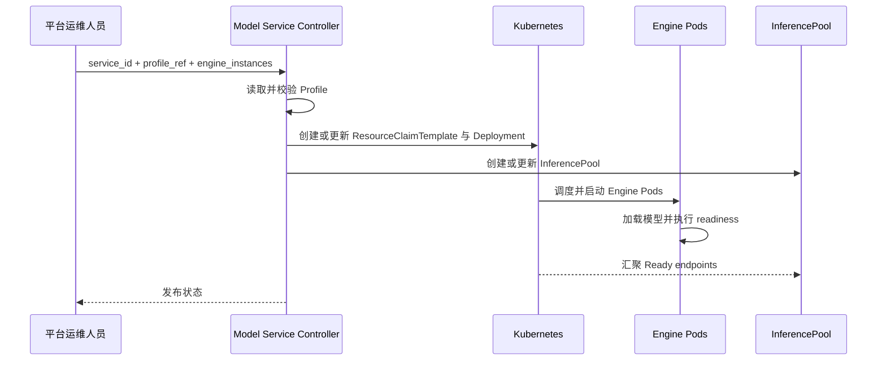
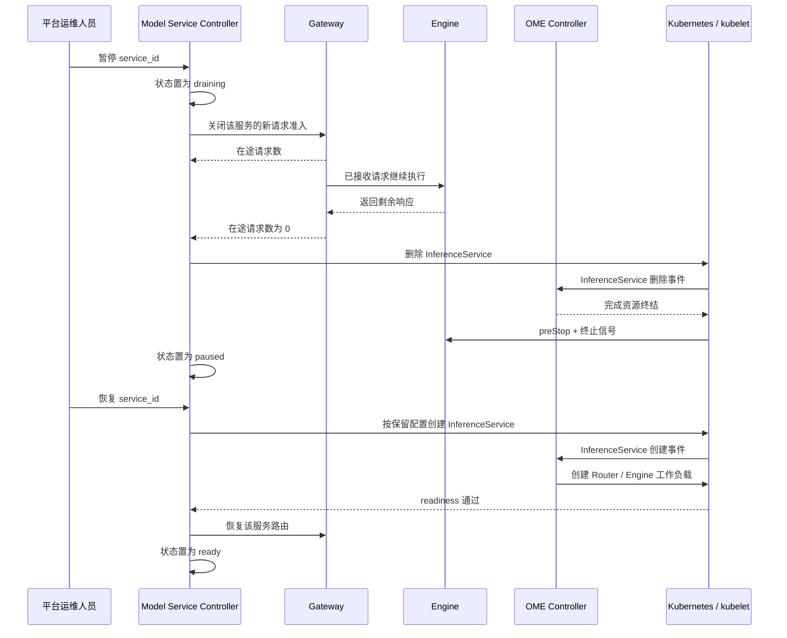

# 模型服务部署架构

## 1. 目标

模型服务部署回答一个问题：

> 一份模型资产和运行配置，如何变成持续可用的 AlayaJet Inference Engine 服务？

该能力对应总体架构中的关系②。输入是平台运维人员的发布请求和版本化 Model Service Profile；输出是
Kubernetes 中持续运行的一组 Engine Pods、对应的 InferencePool 和路由配置。

## 2. 核心决策

1. Model Service Profile 描述一个 Engine 实例应如何运行；
2. 一个 Engine 实例严格对应一个 Engine Pod；
3. 发布请求只指定 `service_id`、`profile_ref` 和 `engine_instances`；
4. Model Service Controller 将发布请求与 Profile 转换为 Kubernetes 的 `Deployment`、
   `ResourceClaimTemplate`、`InferencePool` 和 `Route`；
5. Kubernetes 负责资源调度、Pod 生命周期和故障重建；
6. Engine readiness 通过后才进入 InferencePool 候选 endpoint 集合；
7. Request Scheduler 能够选择到健康 endpoint 时，模型服务进入 `ready`；
8. 模型服务暂停由 Model Service Controller 编排流量排空和工作负载停止；
9. 单个推理请求取消由 Gateway 传播到执行该请求的 Engine。

## 3. 核心概念

| 概念 | 定义 |
| --- | --- |
| 模型服务 | 对外可访问的逻辑服务，以 `service_id` 标识 |
| Model Service Profile | 描述一个 Engine Pod 如何运行的版本化内部配置 |
| 模型服务发布请求 | 运维人员提交给 Controller 的发布操作 |
| Engine 实例 | 一份正在运行的 AlayaJet Inference Engine，等于一个 Engine Pod |
| `engine_instances` | 希望维持的 Engine 实例数量 |
| `Deployment.spec.replicas` | Controller 根据 `engine_instances` 生成的 Pod 期望数量 |
| InferencePool | 基础模型、Engine 配置和加速器类型一致的一组 Engine endpoints |

第一阶段采用严格的一一映射：

```text
engine_instances: N
  -> Deployment.spec.replicas: N
  -> N 个 Engine Pods
  -> N 个 Engine 实例
```

InferencePool 是调度池，不是模型服务本身。Pool 内的 Engine Pods 必须使用相同的基础模型 revision、
Engine 配置和加速器类型，使任一健康 endpoint 都能执行发往该 Pool 的请求，并且 KV/Prefix、负载评分和
故障回退具有一致语义。

第一阶段，一次使用指定 Profile 的模型服务发布创建一个 Engine Deployment 和对应的 InferencePool，
`service_id` 通过路由指向当前生效的 Pool。不同基础模型、模型 revision、Engine 配置或加速器类型使用
不同的 Pool；多个 `service_id` 只有在底层确实共享同一组 Engine endpoints 时才能引用同一个 Pool。

## 4. Model Service Profile

Model Service Profile 描述“指定模型应当以什么配置运行”。它是版本化配置数据，不是 Pod、运行中的服务、
Kubernetes CRD 或对外 API。第一阶段可以使用 YAML 并存放在 Git 或配置库中。

Profile 至少包含：

| 内容 | 示例 |
| --- | --- |
| 模型资产 | model ID、不可变 revision、Tokenizer revision、模型文件地址和内容摘要 |
| Engine 配置 | 镜像、启动参数、精度、并行方式和 KV block 规则 |
| 单实例资源 | GPU 型号与数量、CPU、内存、网络和存储要求 |
| 放置约束 | 指定节点、ServingPool、InstanceClass、节点优先级、可用区和单机 GPU 互联要求 |
| Engine 接口 | 端口、readiness、最大上下文长度和模型加载方式 |

概念示例：

```yaml
profile_id: qwen3-235b-h200-v1
model:
  id: qwen3-235b
  revision: sha256:...
  tokenizer_revision: sha256:...
  source: s3://models/qwen3-235b/
engine:
  image: registry.example.com/alayajet-engine:1.0.0
  precision: fp8
  parallelism:
    tensor: 8
  kv_cache:
    prefix_caching: true
    block_size: 16
resources:
  gpu:
    model: H200
    count: 8
  cpu: "32"
  memory: 256Gi
placement:
  node_names:
    - gpu-node-01
    - gpu-node-02
  serving_pool: premium-h200
  instance_class: h200-sxm-8
  zones:
    - sz-a
  preferred_node_names:
    - gpu-node-01
engine_interface:
  port: 8000
  readiness_path: /health/ready
  max_context_tokens: 32768
```

Profile 的作用域就是一个 Engine 实例，因此 `resources` 直接描述一个 Engine Pod 的资源需求。模型服务
需要运行多少个实例，由发布请求中的 `engine_instances` 控制。

`gpu.model` 是运维维护的调度别名。创建 Profile revision 时，Controller 将别名版本以及解析出的原始
`productName`、架构和显存条件固化到该 revision；后续别名调整不会改变已有 Profile。

`placement.node_names` 是允许部署该 Profile 的节点名单，只填写一个节点名时即固定到该机器；
`serving_pool`、`instance_class` 和 `zones`
进一步约束候选节点，所有硬约束取交集。`preferred_node_names` 表达候选集合内的节点优先级。Controller
将这些字段转换为 required/preferred Node affinity；具体 GPU 仍由 DRA 在最终选定节点内分配。

Profile 只引用模型资产，不保存或管理模型文件本身。Engine Pod 启动时从对象存储或共享存储读取模型，
也可以命中节点缓存，但必须使用 Profile 中的 revision 或内容摘要校验实际加载的模型。节点缓存只是加速
副本，不是模型资产的权威来源。

## 5. 模型服务发布请求

模型服务发布请求由平台运维人员提交给 Model Service Controller：

```yaml
service_id: qwen3-chat
profile_ref: qwen3-235b-h200-v1
engine_instances: 2
```

| 字段 | 含义 |
| --- | --- |
| `service_id` | 要发布的模型服务标识 |
| `profile_ref` | 使用哪套不可变模型运行配置 |
| `engine_instances` | 启动多少个可以独立处理请求的 Engine 实例 |

该请求是 AlayaJet-MaaS 控制面的内部输入，不直接交给 Kubernetes。它不携带 workload、SLO 或 benchmark
结果。

以上面的 Profile 为例，`engine_instances: 2` 表示运行两个 Engine Pods，每个 Pod 使用 8 张 H200，
共申请 16 张 H200。单个请求只会被 Request Scheduler 分配给其中一个 Engine Pod；该 Pod 内的 8 张
GPU 共同完成推理。

```text
InferencePool
  ├─ Engine 实例 A：1 个 Engine Pod，使用 8 张 H200
  └─ Engine 实例 B：1 个 Engine Pod，使用 8 张 H200
```

## 6. Controller 转换

Controller 收到发布请求后：

```text
模型服务发布请求
  + Model Service Profile
  -> Model Service Controller
  -> Deployment + ResourceClaimTemplate + InferencePool + Route
  -> Kubernetes
```

Controller 将别名 `H200` 解析为审核过的原始设备条件，并转换为 DRA `ResourceClaimTemplate`：

```yaml
apiVersion: resource.k8s.io/v1
kind: ResourceClaimTemplate
spec:
  spec:
    devices:
      requests:
        - name: gpu
          exactly:
            deviceClassName: gpu.nvidia.com
            count: 8
            selectors:
              - cel:
                  expression: >-
                    device.attributes['gpu.nvidia.com'].productName in
                      ['H200_SXM_141GB'] &&
                    device.attributes['gpu.nvidia.com'].architecture == 'Hopper' &&
                    device.capacity['gpu.nvidia.com'].memory.isGreaterThan(quantity("140Gi"))
```

Engine Pod 要求节点已经通过审核，并引用该模板：

```yaml
spec:
  nodeSelector:
    alayajet.ai/node-state: active
  resourceClaims:
    - name: engine-gpu
      resourceClaimTemplateName: qwen3-h200-gpu
  containers:
    - name: engine
      image: registry.example.com/alayajet-engine:1.0.0
      resources:
        requests:
          cpu: "32"
          memory: 256Gi
        claims:
          - name: engine-gpu
            request: gpu
```

各字段分工如下：

| Profile 内容 | Kubernetes 字段 |
| --- | --- |
| GPU 型号别名 | 固化的别名版本，以及 `ResourceClaimTemplate` 的原始设备属性 selector |
| GPU 数量 | `ResourceClaimTemplate` 的 `exactly.count` |
| CPU 与内存 | `resources.requests/limits` |
| 节点与拓扑要求 | affinity、taints/tolerations 和 topology 约束 |
| Engine 实例数 | `Deployment.spec.replicas` |
| Engine endpoint 集合 | `InferencePool` selector 与 target port |

GPU 原始属性、运维别名、混装节点、节点准入和 DRA 设备分配见
[资源发现与调度架构](resource_discovery_and_scheduling.md)。

## 7. 发布与可用流程



完整步骤：

1. 运维人员提交模型服务发布请求；
2. Controller 读取并校验模型资产与 Profile；
3. Controller 创建或更新 `ResourceClaimTemplate`、Engine `Deployment`、InferencePool 和 Route；
4. Kubernetes 分配资源并启动 Engine Pods；
5. Engine 加载模型并校验实际模型身份；
6. readiness 通过的 Pod 进入 InferencePool；
7. Request Scheduler 能够选择到健康 endpoint 时，服务进入 `ready`。

## 8. 模型服务状态

| 状态 | 含义 |
| --- | --- |
| `pending` | 正在等待资源、启动或加载模型 |
| `ready` | 存在健康 endpoint，可以接收请求 |
| `degraded` | 部分实例不可用，但仍可提供服务 |
| `draining` | 停止接收新请求，等待在途请求结束 |
| `paused` | 用户期望暂停；路由关闭、运行工作负载已停止，服务配置仍保留 |
| `unavailable` | 当前没有可用服务容量 |

状态由 Controller 根据 Deployment、Pods、readiness、InferencePool endpoints 和发布操作综合形成。
benchmark 结果属于离线选型依据，不进入运行时服务状态判断。

## 9. 暂停、恢复与请求中断

### 9.1 控制边界

模型服务暂停、单请求取消和 Pod 终止属于三个层级：

| 控制动作 | 控制对象 | 执行者 | 结果 |
| --- | --- | --- | --- |
| 暂停模型服务 | `service_id` 对应的完整模型服务 | Model Service Controller | 停止新请求、排空在途请求、停止该服务的 Router 和 Engine 工作负载并释放 GPU |
| 取消单个请求 | `request_id` 对应的一次推理执行 | Gateway + Engine | Gateway 定位目标 Engine 和运行时请求 ID，Engine 从运行队列中中止该请求并释放其运行时资源 |
| 终止 Pod | 一个 Router 或 Engine Pod | Kubernetes kubelet | 执行 `preStop`，向容器主进程发送终止信号，并在宽限期结束后强制结束进程 |

OME Controller 监听 `InferenceService` 等 Kubernetes 资源，并将声明收敛为 Deployment、Service、HPA、
PDB 等工作负载。当前固定版本的 `InferenceService` 没有模型服务级 `pause` 或 `suspend` 字段，Raw
Deployment 的 HPA 最小副本数也会收敛到至少 1。因此，平台将暂停状态保存在模型服务期望态中：

```text
desired_state: running
  -> 创建或保留 OME InferenceService
  -> OME 创建并维护 Router / Engine 工作负载

desired_state: paused
  -> 关闭服务路由并完成排空
  -> 删除 OME InferenceService
  -> Kubernetes 回收其 Router / Engine 工作负载和 GPU
```

模型 revision、Profile、实例数和放置约束保留在模型服务期望态中。恢复时，Controller 使用同一份配置重建
`InferenceService`，等待 Router 和 Engine readiness 通过，再恢复服务路由。`paused` 与
`unavailable` 的区别在于：前者是用户明确要求的稳定期望状态，后者是 `running` 期望下没有可用容量的异常
状态。

OME 的控制入口是 Kubernetes API 事件。OME 改变工作负载期望态后，Deployment Controller 创建或删除
Pod；目标节点 kubelet 负责容器终止过程。容器先执行 `preStop`，随后收到镜像 `STOPSIGNAL`、Pod
`stopSignal` 或默认的 `SIGTERM`；超过 `terminationGracePeriodSeconds` 仍未退出时，kubelet 强制终止。

### 9.2 优雅暂停与恢复



暂停的默认语义是优雅排空：关闭新请求准入后，已经进入 Engine 的请求继续执行。排空设置最大等待时间；
到期后，Controller 对剩余 `request_id` 发起取消，并等待这些请求离开 Gateway 和 Engine 的在途集合。取消
完成后再停止工作负载，避免用删除 Pod 的方式处理中断单个请求。

### 9.3 单个请求取消

Gateway 在请求存续期间保存
`request_id -> service_id -> engine_endpoint -> engine_request_id` 的执行映射。收到取消操作后：

1. Gateway 将该 `request_id` 标记为 `cancelling`，停止向客户端继续交付 Token；
2. Gateway 使用 `engine_request_id` 向当前 Engine 传播取消操作；
3. Engine 从等待队列或运行批次中移除请求，释放该请求占用的 KV Cache 和调度状态；
4. Engine 接受取消操作；请求离开在途集合或上游流结束后，Gateway 将最终状态记录为 `cancelled`；
5. Metering 持久化取消前已经实际生成和交付的 Token 事实。

Pod 终止是服务实例级动作，会同时影响该 Pod 上的全部在途请求。它只用于服务停止或取消超时后的强制
收敛，不作为单个请求取消接口。

当前 SGLang v0.5.2 Engine 已提供 `POST /abort_request`，可按运行时 `rid` 中止一个请求；Gateway 负责维护
平台 `request_id` 到该 `rid` 及 Engine endpoint 的映射，并将平台取消操作转成 Engine 调用。OME 不进入
这条逐请求控制链路。

OME `InferenceService` 类型、控制器删除路径和副本下限见当前固定版本源码：
[InferenceService API](https://github.com/ome-projects/ome/blob/015070c9661c704addf25ce8d0f6e71fba7f7df9/pkg/apis/ome/v1beta1/inference_service.go)、
[InferenceService Controller](https://github.com/ome-projects/ome/blob/015070c9661c704addf25ce8d0f6e71fba7f7df9/pkg/controller/v1beta1/inferenceservice/controller.go)、
[HPA Reconciler](https://github.com/ome-projects/ome/blob/015070c9661c704addf25ce8d0f6e71fba7f7df9/pkg/controller/v1beta1/inferenceservice/reconcilers/hpa/hpa_reconciler.go)。
SGLang Engine 请求中止接口见
[SGLang v0.5.2 `abort_request`](https://github.com/sgl-project/sglang/blob/v0.5.2/python/sglang/srt/entrypoints/http_server.py#L880-L889)。
Pod 终止顺序见
[Kubernetes Pod Lifecycle](https://kubernetes.io/docs/concepts/workloads/pods/pod-lifecycle/#pod-termination)。

## 10. 更新、扩缩与恢复

- **更新**：新的模型 revision 或 Profile 创建新的 Deployment 和 InferencePool，健康后切换路由并下线旧 Pool；
- **扩缩**：Controller 修改 `Deployment.spec.replicas`，InferencePool 自动反映 Ready endpoints；
- **回滚**：Controller 将路由切回前一个健康 InferencePool；
- **故障恢复**：Kubernetes 重建失败 Pod，Controller 重新读取并校验服务期望态；
- **暂停**：先进入 `draining`，排空请求并停止 OME 工作负载，保留模型服务配置后进入 `paused`；
- **恢复**：根据保留配置重建 OME 工作负载，readiness 通过后恢复路由；
- **下线**：完成排空后删除模型服务配置、工作负载和路由。

Controller 不在在线推理数据路径中。Controller Pod 重建期间，已经运行的 Gateway、Request Scheduler 和
Engine Pods 继续处理推理请求。

## 11. Kubernetes 对象

| 工作负载或资源 | Kubernetes 对象 |
| --- | --- |
| Control Plane（包含 Model Service Controller） | `Deployment` + `Service` |
| AlayaJet Inference Engine | `Deployment` |
| 同构 Engine endpoint 调度池 | `InferencePool` |
| 模型服务路由 | `HTTPRoute` 等 Gateway API 资源 |
| Benchmark 与质量验证 | `Job` |

Request Scheduler 的 endpoint 选择、KV/Prefix-aware、队列和优先级见
[推理请求调度架构](inference_request_scheduling.md)。
