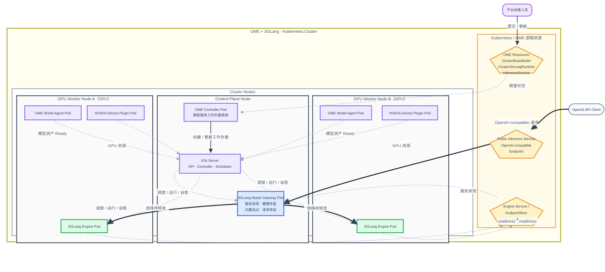

# AlayaJet-MaaS 系统架构

## 1. 架构目标

AlayaJet-MaaS 将多机异构算力转化为模型推理服务。总体架构回答一个核心问题：模型如何变成服务。

具体而言，该架构回答以下四个问题：

**① 集群当前算力如何管理？**

**② 模型如何部署并保持可用？**

**③ 推理请求如何访问模型？**

**④ 服务用量如何准确记录？**

## 2. 总体架构

总图按逻辑角色划分 Control Plane Node 和多个 GPU Worker Node。OME Controller 将模型服务声明收敛为Kubernetes 工作负载；K3s 负责 Pod 调度、运行和自愈；Worker 上的 Model Agent 与 NVIDIA GPU 节点组件分别上报模型资产和 GPU 资源；SGLang Model Gateway 通过 Service/EndpointSlice 发现 Ready Engine，并在内部完成选点和请求转发。具体机器和硬件映射由部署文档维护。

## 3. 组件展开

### 3.1 节点类型

这几类对象分别回答不同问题：

- **逻辑组件**回答“谁负责什么”，例如 SGLang Model Gateway 负责 Engine 发现、选点和请求代理；
- **Deployment**回答“需要维持多少个可互换副本”，Kubernetes 根据 Pod 模板创建并替换指定数量的 Pods；
- **DaemonSet**回答“哪些节点必须运行一个节点级实例”，Kubernetes 在每个符合条件的 Node 上维持一个 Pod；
- **Pod**是实际运行实例，承载组件进程及其一个或多个容器。

`Service` 为匹配的 Pods 提供稳定访问地址，但不创建 Pods。EndpointSlice 记录 Service 当前关联的 Ready Pod endpoints，也不创建 Pods。

| 总图节点 | 类型 | Kubernetes 承载形式 | 与 Pod 的关系 |
| --- | --- | --- | --- |
| Control Plane Node | 物理节点角色 | Kubernetes `Node` | 运行 K3s Server、OME Controller Pods 和 SGLang Model Gateway Pods |
| GPU Worker Node | 物理节点角色 | Kubernetes `Node` | 运行 Model Agent、GPU 资源组件和 SGLang Engine Pods |
| OME Resources | Kubernetes / OME 资源 | `ClusterBaseModel`、`ClusterServingRuntime`、`InferenceService` | 不运行 Pod；由 OME Controller 监听 |
| OME Controller | 逻辑组件 | `Deployment` | 运行于 OME Controller Pods，并创建或维护 Router 与 Engine 工作负载 |
| SGLang Model Gateway | 逻辑组件 | Router `Deployment` + Public Inference `Service` | 运行于多个 Gateway Pods；每个 Pod 都包含内部 Request Scheduler 和完整代理路径 |
| Request Scheduler | Gateway 内部模块 | Gateway Pod 进程内模块 | 不对应独立工作负载或 Pod；从 Ready Engine endpoints 中完成选点 |
| SGLang Engine | 逻辑组件 | Engine `Deployment` | 一个 Engine 实例对应一个 Engine Pod；每个 Ready Pod 形成一个 endpoint |
| OME Model Agent | GPU 节点组件 | `DaemonSet` | 每个纳管 GPU Worker Node 运行一个 Agent Pod |
| NVIDIA GPU 节点组件 | GPU 节点组件 | `DaemonSet` | 每个 GPU Worker Node 运行 GFD、DRA Driver 等 GPU 资源 Pods |
| Public Inference Service | Kubernetes 网络资源 | `Service` | 不运行 Pod；将入口请求转发给 Ready Gateway Pods |
| Engine Service / EndpointSlice | Kubernetes 网络资源 | `Service` + `EndpointSlice` | 不运行 Pod；记录 Ready Engine Pod endpoints，供 Gateway 发现 |
| K3s | Kubernetes 集群能力 | Server、Controller、Scheduler、kubelet、containerd | 调度、运行并重建上述工作负载 Pods |

### 3.2 核心概念

| 概念 | 定义 |
| --- | --- |
| 逻辑组件 | 一组稳定的产品职责，可以由一个或多个 Kubernetes Pods 承载 |
| Kubernetes 工作负载 | 声明 Pod 模板、副本数、更新和恢复方式的 `Deployment`、`DaemonSet` 等对象 |
| Pod | Kubernetes 创建和调度的运行实例；Pod 重建后身份与 IP 可以变化 |
| Service | 为一组匹配的 Pods 提供稳定访问地址的 Kubernetes 资源，不拥有或创建 Pods |
| EndpointSlice | 记录 Service 关联的 Ready Pod endpoints 的 Kubernetes 资源 |
| 模型服务 | 对外可访问的逻辑服务，以 `service_id` 标识，并通过 Public Inference Service 访问 Gateway |
| Model Service Profile | 描述一个 Engine 实例应如何运行的版本化内部配置 |
| Engine 实例 | 一份正在运行的 SGLang Engine，当前等于一个 Engine Pod |
| Engine endpoint | 一个 Ready Engine Pod 的可调用 `IP:Port`，代表该 Engine 实例的请求入口 |
| Request Scheduler | SGLang Model Gateway Pod 内部的请求选点模块，根据 Worker 健康、负载和缓存状态选择 Engine endpoint |

## 4. 四条核心关系

### 4.1 关系①：集群当前有多少可用算力

新节点先以待审核状态进入资源清单，由平台运维人员核对 GPU 等资源的类型、数量和逐设备身份。审核通过
后，节点才进入可部署资源视图。NVIDIA DRA Driver 通过 `ResourceSlice` 发布每张 GPU 的原始型号、
显存、UUID 和拓扑；运维人员为原始型号设置调度别名，Profile 按别名和数量申请资源。Kubernetes 通过
`ResourceClaim` 共同选择节点与具体设备，Control Plane 基于完整资源视图判断某个 Profile 当前是否
可部署。节点准入、逐 GPU 发现、型号别名、混装节点、DRA 设备申请和 Profile 约束转换见
[资源发现与调度架构](resource_discovery_and_scheduling.md)。

### 4.2 关系②：模型如何部署并保持可用

Control Plane 内部的 Model Service Controller 读取发布请求和 Model Service Profile，创建或更新 OME
Resources；OME Controller 将声明收敛为 Router 与 Engine 工作负载；Kubernetes 负责创建、调度和重建
Pods。Engine readiness 通过后进入 Engine Service/EndpointSlice，SGLang Model Gateway 发现至少一个
Ready Engine endpoint 后，模型服务可以接收请求。暂停时，Controller 先通过 Gateway 关闭新请求准入并
排空在途请求，再停止该服务的 OME 工作负载；恢复时重建工作负载，readiness 通过后重新开放路由。单个
请求取消由 Gateway 传播到执行该请求的 Engine，Pod 进程终止由 Kubernetes kubelet 完成。

Profile、发布请求、Engine 实例、resource request、状态机、暂停、恢复、请求取消和进程终止见
[模型服务部署架构](model_service_deployment.md#9-暂停恢复与请求中断)。

### 4.3 关系③：推理请求如何访问模型

每个 SGLang Model Gateway Pod 都维护自己的 Worker Registry、健康、负载和缓存视图。Pod 内部的 Request
Scheduler 从 Ready Engine endpoints 中选择目标，随后同一个 Gateway Pod 将完整请求转发给对应 Engine
Pod，并维护流式或非流式响应连接。Router 与 Engine 的发现关系见[OME + SGLang-native 集群部署](../deployment/sglang_native.md#router-与-engine-服务发现)。

### 4.4 关系④：服务用量如何准确记录

SGLang Engine 提供每次实际执行的 Token、状态和耗时；SGLang Model Gateway 将重试、故障切换、流式
交付和客户端状态汇总为一个逻辑请求；Metering 将结果持久化，同一用量事件重复提交不会重复记账，并支持
事后修正和重新投递。用量字段、重试、流式中断、重复事件处理、修正和投递见[用量计量架构](usage_metering.md)。

## 5. 事实依据

当缓存、指标、日志和控制面记录不一致时，每类关键状态必须有明确的最终判断依据。平台从该来源查询当前
事实，并据此恢复状态和进行审计；其他副本只用于加速或观测。

| 需要确认的信息 | 最终判断依据 |
| --- | --- |
| Node、GPU、Pod 和工作负载状态 | Kubernetes API |
| Node 是否获准进入可部署资源视图 | Control Plane 节点准入记录，以及其维护的 Node label/taint |
| 模型身份、模型资产引用和内部运行配置 | Model Service Profile |
| 健康 Engine endpoints | Kubernetes readiness 与 Engine Service/EndpointSlice |
| Engine 执行队列与 KV Cache | SGLang Engine |
| Endpoint 选择 | SGLang Model Gateway routing log |
| 最终请求和 Token 用量 | Metering 持久化的最终用量记录 |

## 6. 对外边界

AlayaJet-MaaS 对上层提供：

- 标准 Inference API；
- 面向平台运维人员的模型服务 Management API；
- 模型服务状态与运行容量；
- 请求和 Token 用量事件。

Kubernetes 对象、Pod、Node、内部 endpoint、Runtime 类型、镜像、启动参数、并行拓扑、GPU 选择和调度结果均保留在平台内部。
