# 资源发现与调度架构

## 1. 目标

资源发现与调度回答一个问题：

> 集群当前有哪些经过审核、可用于模型部署的算力，模型需要的设备如何被准确分配？

该能力对应总体架构中的关系①，并为关系②提供调度输入。它区分四类事实：

1. **硬件事实**：每台节点实际安装了哪些 CPU、内存、GPU、网络和存储设备；
2. **节点准入**：运维人员是否核对了设备类型和数量，并批准节点承载模型服务；
3. **可分配资源**：Kubernetes 当前可以为工作负载分配哪些具体设备；
4. **资源占用**：设备已经分配给哪些工作负载，还剩多少可用容量。

第一阶段以 Kubernetes Dynamic Resource Allocation（DRA）和 NVIDIA DRA Driver 为 GPU 分配基线。每张 GPU 都以独立设备进入 Kubernetes 资源视图，因此同一节点可以同时安装 H200、B300 等不同型号。

## 2. 设计动机

### 2.1 资源需求：发现、审核和分配

NVIDIA DRA Driver 通过 NVML 发现每张 GPU，并以 `ResourceSlice` 向 Kubernetes 发布设备 UUID、`productName`、架构、显存和 PCIe 拓扑等原始事实。GPU Feature Discovery（GFD）继续提供 Node 级厂商标签，作为节点审核和运行环境检查的补充证据。

Control Plane 负责节点准入、审核和 GPU 型号别名。平台运维人员在版本化 Model Service Profile 中写目标 GPU 型号别名和数量。Controller 将别名解析为原生设备属性，Kubernetes Scheduler 与 NVIDIA DRA Driver 负责选择并分配具体 GPU。

| 问题 | 负责方 |
| --- | --- |
| 节点上安装了哪些具体 GPU？ | NVIDIA DRA Driver 的 `ResourceSlice`，GFD 与 NVML 检查提供交叉验证 |
| 节点能否投入使用？ | Control Plane 与平台运维人员 |
| 一个 Engine Pod 需要什么 GPU？ | Model Service Profile |
| Pod 最终获得哪些 GPU？ | Kubernetes Scheduler、`ResourceClaim` 与 NVIDIA DRA Driver |

### 2.2 从 `H200 × 4` 到具体 GPU

DRA 不直接识别平台定义的 `H200` 运维别名。对于一个需要四张 H200 的 Engine Pod，平台先把 Profile
中的业务需求转换为 Kubernetes 能执行的设备条件；Kubernetes 再结合设备清单和已有分配选择 Node 与具体
GPU。

| 阶段 | 表达 | 负责方 |
| --- | --- | --- |
| Profile 声明 | `gpu.model: H200`、`gpu.count: 4` | 平台运维人员 |
| 解析型号别名 | `productName` 属于批准清单、架构为 Hopper、单卡显存不少于 `140Gi` | Control Plane |
| 生成设备申请 | `gpu.nvidia.com` DeviceClass、`exactly.count: 4` 和 CEL selectors | Model Service Controller |
| 发布设备清单 | 每张 GPU 的所属 Node、UUID、`productName`、架构和显存 | NVIDIA DRA Driver 的 `ResourceSlice` |
| 完成分配 | Engine Pod 的目标 Node，以及分配给该 Pod 的四个 GPU UUID | Kubernetes Scheduler 与 NVIDIA DRA Driver |

`ResourceSlice` 描述“集群有哪些设备以及设备属于哪个 Node”；`ResourceClaim` 描述“这个 Pod 申请什么
设备，并最终分配到了哪些设备”。

调度时，Kubernetes 同时检查两组条件：

1. Node 是否满足 Profile 生成的节点准入、资源池、机型和拓扑约束；
2. 该 Node 是否有四张尚未分配、且同时满足 H200 原生属性条件的 GPU。

例如，集群当前有以下库存：

```text
gpu-node-01: H200 × 8
gpu-node-02: H200 × 2 + B300 × 6

Engine Pod 需求: H200 × 4
调度结果:       gpu-node-01 + 四个具体 H200 GPU UUID
```

`gpu-node-02` 虽然包含 H200，但只有两张，不能满足单个 Engine Pod 的四卡申请。Scheduler 从可行 Node
及其 `ResourceSlice` 设备中联合确定放置结果，并把具体设备分配写入该 Pod 对应的 `ResourceClaim`；随后
NVIDIA DRA Driver 在目标 Node 上准备设备并将其提供给 Engine 容器。

### 2.3 原生属性与运维别名

NVIDIA DRA Driver 发布的 `productName`、`architecture` 和 `memory` 是不可改写的原始事实。资源视图
在原始值旁显示运维别名，例如：

```text
原始 productName: H200_SXM_141GB
运维别名:          H200
```

型号别名是一条版本化选择规则，可以覆盖多个经过验证的原始产品名称，并同时约束架构和显存。运维人员在
Profile 中只写别名；Controller 创建 Profile revision 时，将别名版本和解析后的原生设备条件一起固化。
后续修改别名只影响新的 Profile revision，不改变已经发布的服务。

### 2.4 新节点先审核再提供算力

Node 注册到 Kubernetes，只能证明集群已经看到该节点。新节点先保持调度隔离，由发现组件采集事实、
运维人员逐卡核对；全部设备通过审核后，节点才进入 AlayaJet-MaaS 可部署资源视图。

## 3. 资源如何进入模型服务

一张物理 GPU 不能被 Profile 直接使用。它需要先被发现和审核，再由 Profile 声明需求，最后由
Kubernetes 分配给具体的 Engine Pod：


这五步是前后依赖的关系：

| 步骤 | 输入 | 处理者 | 产出 |
| --- | --- | --- | --- |
| ① 发现设备 | 节点上的物理 GPU | NVIDIA DRA Driver | 每张 GPU 的 `ResourceSlice`，包含 UUID、原始型号、显存和拓扑 |
| ② 审核资源 | `ResourceSlice`，以及 GFD、NVML 的核对结果 | 平台运维人员与 Control Plane | 获准使用的 Node，以及原始型号到运维别名的版本化映射 |
| ③ 声明需求 | 模型实际运行所需的设备和部署位置 | 平台运维人员 | Profile 中的 GPU 型号、数量、指定节点、InstanceClass、ServingPool 和拓扑约束 |
| ④ 生成申请 | Profile 与其中固化的别名版本 | Model Service Controller | `ResourceClaimTemplate`，以及 Kubernetes 为每个 Engine Pod 生成的 `ResourceClaim` |
| ⑤ 分配设备 | Node 状态、`ResourceSlice` 与 `ResourceClaim` | Kubernetes Scheduler 与 NVIDIA DRA Driver | Engine Pod 所在的 Node、分配到的具体 GPU UUID，以及注入 Pod 的设备 |

上一步的产出是下一步的输入：未经审核的设备不会进入可部署资源视图；Profile 表达业务可理解的设备需求
和放置约束；Controller 将其转换为 Kubernetes 能执行的设备条件、Node affinity 和拓扑条件；Kubernetes
再根据实时资源状态完成分配。

### 3.1 责任边界

| 责任 | 负责方 |
| --- | --- |
| 发现 GPU 原始属性、执行设备分配和注入 | NVIDIA DRA Driver |
| 审核新节点、维护 GPU 型号别名 | 平台运维人员与 Control Plane |
| 声明一个 Engine 实例需要的 GPU 型号、数量和放置约束 | Model Service Profile |
| 将 Profile 转换为 Kubernetes 设备申请 | Model Service Controller |
| 选择 Node 和具体 GPU，维护分配结果与 Pod 状态 | Kubernetes |
| 采集利用率、显存、温度和错误等运行指标 | DCGM 与 Prometheus |

Kubernetes API 记录设备、申请、分配和 Pod 放置结果；DCGM 与 Prometheus 只负责运行观测，不参与
资源分配。每个 GPU 节点只使用 NVIDIA DRA 这一套 GPU 分配路径，避免同一设备被重复暴露和分配。

### 3.2 第一期技术基线

以上链路依赖以下部署基线：

| 组件 | 最低版本或要求 |
| --- | --- |
| Kubernetes | `1.34.2`，使用 `resource.k8s.io/v1` |
| NVIDIA GPU Operator | `26.3.3` |
| NVIDIA DRA Driver | `0.4.1` |
| NVIDIA Driver | `580` |
| Container runtime | 启用 CDI |

具体补丁版本由部署时的 NVIDIA 支持矩阵冻结，并作为集群验收项。

## 4. 总体架构



主链路是：

```text
逐 GPU 发现 -> 运维审核 -> Node active
Profile 设备需求/放置约束 -> 设备 selector + Node affinity -> ResourceClaimTemplate -> ResourceClaim
ResourceSlice + ResourceClaim + Node 状态 -> Scheduler -> Engine Pod
```

## 5. 组件职责

| 组件 | 形态 | 核心职责 |
| --- | --- | --- |
| Node Feature Discovery / GFD | GPU Operator 管理的 `DaemonSet` | 提供 Node 级 CPU、GPU 和拓扑标签 |
| NVIDIA DRA Driver | 每个 GPU Node 的 kubelet plugin Pod | 逐设备发布 `ResourceSlice`，准备并注入分配到 Pod 的 GPU |
| `ResourceSlice` | Kubernetes 资源 | 记录每张可分配 GPU 的属性、容量、UUID 和所属 Node |
| `gpu.nvidia.com` | NVIDIA DRA Driver 提供的 `DeviceClass` | 表示完整 NVIDIA GPU 设备 |
| `ResourceClaimTemplate` | Kubernetes namespace 资源 | 描述一个 Engine Pod 需要的 GPU 属性和数量 |
| `ResourceClaim` | Kubernetes namespace 资源 | 记录某个 Pod 的设备请求、分配结果和生命周期 |
| GPU Model Alias | Control Plane 版本化配置 | 将运维可读型号映射为原生 GPU 属性条件 |
| Resource Management API | Control Plane Pod 中的模块 | 管理节点准入、人工审核、型号别名和审计 |
| Model Service Controller | Control Plane Pod 中的 controller | 解析型号别名并将 Profile 转换为工作负载和 `ResourceClaimTemplate` |
| 节点检查任务 | 受 Control Plane 创建的短时 `Job` | 审核时通过 NVML 交叉核对逐卡 UUID、产品和健康状态 |
| DCGM Exporter | GPU Operator 管理的 `DaemonSet` | 输出 GPU 利用率、显存、温度、功耗和错误指标 |

AlayaJet 负责审核节点和声明设备需求，NVIDIA DRA Driver 负责发现、分配和注入设备。

## 6. 节点准入

### 6.1 状态

| 状态 | Kubernetes 表达 | 含义 |
| --- | --- | --- |
| `pending-review` | `alayajet.ai/node-admission=pending:NoSchedule` | 发现组件可以运行，Engine Pod 保持隔离 |
| `active` | 移除准入 taint，设置 `alayajet.ai/node-state=active` | 节点进入可部署资源视图 |
| `disabled` | taint + `alayajet.ai/node-state=disabled` | 节点退出可部署资源视图 |

节点引导程序在 kubelet 首次注册时设置准入 taint：

```yaml
registerWithTaints:
  - key: alayajet.ai/node-admission
    value: pending
    effect: NoSchedule
```

GPU Operator 管理的发现、DRA 和监控组件显式容忍该 taint。Engine Pods 要求
`alayajet.ai/node-state=active`。

### 6.2 审核清单

| 核对项 | 来源 |
| --- | --- |
| Node 身份、CPU、内存、网络和存储 | Kubernetes Node、NFD、CSI 和网络组件 |
| 每张 GPU 的 UUID、`productName`、架构、显存和 PCIe 信息 | NVIDIA DRA Driver 发布的 `ResourceSlice` |
| Node 级 GPU 数量与厂商标签 | GFD labels |
| 逐卡原始产品身份和健康 | 审核时运行的 NVML 检查 Job |
| Driver、Container Toolkit、DRA Driver 和组件版本 | GPU Operator 与 DRA Driver 状态 |
| GPU 运行健康 | NVIDIA DRA Driver 与 DCGM |

审核通过需要满足：

1. `ResourceSlice`、GFD 和 NVML 检查中的 GPU 数量一致；
2. 每张 GPU 都有唯一 UUID，产品、架构、显存和 PCIe 信息可以核对；
3. Driver、CDI 和 DRA Driver 版本满足集群兼容矩阵；
4. GPU 健康状态允许承载工作负载。

同一节点内可以存在不同 GPU 型号。Control Plane 保存逐设备批准清单、原始事实摘要、审批人和审批时间，
然后将 Node 标记为 `active`。

## 7. GPU 型号别名

### 7.1 Kubernetes 原始设备事实

NVIDIA DRA Driver 为每张完整 GPU 发布类似信息：

```yaml
devices:
  - name: gpu-0
    attributes:
      productName:
        string: H200_SXM_141GB
      architecture:
        string: Hopper
      uuid:
        string: GPU-...
      resource.kubernetes.io/pciBusID:
        string: "0000:65:00.0"
    capacity:
      memory:
        value: 141Gi
```

具体 `productName` 和显存值以目标集群的 `ResourceSlice` 为准。该资源由 NVIDIA DRA Driver 管理，
Control Plane 读取并审核，不修改其中的设备属性。

### 7.2 别名定义

运维人员将原始型号关联到一个调度别名：

```yaml
gpu_model_aliases:
  H200:
    product_names:
      - H200_SXM_141GB
    architecture: Hopper
    minimum_memory: 140Gi
```

以上是概念结构。`H200` 可以覆盖多个经过审核、可作为同一类资源使用的原始型号；架构和显存条件防止
名称相似但能力不等价的设备进入同一调度组。资源视图始终同时展示原始 `productName` 和运维别名。

Model Service Profile 同时指定设备需求和放置约束：

```yaml
resources:
  gpu:
    model: H200
    count: 4
  cpu: "32"
  memory: 256Gi
placement:
  node_names:
    - gpu-node-01
    - gpu-node-02
  serving_pool: premium-h200
  instance_class: h200-sxm-8
  zones:
    - sz-a
  preferred_node_names:
    - gpu-node-01
```

Controller 创建 Profile revision 时记录所使用的别名版本，并把当时解析出的 `productName`、架构和
显存条件以及节点、资源池和规格选择结果固化到该 revision。`node_names`、`serving_pool`、
`instance_class` 和 `zones` 是必须同时满足的硬约束；`node_names` 只有一个值时即固定到该机器；
`preferred_node_names` 是满足硬约束后的节点优先级。
后续配置变化时，已有 Profile 和已发布服务保持原有选择语义。

### 7.3 权限与审计

| 权限角色 | 能力 |
| --- | --- |
| `resource-viewer` | 查看原始设备属性、运维别名和版本 |
| `resource-reviewer` | 审核节点，并把发现到的原始型号关联到已有别名 |
| `resource-admin` | 新增、修改、重命名或停用别名及其约束 |

每次变更记录操作者、时间、原因、变更前后内容和版本。修改 `ResourceSlice` 原始事实不属于这些权限；
原始属性继续由 NVIDIA DRA Driver 维护。

## 8. Profile 到 Kubernetes 设备申请

Controller 将别名 `H200` 按 Profile 固化的别名版本解析为原始设备条件，然后转换为：

```yaml
apiVersion: resource.k8s.io/v1
kind: ResourceClaimTemplate
metadata:
  name: qwen3-h200-gpu
spec:
  spec:
    devices:
      requests:
        - name: gpu
          exactly:
            deviceClassName: gpu.nvidia.com
            count: 4
            selectors:
              - cel:
                  expression: >-
                    device.attributes['gpu.nvidia.com'].productName in
                      ['H200_SXM_141GB'] &&
                    device.attributes['gpu.nvidia.com'].architecture == 'Hopper' &&
                    device.capacity['gpu.nvidia.com'].memory.isGreaterThan(quantity("140Gi"))
```

Engine Pod 引用该模板：

```yaml
spec:
  nodeSelector:
    alayajet.ai/node-state: active
  resourceClaims:
    - name: engine-gpu
      resourceClaimTemplateName: qwen3-h200-gpu
  containers:
    - name: engine
      resources:
        requests:
          cpu: "32"
          memory: 256Gi
        claims:
          - name: engine-gpu
            request: gpu
```

| Profile 内容 | Kubernetes 表达 |
| --- | --- |
| GPU 型号别名 | 固化的别名版本，以及 `ResourceClaimTemplate` 中针对原始属性的 CEL selector |
| 单实例 GPU 数量 | `ResourceClaimTemplate` 中的 `exactly.count` |
| CPU 与内存 | Pod `resources.requests/limits` |
| 网络、机架和可用区要求 | topology labels 与 affinity |
| 指定 Node、InstanceClass 和 ServingPool | required Node affinity 与对应 Node labels |
| 优先 Node | preferred Node affinity |
| 存储要求 | StorageClass、PVC、volume 与 volume topology |
| Engine 实例数 | `Deployment.spec.replicas` |

`ResourceClaimTemplate` 为每个 Engine Pod 生成独立 `ResourceClaim`。Controller 根据 Profile 生成
Node allowlist、InstanceClass、ServingPool、可用区和节点优先级；Kubernetes Scheduler 在这些约束内，
根据 Node 状态、`ResourceSlice` 和 Claim 选择节点与具体 GPU。Profile 指定 Node 时仍不直接指定 GPU
UUID，具体设备继续由 DRA 分配。

### 8.1 混装节点示例

假设 `gpu-node-01` 安装四张 H200 和四张 B300：

| Node | 原始 `productName` | 运维别名 | 已审核设备 | 已分配 | 可分配 |
| --- | --- | --- | ---: | ---: | ---: |
| `gpu-node-01` | `H200_SXM_141GB` | `H200` | 4 | 0 | 4 |
| `gpu-node-01` | `B300_SXM_288GB` | `B300` | 4 | 2 | 2 |

Profile 请求 `model: H200, count: 4` 时，Controller 只生成匹配 `H200_SXM_141GB` 的 selector；同一
节点上的 B300 不会进入候选集合。
请求五张 H200 时，该 Node 无法满足 Claim，Pod 保持 Pending。

## 9. 可部署资源视图

可部署资源视图以“Node + 运维别名 + 原始 `productName`”为聚合粒度，同时检查 CPU、内存、GPU、
网络、存储和拓扑：

### 9.1 资源对象

Control Plane 使用三个稳定对象组织可配置、可查询的硬件资源：

| 对象 | 含义 | 示例 |
| --- | --- | --- |
| Node Resource | 一台节点的硬件事实、管理员补充配置、实时分配量和准入状态 | `b300-node-01` |
| InstanceClass | 一种经过验证、可用于模型部署的标准硬件规格 | `b300-sxm6-8` |
| ServingPool | 一组可以共同承载模型服务的节点 | `premium-b300` |

`InstanceClass` 描述单节点稳定能力，例如 GPU 型号与数量、显存、互联、CPU、内存和网络；
`ServingPool` 引用一组 Node Resource，并约束允许进入资源池的 `InstanceClass`。Model Service Profile
选择 `InstanceClass` 或 `ServingPool`，Controller 再将其解析为 Node 约束和 DRA 设备条件。



### 9.2 字段来源与管理员补齐

每个可配置硬件字段都保存发现值、管理员值和最终有效值：

```yaml
gpu:
  model:
    observedValue: null
    configuredValue: B300
    effectiveValue: B300
    source: configured
    status: approved
    updatedBy: resource-admin@example.com
    updatedAt: "2026-08-03T10:00:00Z"
    reason: "旧版驱动未上报 productName，已按 GPU UUID 和采购清单核验"
```

字段按以下规则收敛：

1. 自动发现值存在且已经审核时，`effectiveValue` 使用发现值，`source=observed`；
2. 自动发现值为空或无法归一化时，`resource-admin` 可以填写 `configuredValue`；
3. 管理员值经过审核后成为 `effectiveValue`，`source=configured`，并记录操作者、时间、原因和证据；
4. 后续发现组件恢复并得到相同值时，字段切换为 `source=observed`，管理员值作为历史审计记录保留；
5. 后续发现值与管理员值冲突时，字段标记为 `conflict`，节点回到 `pending-review`，在冲突解决前不参与新调度。

允许管理员补齐的字段包括：

| 类别 | 字段示例 |
| --- | --- |
| GPU | 标准型号、显存等级、GPU 数量、互联类型、设备到型号别名的关联 |
| 网络 | InfiniBand/RoCE 类型、带宽等级、RDMA 能力、网络域 |
| 拓扑 | 机架、可用区、NVSwitch 域、跨节点高速互联组 |
| 主机规格 | `InstanceClass`、CPU 架构、CPU 核数、内存等级、本地盘等级 |
| 业务配置 | `ServingPool`、租户、区域、启用状态和维护状态 |

GPU UUID、Node UID、实时分配量、Pod 绑定结果和健康状态只允许由系统写入。管理员可以补充其业务映射，
不能修改这些运行事实。

管理员补齐的设备属性只有在节点审核通过后才能参与调度。对于同质 GPU 节点，Controller 将审核后的
`InstanceClass` 和 `ServingPool` 同步为 Node label；对于混装 GPU 节点，Controller 依据已审核 GPU UUID
清单生成精确的 DRA selector，避免仅凭人工 Node label 选择错误设备。

### 9.3 Node Resource 查询结构

```json
{
  "nodeName": "b300-node-01",
  "admissionState": "active",
  "schedulable": true,
  "instanceClass": "b300-sxm6-8",
  "servingPools": ["premium-b300"],
  "hardware": {
    "gpu": {
      "model": "B300",
      "count": 8,
      "memoryGiBPerDevice": 288,
      "interconnect": "NVSwitch"
    },
    "cpu": {"architecture": "amd64", "cores": 192},
    "memoryGiB": 2048,
    "network": {"type": "InfiniBand", "bandwidthGbps": 400}
  },
  "allocation": {
    "gpuTotal": 8,
    "gpuAllocated": 4,
    "gpuAvailable": 4
  },
  "fieldSources": {
    "hardware.gpu.model": "observed",
    "hardware.network.bandwidthGbps": "configured"
  }
}
```

列表默认返回最终有效值；详情接口同时返回 `observedValue`、`configuredValue`、证据和变更历史，供审核
与排障使用。

### 9.4 配置与查询 API

| API | 用途 |
| --- | --- |
| `GET /internal/maas/v1/nodes` | 按 GPU 型号、规格、资源池、状态和剩余容量查询节点 |
| `GET /internal/maas/v1/nodes/{node_name}` | 查询节点硬件、字段来源、审核与实时分配详情 |
| `PATCH /internal/maas/v1/nodes/{node_name}` | 补齐允许人工配置的字段，或调整节点业务配置 |
| `GET /internal/maas/v1/instance-classes` | 查询标准硬件规格及当前容量 |
| `GET /internal/maas/v1/serving-pools` | 查询资源池成员、规格约束和剩余容量 |

例如查询所有可部署 B300 节点：

```http
GET /internal/maas/v1/nodes?gpu_model=B300&admission_state=active&has_available_gpu=true
```

管理员补齐未识别的网络带宽：

```http
PATCH /internal/maas/v1/nodes/b300-node-01
Content-Type: application/json
```

```json
{
  "configuredFields": {
    "hardware.network.type": "InfiniBand",
    "hardware.network.bandwidthGbps": 400
  },
  "reason": "按交换机端口和网卡资产记录核验"
}
```

写接口要求 `resource-admin` 权限，并为每次修改生成审计记录。查询接口返回的容量来自 Kubernetes
Node、`ResourceSlice` 和 `ResourceClaim` 的实时聚合，不允许通过配置接口直接修改。

### 9.5 资源视图的数据来源

| 字段 | 权威来源 | 用途 |
| --- | --- | --- |
| Node UID、Ready、Unschedulable、taints | Kubernetes Node | 排除不可调度节点 |
| Node 准入状态和批准记录 | Control Plane 审核记录与 Node label | 排除未审核节点 |
| 每张 GPU 的属性、容量、UUID 和所属 Node | NVIDIA DRA `ResourceSlice` | 逐设备发现与匹配 |
| GPU 型号别名、原始型号关联和版本 | Control Plane 版本化配置 | 供 Profile 使用并生成设备 selector |
| GPU 申请与分配结果 | `ResourceClaim` status | 统计已分配设备并定位工作负载 |
| CPU、内存 capacity/allocatable | Node status | 判断通用资源上限 |
| 网络、机架与可用区标签 | Node labels | 满足网络和拓扑约束 |
| StorageClass、PV/PVC 和 volume topology | Kubernetes Storage API | 满足容量、访问模式和数据位置要求 |
| Pending 原因 | Pod、ResourceClaim conditions 和 events | 解释部署失败 |
| InstanceClass、ServingPool 和管理员补齐字段 | Control Plane 版本化配置 | 形成可交付规格、资源分组和发现缺失字段的有效值 |

展示给运维人员的每个设备至少包含：

```text
Node / Device name / UUID / 原始 productName / 运维别名 / architecture / memory
PCIe root / 健康 / 审核状态 / 分配状态 / 当前工作负载
```

资源视图可以预估某个 Profile 当前可部署多少个 Engine 实例，但最终决定权属于 Kubernetes Scheduler。

## 10. 设备分配流程

以 `H200 × 4` 为例：

1. Controller 创建对应 `ResourceClaimTemplate` 和 Engine Deployment；
2. Kubernetes 为待创建的 Engine Pod 生成 `ResourceClaim`；
3. Controller 根据 Profile 固化的别名版本生成 selector，Claim 只匹配对应原始 H200 型号；
4. Scheduler 从 `active` 节点的 `ResourceSlice` 中寻找四张可共同访问的匹配设备；
5. Scheduler 将具体 Node 和 GPU 分配结果写入 Claim，并绑定 Pod；
6. NVIDIA DRA Driver 准备已分配设备并通过 CDI 注入 Engine 容器；
7. Engine 启动并通过 readiness 后进入 InferencePool。

该流程对同质节点和混装节点完全一致。

## 11. 状态和数据以谁为准

| 信息 | 最终判断依据 |
| --- | --- |
| Node 是否属于集群、是否在线 | Kubernetes Node conditions 与 Lease |
| Node 是否获准部署 Engine | Control Plane 准入记录及其维护的 label/taint |
| GPU 原始属性、容量、UUID 和所属 Node | NVIDIA DRA `ResourceSlice` |
| GPU 型号别名和原始型号关联 | Control Plane 版本化配置 |
| Pod 申请了什么设备 | `ResourceClaim.spec` |
| Pod 获得了哪些具体设备 | `ResourceClaim.status.allocation` |
| Pod 放置结果 | Kubernetes Scheduler 与 Pod spec |
| GPU 实时利用率、显存和温度 | DCGM/Prometheus |
| 模型单实例资源需求 | Model Service Profile |

## 12. 故障与变更处理

| 场景 | 处理 |
| --- | --- |
| 新 Node 未携带准入 taint | Control Plane 恢复 taint；Engine Pod 仍要求 active label |
| `ResourceSlice`、GFD 和 NVML 数量不一致 | 节点保持隔离并返回差异 |
| 某张 GPU 属性无法核对 | 节点保持 `pending-review` |
| 自动发现字段为空 | 管理员提交补充值和核验证据，审核通过后作为有效值 |
| 自动发现值与管理员值冲突 | 字段标记为 `conflict`，节点回到 `pending-review`，解决冲突后重新批准 |
| 原始型号没有关联运维别名 | 节点可以继续审核，但该设备不进入基于别名的可部署容量 |
| Profile 引用不存在或已停用的别名 | Controller 拒绝创建新的 Profile revision |
| active 节点硬件或 UUID 变化 | 添加 taint，cordon、drain 后重新审核 |
| NVIDIA DRA Driver 异常 | 该节点停止产生可用设备并告警 |
| GPU 设备不健康 | 从可分配候选中排除并告警 |
| Node NotReady | Kubernetes 排除新调度，工作负载按 Kubernetes 策略恢复 |
| Profile 型号别名解析出的条件没有匹配设备 | Claim 与 Pod 保持 Pending，并返回设备匹配原因 |
| 匹配型号的设备数量不足 | Claim 与 Pod 保持 Pending，并返回数量不足原因 |
| DCGM 指标中断 | 影响监控和优化，不改写设备分配事实 |

## 13. 验收

第一阶段至少验证：

1. 新节点审核前不能承载 Engine Pod；
2. 运维人员可以核对每张 GPU 的 UUID、原始型号、架构和显存；
3. `resource-reviewer` 可以把 `H200_SXM_141GB` 关联为 `H200`，`resource-admin` 可以维护别名；
4. 别名修改具有版本与审计记录，已有 Profile 的解析结果保持不变；
5. 单个 Node 同时安装 H200 和 B300 时可以通过审核并进入资源视图；
6. H200 Claim 只获得 H200 UUID，B300 Claim 只获得 B300 UUID；
7. 请求数量超过匹配设备数量时 Pod 保持 Pending，且原因可查询；
8. 每个 Engine Pod 获得独立 Claim，实例删除后设备可以再次分配；
9. Node cordon、NotReady 或 GPU 不健康后不承接新的 Engine Pod；
10. Control Plane 重启后可以从 Kubernetes API 重建资源视图；
11. DCGM/Prometheus 不可用时，设备分配仍保持正确。
12. 自动发现字段为空时，管理员可以补齐允许配置的字段，且查询结果显示 `source=configured`；
13. 自动发现恢复且与管理员值一致时切换为 `source=observed`；两者冲突时节点停止承接新调度；
14. 可以按 `InstanceClass`、`ServingPool`、GPU 型号和剩余 GPU 数查询节点；
15. GPU UUID、实时分配量和 Pod 绑定结果不能通过管理员配置接口改写。

## 14. 实施顺序

### 阶段 A：DRA 与节点准入

- 固化 Kubernetes、GPU Operator、NVIDIA Driver、CDI 和 DRA Driver 兼容矩阵；
- 部署 NVIDIA DRA Driver 并验证 `gpu.nvidia.com` 与逐 Node `ResourceSlice`；
- 固化 `pending-review -> active/disabled` 状态和准入 taint；
- 建立 GFD、`ResourceSlice` 与 NVML 交叉核对流程；
- 验证同质节点与混装节点。

### 阶段 B：型号别名、Controller 与 Profile

- 建立原始 `productName` 到运维别名的版本化关联、RBAC 和审计；
- 固化 Profile 的 GPU 型号、数量、指定节点、InstanceClass、ServingPool 和拓扑约束字段；
- Controller 将型号别名解析并固化为 `ResourceClaimTemplate`；
- Engine Pod 使用 `ResourceClaim` 获取设备；
- 建立 Profile 版本、发布、更新和回滚流程。

### 阶段 C：资源视图与验收

- 提供按 Node、运维别名和原始 GPU 属性的容量、分配结果和 Pending 原因；
- 提供 Node Resource、InstanceClass 和 ServingPool 的配置与查询 API；
- 支持管理员补齐未识别字段，并实现字段来源、证据、版本、冲突和审计；
- 完成节点加入、审核、停用、硬件变化和 Control Plane 重启恢复测试；
- 验证 H200/B300 混装节点上的型号精确分配。

## 15. 后续演进

- MIG、time-slicing、MPS 和按显存容量申请；
- GPU、NIC、RDMA 与 PCIe/NVLink 拓扑的联合设备约束；
- 跨节点 Engine 实例和 ComputeDomain；
- 基于利用率、功耗和温度的放置优化；
- 多厂商加速器属性的统一表达。

## 16. 公开实现依据

- [NVIDIA GPU Operator](https://docs.nvidia.com/datacenter/cloud-native/gpu-operator/latest/)：
  管理 NVIDIA Driver、Container Toolkit、NFD/GFD、DCGM 和相关节点组件；
- [NVIDIA GPU Operator：DRA Driver](https://docs.nvidia.com/datacenter/cloud-native/gpu-operator/latest/dra-intro-install.html)：
  给出 DRA GPU allocation 的安装方式、版本要求和与 GPU Operator 的集成边界；
- [NVIDIA DRA Driver](https://dra-driver-nvidia-gpu.sigs.k8s.io/docs/)：
  通过 `gpu.nvidia.com` 管理完整 GPU、MIG 和 VFIO 设备；
- [NVIDIA ResourceSlice attributes](https://dra-driver-nvidia-gpu.sigs.k8s.io/docs/reference/resourceslice-attributes/)：
  逐设备发布 `productName`、架构、显存、UUID 和 PCIe 属性；
- [NVIDIA：Request full GPUs](https://dra-driver-nvidia-gpu.sigs.k8s.io/docs/guides/gpu-allocation/allocating-gpus/)：
  使用 `ResourceClaimTemplate` 和 CEL selector 按产品或容量申请 GPU；
- [Kubernetes Dynamic Resource Allocation](https://kubernetes.io/docs/concepts/scheduling-eviction/dynamic-resource-allocation/)：
  定义 `ResourceSlice`、`DeviceClass`、`ResourceClaimTemplate` 和 `ResourceClaim`；
- [Kubelet Configuration `registerWithTaints`](https://kubernetes.io/docs/reference/config-api/kubelet-config.v1beta1/)：
  kubelet 可以在首次注册 Node 时附带 taint；
- [Kubernetes Taints and Tolerations](https://kubernetes.io/docs/concepts/scheduling-eviction/taint-and-toleration/)：
  `NoSchedule` taint 用于隔离待审核节点。
