# 用量计量架构

## 1. 目标

用量计量回答一个问题：

> 一次推理请求经过路由、重试和流式传输后，如何形成准确、可对账的最终用量事实？

该能力对应总体架构中的关系④。AlayaJet-MaaS 负责生成请求与 Token 用量事实；套餐、单价、折扣、账单和
收款由上层 MaaS 或业务平台负责。

## 2. 核心决策

1. `request_id` 标识一次逻辑推理请求；
2. Engine 提供每次实际执行的 Token 与执行事实；
3. Gateway 掌握请求身份、选定 endpoint、重试、流式交付和客户端中断，负责形成最终逻辑请求结果；
4. Metering 负责幂等持久化、修正、重放和向上投递；
5. 内部 retry/failover 不产生多笔最终用量；
6. 流式请求分别记录生成 Token 与实际交付 Token；
7. 最终用量事实以 Metering 持久化的最终用量记录为准。

最终用量记录不是一个独立服务，而是 Metering 持久化的数据集合。第一阶段可以使用关系型数据库表保存，
并通过 `event_id` 唯一约束避免重复记账。

## 3. 数据流



Engine 不直接向上层发送最终用量，因为它不知道一次逻辑请求是否发生重试、客户端是否中断，以及哪些
输出 Token 已经真正写入客户端连接。

## 4. 组件职责

| 组件 | 职责 |
| --- | --- |
| AlayaJet Inference Engine | 返回每次执行尝试的实际模型、输入 Token、生成 Token、缓存命中和执行状态 |
| Gateway | 将执行尝试、重试、流式交付和客户端状态汇总成一个逻辑请求结果 |
| Metering | 持久化最终用量记录，生成修正记录并向上投递用量事件 |
| 上层 MaaS / 业务平台 | 接收用量事实，执行配额、定价、账单和商业运营 |

## 5. 最小用量字段

| 字段 | 含义 |
| --- | --- |
| `event_id` | 用量事件幂等键 |
| `request_id` | 一次逻辑请求的统一关联键 |
| `service_id` | 实际调用的模型服务 |
| `model_id` / `model_revision` | 实际执行的模型与版本 |
| `started_at` / `completed_at` | 请求执行时间范围 |
| `input_tokens` | 输入 Token |
| `output_tokens_generated` | Engine 已经生成的输出 Token |
| `output_tokens_delivered` | 已写入客户端连接的输出 Token |
| `cached_input_tokens` | 命中缓存的输入 Token（可获得时） |
| `reasoning_tokens` | reasoning Token（可获得时） |
| `attempt_count` | 内部执行尝试次数 |
| `status` / `error_code` | 最终请求结果 |

字段的外部协议、必选性和兼容规则由[服务契约](../contracts/service_contract.md)定义。

## 6. 重试与故障切换

一次执行尝试（attempt）是 Gateway 将一个逻辑请求交给某个 Engine endpoint 后发生的一次实际执行。
发生内部重试或切换 endpoint 时，会产生新的执行尝试，因此一次逻辑请求可以包含多次执行：

```text
request_id: req-123
  ├─ 执行尝试 1 -> Engine A -> 响应前失败
  └─ 执行尝试 2 -> Engine B -> 成功
```

计量规则：

- 两次执行尝试共享同一个 `request_id`；
- Gateway 记录 `attempt_count: 2`；
- Metering 只生成一个最终逻辑请求结果；
- 每次执行的资源消耗可以作为内部成本事实保留；
- 对上层是否计入失败执行，由服务契约和商业策略决定，不由 Engine 自行决定。

响应开始后不再将流式请求切换到另一 Engine Pod。

## 7. 流式请求

流式请求需要区分：

- `output_tokens_generated`：Engine 已经完成计算的 Token；
- `output_tokens_delivered`：Gateway 已经写入客户端连接的 Token。

当客户端中途断开时，两者可能不同。前者用于平台内部资源与成本分析，后者用于交付事实和上层计费策略。

## 8. 幂等、修正与重放

Metering 使用 `event_id` 执行幂等写入，重复投递同一事件不会产生重复用量。

已经持久化的事件不直接覆盖。发生迟到数据或错误修正时，创建引用原始事件的 correction 事件：

```text
原始事件 event-001
  <- correction event-002
```

最终用量记录保存原始事件、修正关系和投递状态。向上投递失败时，Metering 可以从数据库重新投递，不需要
重新执行推理。

## 9. 状态权威来源

| 信息 | 权威来源 |
| --- | --- |
| 每次执行的实际模型与 Token | AlayaJet Inference Engine |
| 请求身份、重试和流式交付 | Gateway |
| 最终逻辑请求用量 | Metering 持久化的最终用量记录 |
| 用量事件投递状态 | Metering |
| 套餐、价格、折扣与账单 | 上层 MaaS / 业务平台 |

## 10. 验收

第一阶段至少验证：

1. 普通成功请求形成一条最终用量；
2. 内部 retry 不会生成重复最终用量；
3. 流式中断可以区分 generated 与 delivered Token；
4. 重复事件写入保持幂等；
5. correction 可以修正原始事件且保留审计链；
6. 上层暂时不可用时，用量事件可以恢复投递；
7. Metering 重启后可以从最终用量记录恢复状态。
