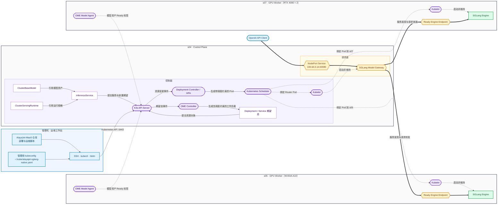
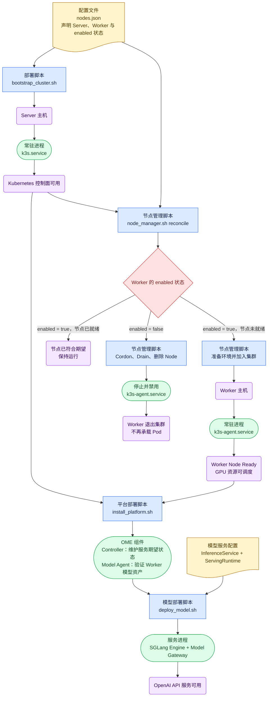

# OME + SGLang-native 集群部署

本文说明如何使用仓库内的配置和脚本，从零部署一套由 OME 管理、SGLang 执行推理的
K3s 集群。集群由一台 Server 主机和一台或多台 GPU Worker 主机构成：

- 管理机保存部署仓库和管理用 kubeconfig，通过 SSH、Helm 和 `kubectl` 管理集群；
- Server 主机运行 K3s Server、OME Controller 和 SGLang Model Gateway；
- Worker 主机运行 K3s Agent、OME Model Agent 和 SGLang Engine；
- OME Controller 维护模型服务期望状态；
- OME Model Agent 验证 Worker 上的本地模型资产；
- SGLang Model Gateway 发现健康 Engine、选择执行节点并代理 OpenAI API 请求。

## 系统架构与部署边界



图中粗实线是推理请求路径，细实线是 OME 声明与控制关系，虚线是 Kubernetes 资源收敛和节点状态
上报。OME Controller 将模型服务的节点选择、亲和性和拓扑分布要求写入工作负载；Kubernetes Scheduler
根据这些约束选择节点并绑定 Pod。K3s API Server 与 Scheduler 不参与推理请求转发。

s05 和 s07 在系统架构中属于同一种 GPU Worker：OME Model Agent 验证本地模型资产，OME 和
Kubernetes 创建并维护 SGLang Engine，Model Gateway 发现两个 Ready Engine Endpoint 并在请求间
进行选点和转发。

运行时只有通过 readiness 检查并进入 Gateway Worker Registry 的 Engine Endpoint 才接收请求。
Worker 被 cordon、Engine 尚未启动或 readiness 失败时，Gateway 不会把请求转发到该节点。

管理机不属于 K3s Node，不承载控制面或推理 Pod。部署流程从管理机执行；
`bootstrap_cluster.sh` 从 s04 的 `/etc/rancher/k3s/k3s.yaml` 读取集群凭据，并将管理副本保存为
管理机上的 `~/.kube/alayajet-sglang-native.yaml`。

### 启动与持续控制职责

管理机负责发起安装、节点加入和配置提交；s04 控制面负责维护 Kubernetes 期望状态和调度 Pod；每台集群
机器上的 systemd、K3s Kubelet 和 containerd 负责在本机真正启动服务与容器。

| 机器 | 初次安装与启动由谁发起 | 本机常驻系统服务 | 当前由集群维护的主要 Pod |
|---|---|---|---|
| 管理机 | 运维人员执行仓库脚本 | 不运行 K3s 服务 | 不承载集群 Pod |
| s04 | 管理机通过 SSH 安装并启用 | `k3s.service` | K3s 系统 Pod、OME Controller、SGLang Model Gateway |
| s05 | 管理机通过 SSH 安装并启用 | `k3s-agent.service` | OME Model Agent、NVIDIA Device Plugin、SGLang Engine |
| s07 | 管理机通过 SSH 安装并启用 | `k3s-agent.service` | OME Model Agent、NVIDIA Device Plugin、SGLang Engine |

完整控制链为：

```text
管理机
  ├─ SSH s04 → 安装并由 systemd 启动 k3s.service
  ├─ SSH s05 → 安装并由 systemd 启动 k3s-agent.service
  ├─ SSH s07 → 安装并由 systemd 启动 k3s-agent.service
  └─ kubectl / Helm → 向 s04 API Server 提交期望状态

s04 K3s Control Plane
  ├─ Controller 创建或更新 Deployment / Pod
  └─ Scheduler 将 Pod 绑定到 s04、s05 或 s07

目标节点
  └─ 本机 Kubelet + containerd 拉取镜像并启动、探测和重启容器
```

`bootstrap_cluster.sh` 从管理机通过 SSH 安装和启动 s04 的 `k3s.service`，随后调用
`node_manager.sh reconcile`，通过 SSH 安装和启动 s05、s07 的 `k3s-agent.service`。节点加入集群后，
s04 不再通过 SSH 启动 Worker 容器，而是通过 API Server、Controller 和 Scheduler 下发 Pod 期望状态，
由目标节点本地执行。

机器重启后，s04 的 `k3s.service` 以及 s05、s07 的 `k3s-agent.service` 由各机器本地 systemd 自动启动；
控制面恢复后，Kubernetes 根据已有 Deployment、DaemonSet 和 InferenceService 继续收敛 Pod。物理机上电由
基础设施或机器管理员负责。

### 节点注册与服务发现

集群使用两条发现链路：节点注册让 s04 认识集群机器，Kubernetes 服务发现让 Router 和 Engine 等工作负载
认识彼此。

#### 节点注册

管理机从 `nodes.json` 读取各节点身份。Worker 安装 K3s Agent 时，使用 s04 的内部 API 地址和 Server
Token 完成首次注册：

```text
管理机 nodes.json
  ├─ s04：name=s04，nodeIP=12.12.12.14
  ├─ s05：name=s05，nodeIP=12.12.12.15
  └─ s07：name=s07，nodeIP=12.12.12.17

s05 / s07 K3s Agent
  └─ K3S_URL=https://12.12.12.14:6443 + K3S_TOKEN
       → s04 API Server
       → 创建或恢复 Kubernetes Node 身份
       → 获取集群证书
```

注册完成后，K3s Agent 使用证书连接 s04，并持续更新 Node 状态和同名 Lease。控制面据此获得节点名称、
内部地址、Ready 状态、标签以及 CPU、内存和 GPU 等可调度资源。s05 和 s07 各自向 s04 注册，控制面中的
Kubernetes Node 与 Lease 构成集群机器的权威成员视图。

```bash
kubectl get nodes -o wide
kubectl -n kube-node-lease get lease
kubectl describe node s05
kubectl describe node s07
```

K3s 使用各节点 `networkInterface` 和 `nodeIP` 建立集群网络。Scheduler 绑定 Pod 后，目标节点 Kubelet
启动容器；Flannel Pod 网络负责跨节点 Pod IP 连通，Kubernetes Service 与 CoreDNS 提供稳定的服务地址和
名称解析。

#### Router 与 Engine 服务发现

OME Controller 根据 `InferenceService` 创建 Router、Engine Deployment 和 Service。Engine Pod 通过
readiness 后进入 Service 对应的 EndpointSlice。当前 Router 同时启用 SGLang Kubernetes service
discovery，使用以下标签选择同一 `InferenceService` 的 Engine：

```text
component=engine
ome.io/inferenceservice=<InferenceService 名称>
```

完整链路为：

```text
InferenceService
  → OME Controller 创建 Engine Deployment / Service
  → Kubernetes Scheduler 将 Engine Pod 绑定到 s05、s07
  → 节点 Kubelet 启动 Engine
  → readiness 通过
  → Service / EndpointSlice 发布 Ready Engine Pod IP
  → SGLang Router 按 namespace 与标签发现 Engine
  → Router 健康检查后将请求转发到可用 Engine
```

从管理机查看节点成员、Pod 位置和实际服务发现结果：

```bash
export MODEL_NAMESPACE=qwen2-5-0-5b-instruct

kubectl get nodes -o wide
kubectl -n kube-node-lease get lease
kubectl -n "$MODEL_NAMESPACE" get pods -o wide
kubectl -n "$MODEL_NAMESPACE" get service,endpointslice -o wide
kubectl -n "$MODEL_NAMESPACE" get deployment \
  -l component=router \
  -o jsonpath='{.items[0].spec.template.spec.containers[0].command}'
echo
```

## 1. 部署流程



- 黄色文档：配置文件；
- 蓝色矩形：一次性执行的脚本；
- 绿色胶囊：部署后持续运行的进程；
- 紫色圆角框：主机或系统状态；
- 红色菱形：节点期望状态判断。

## 2. 软件基线

| 组件 | 固定版本 |
|---|---|
| K3s | `v1.32.9+k3s1` |
| cert-manager | `v1.18.2` |
| NVIDIA Device Plugin | `v0.17.4` |
| OME 源码 | [`015070c`](https://github.com/ome-projects/ome/commit/015070c9661c704addf25ce8d0f6e71fba7f7df9) |
| OME Controller / Model Agent | `v1.2.1` |
| SGLang 源码 | 由 `cluster.runtimeSourcePath` 指向本地仓库；缺失时从 `cluster.runtimeGitUrl` 下载并 checkout `cluster.runtimeGitRef` |
| SGLang Engine 基础镜像 | `docker.io/nvidia/cuda:12.6.1-cudnn-devel-ubuntu22.04` |
| SGLang Router 基础镜像 | `docker.io/ubuntu:22.04` |
| NVIDIA Driver | `>= 560` |
| NVIDIA Container Toolkit | `1.19.1-1` |

SGLang Engine 与 Model Gateway 不再使用预构建应用镜像。管理机先将 SGLang 源码同步到各运行节点，
Engine Pod 使用 CUDA 基础镜像，Router Pod 使用通用 Ubuntu 基础镜像，并挂载源码目录和 venv 沙箱目录，首次启动或源码 revision 变化时在沙箱内
执行 `pip install -e python[all]`，随后从源码启动 Engine 或 Router。部署前需确认 Worker 的
NVIDIA Driver 与基础镜像中的 CUDA 版本兼容。

## 3. 部署前提

管理机和所有集群节点需要满足以下条件：

1. 管理机可以通过 SSH 访问所有节点；
2. 远端用户具有免交互 `sudo` 权限，或由管理员提前完成人工系统准备；
3. 所有节点的集群网卡和内部地址互通；
4. Worker 已安装受支持的 NVIDIA Driver；
5. Worker 有足够的磁盘空间保存模型、基础镜像、SGLang 源码和运行时沙箱；
6. Server API 地址可由管理机访问；
7. 模型服务地址可由调用方访问；
8. 管理机本地存在可编译的 SGLang 源码仓库，路径由 `cluster.runtimeSourcePath` 或
   `SGLANG_SOURCE_PATH` 指定；若该路径不存在，部署脚本会从 `cluster.runtimeGitUrl` 下载源码并 checkout
   `cluster.runtimeGitRef`。

部署脚本会准备 `kubectl`、Helm、K3s 和 NVIDIA Container Toolkit。若驱动安装或升级需要重启，
脚本会等待节点恢复后继续执行。

### 3.1 sudo 的用途

`nodes.json` 中 Server 和 Worker 的 SSH 用户默认需要支持 `sudo -n`。部署脚本使用该权限完成：

- 安装 `curl`、`rsync`、`iproute2`、`gnupg2` 等系统软件；
- 安装或升级 NVIDIA Driver 和 NVIDIA Container Toolkit；
- 写入 `/etc/rancher/k3s/registries.yaml`；
- 安装、启动、停止和禁用 K3s、K3s Agent 或旧 kubelet；
- 读取 K3s kubeconfig 和 Worker 加入集群所需的 Token；
- 创建 `/mnt/data/models` 并设置模型目录所有者；
- 创建 SGLang 源码目录和运行时沙箱目录；
- 驱动安装完成后重启节点。

免交互权限可从管理机验证：

```bash
ssh <user>@<host> 'sudo -n true'
```

如果命令退出码为 0，部署脚本可以自动执行远端系统操作。只有需要输入密码的普通 `sudo` 无法直接
用于自动部署，因为远端命令明确使用 `sudo -n`，不会显示密码提示。

### 3.2 没有免交互 sudo 时的人工准备

没有免交互 `sudo` 时，由机器管理员登录每个节点，使用普通 `sudo` 完成系统层部署。以下变量均从
`nodes.json` 取得：

```bash
K3S_VERSION=<cluster.k3sVersion>
SERVER_NODE_NAME=<cluster.server 对应节点的 name>
SERVER_NODE_IP=<Server 的 nodeIP>
SERVER_INTERFACE=<Server 的 networkInterface>
API_ADDRESS=<cluster.apiAddress>
WORKER_NODE_NAME=<Worker 的 name>
WORKER_NODE_IP=<Worker 的 nodeIP>
WORKER_INTERFACE=<Worker 的 networkInterface>
DEPLOY_USER=<nodes.json 中 ssh 字段的用户>
DEPLOY_GROUP=<该用户的主用户组>
```

#### 所有节点：安装基础软件并准备模型目录

Ubuntu/Debian 节点执行：

```bash
sudo apt-get update
sudo env DEBIAN_FRONTEND=noninteractive apt-get install -y \
  ca-certificates curl gnupg2 iproute2 rsync tar

sudo install -d -o "$DEPLOY_USER" -g "$DEPLOY_GROUP" /mnt/data/models
```

模型目录准备完成后，部署用户可以使用 `rsync` 传输模型，不再需要通过 `sudo` 创建目录。

#### GPU Worker：准备 Driver 和 Container Toolkit

先检查 Driver：

```bash
nvidia-smi
```

如果 Driver 不存在或低于 `nodes.json` 中的 `minimumNvidiaDriverMajor`，在 Ubuntu/Debian 上执行：

```bash
sudo apt-get update
sudo env DEBIAN_FRONTEND=noninteractive apt-get install -y ubuntu-drivers-common
sudo ubuntu-drivers install --gpgpu
sudo systemctl reboot
```

节点恢复后安装 `nodes.json` 固定版本的 NVIDIA Container Toolkit：

```bash
curl -fsSL https://nvidia.github.io/libnvidia-container/gpgkey |
  sudo gpg --dearmor --yes \
    -o /usr/share/keyrings/nvidia-container-toolkit-keyring.gpg

curl -fsSL https://nvidia.github.io/libnvidia-container/stable/deb/nvidia-container-toolkit.list |
  sed 's#deb https://#deb [signed-by=/usr/share/keyrings/nvidia-container-toolkit-keyring.gpg] https://#g' |
  sudo tee /etc/apt/sources.list.d/nvidia-container-toolkit.list >/dev/null

sudo apt-get update
sudo env DEBIAN_FRONTEND=noninteractive apt-get install -y \
  "nvidia-container-toolkit=<cluster.nvidiaContainerToolkitVersion>" \
  "nvidia-container-toolkit-base=<cluster.nvidiaContainerToolkitVersion>" \
  "libnvidia-container-tools=<cluster.nvidiaContainerToolkitVersion>" \
  "libnvidia-container1=<cluster.nvidiaContainerToolkitVersion>"
```

#### Server：安装 K3s Server

先将仓库中的 `deploy/sglang-native/cluster/registries.yaml` 复制到 Server 的临时目录，然后执行：

```bash
sudo install -D -m 0600 \
  /tmp/alayajet-registries.yaml \
  /etc/rancher/k3s/registries.yaml

curl -sfL https://get.k3s.io |
  sudo env INSTALL_K3S_VERSION="$K3S_VERSION" \
  sh -s - server \
    --node-name "$SERVER_NODE_NAME" \
    --node-ip "$SERVER_NODE_IP" \
    --advertise-address "$SERVER_NODE_IP" \
    --flannel-iface "$SERVER_INTERFACE" \
    --disable traefik \
    --disable servicelb \
    --write-kubeconfig-mode 600 \
    --tls-san "$SERVER_NODE_IP" \
    --tls-san "$API_ADDRESS" \
    --node-label alayajet.io/role=control

sudo systemctl enable --now k3s
sudo cat /var/lib/rancher/k3s/server/node-token
```

保存最后一条命令输出的 Token，供 Worker 加入集群。

管理员还需读取 `/etc/rancher/k3s/k3s.yaml`，将其安全传给管理机。管理机保存为
`cluster.kubeconfig` 指定的路径，并将其中的 `https://127.0.0.1:6443` 替换为：

```text
https://<cluster.apiAddress>:6443
```

#### Worker：安装 K3s Agent

将同一份 `registries.yaml` 复制到每台 Worker 的临时目录，然后执行：

```bash
sudo install -D -m 0600 \
  /tmp/alayajet-registries.yaml \
  /etc/rancher/k3s/registries.yaml

sudo systemctl disable --now kubelet 2>/dev/null || true

curl -sfL https://get.k3s.io |
  sudo env \
    INSTALL_K3S_VERSION="$K3S_VERSION" \
    K3S_URL="https://$SERVER_NODE_IP:6443" \
    K3S_TOKEN="<Server 输出的 Token>" \
    sh -s - agent \
      --node-name "$WORKER_NODE_NAME" \
      --node-ip "$WORKER_NODE_IP" \
      --flannel-iface "$WORKER_INTERFACE" \
      --node-label alayajet.io/role=gpu-worker

sudo systemctl enable --now k3s-agent
```

每台 Worker 分别使用自己的 `WORKER_NODE_NAME`、`WORKER_NODE_IP` 和 `WORKER_INTERFACE`。

#### 管理机：继续平台和模型服务部署

先由管理机将完整模型同步到每个 GPU Worker：

```bash
rsync -a /path/to/model/ \
  <worker-user>@<worker-host>:/mnt/data/models/<vendor>/<model>/
```

如果 Model Gateway 需要在 Server 上加载 tokenizer，则只同步配置和 tokenizer 文件：

```bash
rsync -a \
  --exclude='*.safetensors' \
  --exclude='*.bin' \
  --exclude='*.gguf' \
  --exclude='*.pt' \
  --exclude='*.pth' \
  /path/to/model/ \
  <server-user>@<server-host>:/mnt/data/models/<vendor>/<model>/
```

管理员完成模型目录、K3s Server、K3s Agent 和 kubeconfig 准备后，在管理机确认：

```bash
export KUBECONFIG="<cluster.kubeconfig 对应的本机路径>"
kubectl get nodes -o wide
```

所有启用节点均为 `Ready` 后，可以继续执行不需要远端 `sudo` 的 Kubernetes 部署阶段：

```bash
./deploy/sglang-native/scripts/install_platform.sh
./deploy/sglang-native/scripts/deploy_model.sh
./deploy/sglang-native/scripts/verify.sh
```

没有免交互 `sudo` 时，不执行 `prepare_environment.sh`、`preflight.sh`、
`bootstrap_cluster.sh`、`node_manager.sh add/remove`、`stage_runtime_source.sh` 和 `stage_model.sh`；
这些脚本包含 `sudo -n`。对应的系统操作、节点生命周期操作、运行时源码目录、沙箱目录和模型目录准备
需要由管理员手动完成。

## 4. 配置集群

集群唯一配置源是
[`deploy/sglang-native/cluster/nodes.json`](../../deploy/sglang-native/cluster/nodes.json)。
部署前需要确认：

### 4.1 集群配置

| 字段 | 含义 |
|---|---|
| `server` | Server 节点的逻辑名称 |
| `k3sVersion` | 所有节点使用的 K3s 版本 |
| `kubeconfig` | 管理机保存 kubeconfig 的路径 |
| `apiAddress` | 管理机访问 Kubernetes API 的地址 |
| `serviceAddress` | 客户端访问模型服务的地址 |
| `serviceNodePort` | SGLang Model Gateway 对外端口 |
| `minimumDiskGiB` | 节点最小可用磁盘要求 |
| `minimumNvidiaDriverMajor` | Worker 最低 NVIDIA Driver 主版本 |
| `nvidiaContainerToolkitVersion` | NVIDIA Container Toolkit 固定版本 |
| `runtimeSourcePath` | 管理机本地 SGLang 源码仓库路径；可用 `SGLANG_SOURCE_PATH` 临时覆盖 |
| `runtimeGitUrl` | 当 `runtimeSourcePath` 不存在时自动 clone 的 SGLang Git 仓库；可用 `SGLANG_GIT_URL` 临时覆盖 |
| `runtimeGitRef` | 自动 clone 后 checkout 的 branch、tag 或 commit；可用 `SGLANG_GIT_REF` 临时覆盖 |
| `runtimeRepoTarget` | 每台运行节点上的 SGLang 源码目录 |
| `runtimeSandboxTarget` | 每台运行节点上的 venv 沙箱目录 |
| `runtimeBaseImage` | Engine 使用的 CUDA 基础镜像 |
| `runtimeRouterBaseImage` | Router 使用的通用 Linux 基础镜像 |

### 4.2 节点配置

| 字段 | 含义 |
|---|---|
| `name` | Kubernetes 节点名 |
| `enabled` | 节点是否属于集群期望状态 |
| `role` | `server` 或 `worker` |
| `ssh` | 管理机访问节点的 SSH 目标 |
| `hostname` | 远端主机名校验值 |
| `nodeIP` | Kubernetes 节点间通信地址 |
| `networkInterface` | K3s Flannel 使用的网卡 |
| `gpu` | 是否要求节点提供 GPU |
| `modelMode` | `full`、`tokenizer` 或 `none` |
| `modelSource` | 是否可作为模型同步源 |
| `modelSourcePath` | 模型源目录 |
| `labels` | Kubernetes 节点标签 |

Server 节点使用：

```text
alayajet.io/role=control
```

GPU Worker 使用：

```text
alayajet.io/role=gpu-worker
```

#### 4.2.1 节点命名与身份管理

控制面以 `nodes.json` 作为节点身份的唯一声明入口。一个节点由以下四类名称和地址共同描述：

| 配置或状态 | 用途 | 当前示例 |
|---|---|---|
| `nodes[].name` | 稳定的 Kubernetes Node 名；部署时作为 K3s `--node-name` | `s04` |
| `nodes[].hostname` | 目标机器执行 `hostname` 的结果；预检用于防止 SSH 连到错误机器 | `gpu04` |
| `nodes[].ssh` | 管理机登录目标机器的管理网络地址 | `yujun@10.16.71.35` |
| `nodes[].nodeIP` | Kubernetes 节点间通信使用的内部地址；部署时作为 `--node-ip` | `12.12.12.14` |

`cluster.server` 的值必须等于唯一 Server 节点的 `nodes[].name`。`bootstrap_cluster.sh` 将 Server 的
`name` 写入 K3s `--node-name`；`node_manager.sh add` 对 Worker 执行相同操作。K3s 据此创建 Kubernetes
Node，并将 `kubernetes.io/hostname` 设置为同一逻辑名称。当前映射为：

| 机器职责 | Kubernetes Node | `kubernetes.io/hostname` | 系统 hostname | Node IP |
|---|---|---|---|---|
| Control Plane | `s04` | `s04` | `gpu04` | `12.12.12.14` |
| GPU Worker | `s05` | `s05` | `gpu05` | `12.12.12.15` |
| GPU Worker | `s07` | `s07` | `gpu07` | `12.12.12.17` |

命名遵循以下约束：

1. `nodes[].name` 使用小写字母、数字和连字符，集群内唯一，并在机器更换和控制面恢复时保持稳定；
2. `nodes[].hostname` 精确等于远端 `hostname` 输出，可以与 Kubernetes Node 名不同；
3. `nodeIP` 和 `ssh` 地址分别服务于集群网络和管理网络，不参与 Kubernetes Node 命名；
4. Pod 放置策略引用 `kubernetes.io/hostname` 时填写 `nodes[].name`；
5. Worker 更改 Kubernetes Node 名时，按“移除旧节点、更新 `nodes.json`、添加新节点”的节点替换流程执行。

从管理机检查配置唯一性、远端机器身份和集群实际名称：

```bash
python3 deploy/sglang-native/scripts/inventory.py \
  deploy/sglang-native/cluster/nodes.json validate
./deploy/sglang-native/scripts/preflight.sh
kubectl get nodes \
  -o custom-columns='NODE:.metadata.name,HOSTNAME_LABEL:.metadata.labels.kubernetes\.io/hostname,INTERNAL_IP:.status.addresses[?(@.type=="InternalIP")].address,ROLE:.metadata.labels.alayajet\.io/role'
```

### 4.3 Accelerator Pool 节点标签

`alayajet.io/accelerator-pool` 是 AlayaJet-MaaS 定义的 Kubernetes Node label，不是 OME 或
NVIDIA Device Plugin 的内置字段。它表示一组已经通过硬件验收、可以使用相同 Engine 配置的节点。
标签 key 和 pool value 的定义由平台运维维护，期望状态写在 `nodes.json` 的节点 `labels` 数组中。

例如，一台具有 8 张 H200 SXM GPU 且 GPU 互联符合 TP8 要求的节点使用：

```json
{
  "name": "h200-01",
  "labels": [
    "alayajet.io/role=gpu-worker",
    "alayajet.io/accelerator-pool=h200-sxm-8gpu"
  ]
}
```

完整节点记录仍需包含 `enabled`、`role`、`ssh`、`hostname`、`nodeIP`、`networkInterface`、`gpu`、
`modelMode` 和模型源配置等字段。`bootstrap_cluster.sh` 和 `node_manager.sh add` 会把 `labels` 数组转换为
K3s 的 `--node-label` 参数。节点已在集群中时，在修改 `nodes.json` 后同步写入 Kubernetes：

```bash
export GPU_NODE=h200-01

kubectl label node "$GPU_NODE" \
  alayajet.io/role=gpu-worker \
  alayajet.io/accelerator-pool=h200-sxm-8gpu \
  --overwrite
```

写入 accelerator pool 前，在目标机器验证 GPU 型号、数量、显存和互联拓扑：

```bash
nvidia-smi --query-gpu=index,name,uuid,memory.total \
  --format=csv,noheader
nvidia-smi topo -m
```

再从管理机确认 Kubernetes 已上报 8 张可调度 GPU，并检查标签：

```bash
kubectl get node "$GPU_NODE" \
  -o jsonpath='{.status.allocatable.nvidia\.com/gpu}{"\n"}'
kubectl get nodes \
  -L alayajet.io/role,alayajet.io/accelerator-pool
kubectl get nodes \
  -l alayajet.io/accelerator-pool=h200-sxm-8gpu \
  -o wide
```

Pool 标签是硬件验收结果：只有满足该 Pool 的 GPU 型号、单机数量、显存和互联要求的节点才使用相同
label。`nvidia.com/gpu` 负责表达可分配数量，Pool label 负责表达已审核的硬件与拓扑类别。

所有脚本均支持通过 `CONFIG_PATH` 使用另一份集群配置：

```bash
CONFIG_PATH=/path/to/nodes.json \
  ./deploy/sglang-native/scripts/preflight.sh
```

## 5. 配置模型服务

模型、Runtime、Engine、Router 和服务入口定义在
[`deploy/sglang-native/model/qwen2.5-0.5b-instruct.yaml`](../../deploy/sglang-native/model/qwen2.5-0.5b-instruct.yaml)。

发布其他模型时，需要确认：

1. `ClusterBaseModel` 中的模型名称、格式、架构和存储地址；
2. `ClusterServingRuntime` 中的基础镜像、源码挂载、沙箱挂载、启动参数和资源规格；
3. `InferenceService` 中的 Engine 与 Router 副本范围；
4. NodePort 不与集群中的其他服务冲突；
5. Engine 副本数不超过可调度 GPU 数。

### 5.1 OME Controller 与 Scheduler 的放置职责

OME Controller 能够控制 Engine 的节点放置。它将 OME 对象中的放置策略合并到 Engine
`Deployment.spec.template.spec`，Deployment Controller 创建 Pod 后，Kubernetes Scheduler 根据最终
`PodSpec` 过滤、评分并绑定节点。

| 配置位置 | 放置职责 |
|---|---|
| `ClusterBaseModel.spec.storage.nodeSelector` | 指定准备和验证本地模型资产的节点范围 |
| `ClusterServingRuntime.spec.engineConfig.nodeSelector/affinity/tolerations` | 定义该 Runtime 的通用 Engine 候选节点和运行条件 |
| `InferenceService.spec.engine.nodeSelector/affinity` | 定义某个模型服务的节点范围和服务级放置约束 |
| `InferenceService.spec.engine.topologySpreadConstraints` | 定义多个 Engine 副本在主机、机架或可用区之间的分布 |
| `InferenceService.spec.engine.minReplicas/maxReplicas` | 定义需要维持的 Engine 实例数量 |

放置控制链为：

```text
ClusterBaseModel + ClusterServingRuntime + InferenceService
                         │
                         ▼
                  OME Controller
                         │ 生成含调度约束的 Deployment / PodSpec
                         ▼
                Kubernetes Scheduler
                         │ 绑定节点
                         ▼
                    GPU Worker
```

精确指定一个 Kubernetes 节点时，在 `InferenceService` 的 Engine 配置中使用节点主机名：

```yaml
spec:
  engine:
    minReplicas: 1
    maxReplicas: 1
    nodeSelector:
      kubernetes.io/hostname: s05
```

### 5.2 在 s05 和 s07 各运行一个 Engine

s05 和 s07 都带有 `alayajet.io/role=gpu-worker` 标签。两个 Engine 副本使用同一候选节点条件，并通过
`kubernetes.io/hostname` 拓扑域强制分散：

```yaml
spec:
  engine:
    minReplicas: 2
    maxReplicas: 2
    nodeSelector:
      alayajet.io/role: gpu-worker
    labels:
      alayajet.io/model-service: qwen2-5-0-5b-instruct
    topologySpreadConstraints:
      - maxSkew: 1
        minDomains: 2
        topologyKey: kubernetes.io/hostname
        whenUnsatisfiable: DoNotSchedule
        labelSelector:
          matchLabels:
            alayajet.io/model-service: qwen2-5-0-5b-instruct
```

`nodeSelector` 将候选节点限定为 GPU Worker；`topologySpreadConstraints` 要求同一模型服务的两个
Engine Pod 分布在两个不同主机上。任一 Worker 不满足节点、GPU、模型资产或健康状态要求时，不符合约束的
副本保持 `Pending`，已经就绪的 Engine 继续提供服务。

### 5.3 单个 Engine replica 使用同一台机器的 8 张 GPU

一个 Engine replica 对应一个 Engine Pod。Kubernetes Pod 只能绑定一个 Node，因此容器申请
`nvidia.com/gpu: "8"` 时，8 张 GPU 必须全部来自同一台机器，不会跨节点拆分。

Runtime 同时配置 8-GPU 资源申请和 SGLang Tensor Parallel 8：

```yaml
apiVersion: ome.io/v1beta1
kind: ClusterServingRuntime
metadata:
  name: sglang-h200-tp8
spec:
  engineConfig:
    nodeSelector:
      alayajet.io/accelerator-pool: h200-sxm-8gpu
    runtimeClassName: nvidia
    volumes:
      - name: sglang-source
        hostPath:
          path: /mnt/data/repos/SGLang
          type: Directory
      - name: sglang-sandbox
        hostPath:
          path: /mnt/data/sandboxes/sglang-native
          type: DirectoryOrCreate
    runner:
      name: engine
      image: docker.io/pytorch/pytorch:2.7.1-cuda12.6-cudnn9-devel
      command:
        - bash
        - -lc
        - |
          set -euo pipefail
          source_dir=/opt/sglang-source
          venv_dir=/opt/sglang-sandbox/venv
          python3 -m venv "$venv_dir"
          "$venv_dir/bin/python" -m pip install -e "$source_dir/python[all]"
          exec "$venv_dir/bin/python" -m sglang.launch_server \
            --model-path $(MODEL_PATH) \
            --tp-size 8
      resources:
        requests:
          cpu: "64"
          memory: 512Gi
          nvidia.com/gpu: "8"
        limits:
          cpu: "64"
          memory: 512Gi
          nvidia.com/gpu: "8"
      volumeMounts:
        - name: sglang-source
          mountPath: /opt/sglang-source
          readOnly: true
        - name: sglang-sandbox
          mountPath: /opt/sglang-sandbox
```

`InferenceService` 中的副本数表示独立的 8-GPU Engine 数量：

```yaml
spec:
  engine:
    minReplicas: 1
    maxReplicas: 1
    nodeSelector:
      alayajet.io/accelerator-pool: h200-sxm-8gpu
```

对应关系为：

```text
1 replica
  -> 1 Engine Pod
  -> 1 Node
  -> 8 GPU
  -> SGLang TP=8
  -> 1 Ready Engine endpoint
```

两个 replica 表示两个独立 Engine Pod，总需求为 16 张 GPU。要求它们分布在两台 8-GPU 节点时，增加
hostname 拓扑分布约束：

```yaml
spec:
  engine:
    minReplicas: 2
    maxReplicas: 2
    nodeSelector:
      alayajet.io/accelerator-pool: h200-sxm-8gpu
    labels:
      alayajet.io/model-service: example-model-tp8
    topologySpreadConstraints:
      - maxSkew: 1
        minDomains: 2
        topologyKey: kubernetes.io/hostname
        whenUnsatisfiable: DoNotSchedule
        labelSelector:
          matchLabels:
            alayajet.io/model-service: example-model-tp8
```

只有一台节点提供 8 张空闲 GPU 时，第一个副本可以运行，第二个副本保持 `Pending`。检查调度结果：

```bash
export MODEL_NAMESPACE=example-model

kubectl -n "$MODEL_NAMESPACE" get pods -l component=engine -o wide
kubectl -n "$MODEL_NAMESPACE" describe pod -l component=engine
```

### 5.4 本地模型资产就绪

本地模型统一放在：

```text
/mnt/data/models/<vendor>/<model>
```

`ClusterBaseModel` 使用 `local://` 存储时，OME Model Agent 会检查每个 Worker 的模型目录。验证成功后，
它会给节点写入对应模型的 `Ready` 标签；OME Controller 将模型就绪状态作为 Engine 的放置输入，与
Runtime 和 InferenceService 的放置约束一起写入工作负载。

## 6. 执行部署

以下命令均在仓库根目录执行。

### 6.1 准备环境并执行预检

```bash
./deploy/sglang-native/scripts/prepare_environment.sh
./deploy/sglang-native/scripts/preflight.sh
```

预检覆盖：

- SSH 和免交互 `sudo`；
- 节点身份、内部地址和集群网卡；
- CPU、内存和磁盘空间；
- NVIDIA Driver 与容器 Runtime；
- SGLang 本地源码仓库；
- 模型源目录和必要文件。

### 6.2 准备运行时源码

```bash
./deploy/sglang-native/scripts/stage_runtime_source.sh
```

脚本从 `cluster.runtimeSourcePath` 或 `SGLANG_SOURCE_PATH` 读取管理机本地 SGLang 仓库；如果该路径不存在，
会先从 `cluster.runtimeGitUrl` 或 `SGLANG_GIT_URL` clone，并 checkout `cluster.runtimeGitRef` 或
`SGLANG_GIT_REF`。如果路径已经存在但不是可用的 SGLang 源码树，脚本会报错，不会覆盖成员本地目录。

随后脚本经管理机中转同步到：

- Server 节点的 `cluster.runtimeRepoTarget`，供 Model Gateway 使用；
- 每个 `modelMode!=none` 的 Worker 节点，供 SGLang Engine 使用。

脚本还会在每台目标节点创建 `cluster.runtimeSandboxTarget`。Pod 首次启动或源码 revision 变化时，会在该目录中
创建或更新 venv 沙箱，并从挂载的源码执行 `pip install -e python[all]`。

指定同步目标：

```bash
./deploy/sglang-native/scripts/stage_runtime_source.sh <node-name>
```

### 6.3 准备模型

```bash
./deploy/sglang-native/scripts/stage_model.sh
```

脚本从配置的模型源读取文件，经管理机中转：

- 向 `modelMode=full` 的 Worker 同步完整模型；
- 向 `modelMode=tokenizer` 的节点同步配置和 tokenizer；
- 校验模型配置与权重文件存在。

指定同步目标：

```bash
./deploy/sglang-native/scripts/stage_model.sh <worker-name>
```

### 6.4 建立 K3s 集群

```bash
./deploy/sglang-native/scripts/bootstrap_cluster.sh
```

脚本在 Server 上安装并启动 `k3s.service`，生成管理用 kubeconfig，然后根据 `nodes.json` 收敛
Worker：

- `enabled=true` 且尚未就绪：安装并启动 `k3s-agent.service`；
- `enabled=true` 且已经就绪：保持运行；
- `enabled=false` 但仍在集群：安全排空并移除。

完成后，所有启用节点应为 `Ready`。

节点命名规则见[节点命名与身份管理](#421-节点命名与身份管理)；SQLite 数据库、Server Token、离机备份和
s04 故障恢复流程见[控制面备份与故障恢复](../operations/cluster_and_model_status.md#11-控制面备份与故障恢复)。

### 6.5 安装平台组件

```bash
./deploy/sglang-native/scripts/install_platform.sh
```

脚本安装并等待以下组件就绪：

- cert-manager；
- NVIDIA Device Plugin；
- OME CRD；
- OME Controller；
- OME Model Agent。

OME Controller 通过 `alayajet.io/role=control` 运行在 Server；Model Agent 通过
`alayajet.io/role=gpu-worker` 运行在每个 GPU Worker。

### 6.6 发布模型服务

```bash
./deploy/sglang-native/scripts/deploy_model.sh
```

OME Controller 根据模型清单创建并维护：

- SGLang Engine Deployment；
- SGLang Model Gateway Deployment；
- ClusterIP Service；
- NodePort Service；
- HPA；
- PDB。

脚本会使用 `nodes.json` 渲染 Runtime 清单中的基础镜像、源码目录和沙箱目录，把渲染后清单 hash 写入
`InferenceService` 注解以触发 Runtime 模板重调谐，并等待
`InferenceService` 的 `Ready` 条件成立后返回。这里使用脚本内置轮询直接读取
`.status.conditions[?(@.type=="Ready")].status`，避免 OME CRD 已显示 `READY=True` 但
`kubectl wait inferenceservice/...` 仍超时的情况。

## 7. 部署验收

执行一键验证：

```bash
./deploy/sglang-native/scripts/verify.sh
```

验证脚本检查：

1. Server 和所有启用的 Worker 为 `Ready`；
2. `InferenceService READY=True`；
3. Engine Pod 和 Router Pod 为 `Ready`；
4. `/v1/models` 能发现配置的模型；
5. 非流式 Chat Completions 返回成功；
6. 流式 Chat Completions 持续返回 SSE，并以 `data: [DONE]` 结束。

`verify.sh` 对 `InferenceService` 的等待方式与 `deploy_model.sh` 相同：直接读取 Ready condition 的
status 字段；Engine 和 Router Pod 则继续使用 Kubernetes 原生 Pod Ready 等待。

也可以分别检查：

```bash
export KUBECONFIG="$HOME/.kube/alayajet-sglang-native.yaml"

kubectl get nodes -o wide
kubectl -n ome get pods -o wide
kubectl -n <model-namespace> get inferenceservice,pods,services -o wide
```

服务入口为：

```text
http://<serviceAddress>:<serviceNodePort>
```

## 8. Worker 生命周期管理

新增 Worker 时，先在 `nodes.json` 中添加完整配置并设为 `enabled=false`，然后执行：

```bash
./deploy/sglang-native/scripts/node_manager.sh add <worker-name>
```

该命令会将节点设为启用状态、准备环境、加入 K3s、恢复节点标签、等待 GPU 上报，并准备运行时源码和模型。

移除 Worker：

```bash
./deploy/sglang-native/scripts/node_manager.sh remove <worker-name>
```

该命令依次执行 cordon、drain、删除 Kubernetes Node，并停止和禁用远端
`k3s-agent.service`。节点上的模型文件、SGLang 源码和运行时沙箱会保留。

根据配置收敛所有 Worker：

```bash
./deploy/sglang-native/scripts/node_manager.sh reconcile
```

查看节点状态：

```bash
./deploy/sglang-native/scripts/node_manager.sh status
```

## 9. 部署资产

| 路径 | 用途 |
|---|---|
| `deploy/sglang-native/cluster/nodes.json` | 集群参数、节点清单和期望状态 |
| `deploy/sglang-native/cluster/registries.yaml` | K3s 容器镜像源 |
| `deploy/sglang-native/platform/ome-values.yaml` | OME 安装参数 |
| `deploy/sglang-native/platform/nvidia-device-plugin.yaml` | GPU 资源发现 |
| `deploy/sglang-native/model/qwen2.5-0.5b-instruct.yaml` | 模型、Runtime、服务和入口 |
| `deploy/sglang-native/scripts/prepare_environment.sh` | 安装和升级管理机与远端依赖 |
| `deploy/sglang-native/scripts/preflight.sh` | 部署前检查 |
| `deploy/sglang-native/scripts/stage_runtime_source.sh` | SGLang 源码分发与沙箱目录准备 |
| `deploy/sglang-native/scripts/stage_model.sh` | 模型分发与校验 |
| `deploy/sglang-native/scripts/bootstrap_cluster.sh` | 创建 K3s 集群 |
| `deploy/sglang-native/scripts/install_platform.sh` | 安装平台组件 |
| `deploy/sglang-native/scripts/deploy_model.sh` | 发布模型服务 |
| `deploy/sglang-native/scripts/node_manager.sh` | Worker 生命周期管理 |
| `deploy/sglang-native/scripts/verify.sh` | 服务验收 |

集群、模型和请求的日常管理见
[SGLang-native 集群、模型与请求管理](../operations/sglang_native_model_service.md)。
