# SGLang-native 集群、模型与请求管理

本文中的命令都在管理机的仓库根目录执行。管理机是保存仓库、部署脚本和管理用 kubeconfig 的运维
工作站，不属于 K3s 集群节点。当前集群由 s04 上的一个 K3s Server 和 s05、s07
两个 GPU Worker 组成；机器信息只维护在
[`deploy/sglang-native/cluster/nodes.json`](../../deploy/sglang-native/cluster/nodes.json)。

目标运行拓扑：

| 机器 | 角色 | 当前工作负载 | GPU 调度状态 |
|---|---|---|---|
| 管理机 | 运维工作站 | 仓库、部署脚本、`kubectl`、Helm、管理用 kubeconfig | 不属于集群资源 |
| s04 | K3s Server、控制节点 | OME Controller、SGLang Model Gateway | 不向集群提供 GPU |
| s05 | GPU Worker | OME Model Agent、SGLang Engine | 可调度 |
| s07 | GPU Worker | OME Model Agent、SGLang Engine | 可调度 |

模型服务入口为 `http://100.64.0.14:30080`。

管理机与 s04 分别保存不同用途的 kubeconfig：

| 位置 | 文件 | 用途 |
|---|---|---|
| 管理机 | `~/.kube/alayajet-sglang-native.yaml` | 通过 `100.64.0.14:6443` 远程管理集群 |
| s04 | `/etc/rancher/k3s/k3s.yaml` | K3s Server 生成的集群原始配置 |

## 1. 第一次部署

### 1.1 配置机器

编辑 `nodes.json`，先确认集群入口，再填写每台机器的连接、节点网络和职责。下面是当前
s04 + s05 + s07 集群的完整配置；`// 修改：` 标出了换集群或换机器时需要确认的字段。
注释只用于说明，实际 `nodes.json` 必须保持为不含注释的标准 JSON。

```jsonc
{
  "cluster": {
    "name": "alayajet-sglang-native", // 修改：新集群使用新的唯一名称
    "server": "s04",                  // 修改：必须等于下面控制节点的 name
    "k3sVersion": "v1.32.9+k3s1",    // 通常保持：全体节点使用同一版本
    "kubeconfig": ".kube/alayajet-sglang-native.yaml", // 修改：多集群时使用独立文件
    "apiAddress": "100.64.0.14",      // 修改：管理机能够访问的 K3s Server 地址
    "serviceAddress": "100.64.0.14",  // 修改：模型客户端能够访问的服务地址
    "serviceNodePort": 30080,         // 修改：端口冲突时换成 30000-32767 内的端口
    "minimumDiskGiB": 80,             // 修改：节点 /var/lib 的最低可用空间
    "minimumNvidiaDriverMajor": 560,  // 修改：Runtime 所要求的最低 Driver 主版本
    "nvidiaContainerToolkitVersion": "1.19.1-1" // 通常保持：自动安装的固定版本
  },
  "nodes": [
    {
      "name": "s04",                         // 修改：Kubernetes 中的唯一节点名
      "enabled": true,                       // 控制节点保持 true
      "role": "server",                      // 控制节点保持 server
      "ssh": "yujun@10.16.71.35",            // 修改：管理机使用的 SSH 用户和地址
      "hostname": "gpu04",                   // 修改：远端执行 hostname 的实际结果
      "nodeIP": "12.12.12.14",               // 修改：集群节点间互通的内部地址
      "networkInterface": "ibs18",           // 修改：承载 nodeIP 的网卡
      "gpu": false,                          // 当前控制节点不承载 Engine
      "modelMode": "none",                   // 控制节点不分发模型
      "modelSource": false,
      "labels": ["alayajet.io/role=control"]
    },
    {
      "name": "s07",                         // 修改：Worker 的唯一节点名
      "enabled": true,                       // 当前已加入；新增机器时先填 false
      "role": "worker",
      "ssh": "haotian@100.64.0.17",          // 修改：管理机使用的 SSH 用户和地址
      "hostname": "gpu07",                   // 修改：远端执行 hostname 的实际结果
      "nodeIP": "12.12.12.17",               // 修改：集群节点间互通的内部地址
      "networkInterface": "ibp65s0f0",       // 修改：承载 nodeIP 的网卡
      "gpu": true,
      "modelMode": "full",                   // GPU Worker 保存完整模型
      "modelSource": false,
      "labels": ["alayajet.io/role=gpu-worker"]
    },
    {
      "name": "s05",                         // 修改：Worker 的唯一节点名
      "enabled": true,                       // 当前已加入；新增机器时先填 false
      "role": "worker",
      "ssh": "haotian@100.64.0.15",          // 修改：管理机使用的 SSH 用户和地址
      "hostname": "gpu05",                   // 修改：远端执行 hostname 的实际结果
      "nodeIP": "12.12.12.15",               // 修改：集群节点间互通的内部地址
      "networkInterface": "ibs18",           // 修改：承载 nodeIP 的网卡
      "gpu": true,
      "modelMode": "full",
      "modelSource": false,                  // 已有一个可用模型源时保持 false
      "labels": ["alayajet.io/role=gpu-worker"]
    }
  ]
}
```

所有脚本都支持用 `CONFIG_PATH=/path/to/nodes.json` 切换机器配置。

字段含义：

| 字段 | 作用 |
|---|---|
| `enabled` | 该节点是否属于集群期望态 |
| `role` | `server` 运行控制面，`worker` 运行计算负载 |
| `ssh` / `hostname` | 连接远端并校验机器身份 |
| `nodeIP` / `networkInterface` | K3s 节点和 Pod 网络使用的节点链路 |
| `gpu` | 是否准备 NVIDIA Driver、Container Toolkit 并等待 GPU 上报 |
| `modelMode` | `full` 保存完整权重，`tokenizer` 只保存 Router 所需文件，`none` 不分发模型 |
| `modelSource` / `modelSourcePath` | 是否可从该节点的既有目录取得初始完整模型 |
| `labels` | 加入集群时写入的 Kubernetes Node labels |

管理机必须能通过配置中的 `ssh` 登录所有启用节点，并能在远端执行 `sudo -n true`。这是部署凭据，其余软件环境由脚本收敛。

### 1.2 自动准备环境并建立集群

```bash
./deploy/sglang-native/scripts/bootstrap_cluster.sh
```

该命令会自动完成：

1. 在管理机安装基础命令，并在仓库的 `.tools/bin` 安装固定版本的 `kubectl` 和 `helm`；
2. 在远端补齐 `curl`、`rsync`、`iproute2`、证书和归档工具；
3. 在 GPU 节点安装或升级 NVIDIA Driver，使其达到 `minimumNvidiaDriverMajor`；
4. 安装固定版本的 NVIDIA Container Toolkit；
5. 运行部署条件检查；
6. 安装 K3s Server，并使所有 `enabled=true` 的 Worker 加入集群。

Driver 发生安装或升级时，脚本会重启该节点并等待 SSH 恢复。软件安装方式遵循[Ubuntu NVIDIA Driver 文档](https://documentation.ubuntu.com/server/how-to/graphics/install-nvidia-drivers/)和[NVIDIA Container Toolkit 安装文档](https://docs.nvidia.com/datacenter/cloud-native/container-toolkit/latest/install-guide.html)。

只准备环境、不建立集群时执行：

```bash
./deploy/sglang-native/scripts/prepare_environment.sh
./deploy/sglang-native/scripts/preflight.sh
```

### 1.3 分发模型并安装平台

```bash
./deploy/sglang-native/scripts/stage_runtime_source.sh
./deploy/sglang-native/scripts/stage_model.sh
./deploy/sglang-native/scripts/install_platform.sh
./deploy/sglang-native/scripts/deploy_model.sh
./deploy/sglang-native/scripts/verify.sh
```

这五步依次完成运行时源码分发、模型分发、模型服务控制面安装、模型服务发布和 OpenAI-compatible API 验收。其中 `install_platform.sh` 实际安装：

| 组件 | 部署位置 | 作用 |
|---|---|---|
| cert-manager | `cert-manager` namespace | 为 OME Controller 和 Webhook 管理 TLS 证书 |
| OME CRD | Kubernetes API | 定义 `ClusterBaseModel`、`ClusterServingRuntime` 和 `InferenceService` |
| OME Controller | `alayajet.io/role=control` 节点 | 把 `InferenceService` 转换为带放置约束的 Engine、Router、Service 等工作负载并持续收敛 |
| OME Model Agent | 每个 GPU Worker | 检查本地模型文件，并把模型可用状态写到 Node label |
| NVIDIA Device Plugin | 每个 GPU Worker | 发现节点上的 GPU，并以 `nvidia.com/gpu` 资源报告给 Kubernetes 调度器 |

这里的“GPU 组件”特指 NVIDIA Device Plugin。NVIDIA Driver 和 NVIDIA Container Toolkit
属于宿主机运行环境，已经由前面的 `prepare_environment.sh` 安装。

`deploy_model.sh` 和 `verify.sh` 等待 `InferenceService` 时会直接轮询
`.status.conditions[?(@.type=="Ready")].status`，读到 `True` 后继续。不要用
`kubectl wait --for=condition=Ready inferenceservice/...` 替代这一步；OME CRD 已经显示
`READY=True` 时，`kubectl wait` 仍可能因 condition 解析不一致而超时。`verify.sh` 同时验证模型发现、
非流式 Chat Completions 和流式 Chat Completions。

## 2. 连接和查看集群

从机器配置读取 kubeconfig：

```bash
CONFIG=deploy/sglang-native/cluster/nodes.json
INVENTORY=deploy/sglang-native/scripts/inventory.py
export KUBECONFIG="$HOME/$(python3 "$INVENTORY" "$CONFIG" cluster kubeconfig)"
```

查看配置期望态和实际节点：

```bash
./deploy/sglang-native/scripts/node_manager.sh status
```

查看模型与服务：

```bash
kubectl get clusterbasemodel
kubectl get clusterservingruntime
kubectl get inferenceservice -A
kubectl -n qwen2-5-0-5b-instruct get pods,services -o wide
```

当前资源关系：



## 3. 动态管理计算节点

### 3.1 添加 Worker

先在 `nodes.json` 的 `nodes` 数组中增加机器记录，初始设置为 `enabled: false`。然后执行：

```bash
./deploy/sglang-native/scripts/node_manager.sh add <节点名>
```

`add` 会把该节点设为启用，自动准备环境，安装 K3s Agent，写入 labels，等待 Node Ready 和 GPU
可调度，再按 `modelMode` 同步模型。平台已安装时，现有 DaemonSet 会自动在新节点启动 Model Agent
和 NVIDIA Device Plugin；OME 随后可将 Engine 调度到该节点。

### 3.2 移除 Worker

```bash
./deploy/sglang-native/scripts/node_manager.sh remove <节点名>
```

`remove` 会把该节点设为停用，依次执行 cordon、drain、删除 Kubernetes Node 和停止 K3s Agent。
模型文件、SGLang 源码和运行时沙箱保留，因此再次 `add` 时可以快速恢复。

### 3.3 按配置收敛

编辑多个节点的 `enabled` 后统一执行：

```bash
./deploy/sglang-native/scripts/node_manager.sh reconcile
```

该命令会加入期望启用但尚未 Ready 的 Worker，并移除期望停用但仍在集群中的 Worker。

### 3.4 临时保留 GPU 给独立进程

节点上的 GPU 正被集群外推理进程使用时，先禁止 Kubernetes 向该节点调度新的 Pod：

```bash
kubectl cordon <节点名>
kubectl get node <节点名>
nvidia-smi
```

独立进程结束且 GPU 已释放后恢复调度：

```bash
kubectl uncordon <节点名>
kubectl get node <节点名>
```

`cordon` 只改变 Kubernetes 调度状态，不停止节点上的 K3s Agent、Model Agent 或独立推理进程。

## 4. 管理模型

### 4.1 模型服务的三个对象

| 对象 | 管什么 | 常见修改 |
|---|---|---|
| `ClusterBaseModel` | 模型身份、格式和存储路径 | 新模型、新版本、新目录 |
| `ClusterServingRuntime` | Engine/Router 基础镜像、源码挂载、沙箱挂载、GPU 数和 SGLang 参数 | TP、显存比例、基础镜像和启动参数 |
| `InferenceService` | 模型与 Runtime 的组合、Engine/Router 副本和服务级放置策略 | 发布、放置、扩缩和停止 |

当前完整定义位于
[`deploy/sglang-native/model/qwen2.5-0.5b-instruct.yaml`](../../deploy/sglang-native/model/qwen2.5-0.5b-instruct.yaml)。

日常查看集群、OME、模型、Engine、Router、事件和日志的命令见
[集群与模型状态检查](cluster_and_model_status.md)。

### 4.2 控制 Engine 节点放置

OME Controller 读取 Runtime 和 InferenceService 中的 `nodeSelector`、`affinity`、`tolerations` 与
`topologySpreadConstraints`，生成最终的 Engine PodSpec；Kubernetes Scheduler 根据该 PodSpec 绑定
具体节点。

#### 4.2.1 定义 Accelerator Pool

`alayajet.io/accelerator-pool` 是平台自定义的 Kubernetes Node label。定义链如下：

```text
nodes.json 的 node.labels
        │
        ▼
K3s Node.metadata.labels
        │
        ▼
OME Runtime / InferenceService nodeSelector
        │
        ▼
Kubernetes Scheduler 候选节点
```

例如，8 张 H200 SXM GPU 的 TP8 节点在 `nodes.json` 中声明：

```json
"labels": [
  "alayajet.io/role=gpu-worker",
  "alayajet.io/accelerator-pool=h200-sxm-8gpu"
]
```

节点加入集群时，部署脚本会把这些值写成 Kubernetes Node labels。对于已经 Ready 的节点，修改
`nodes.json` 后同步更新 Node：

```bash
export GPU_NODE=h200-01

kubectl label node "$GPU_NODE" \
  alayajet.io/role=gpu-worker \
  alayajet.io/accelerator-pool=h200-sxm-8gpu \
  --overwrite
kubectl get node "$GPU_NODE" \
  -L alayajet.io/role,alayajet.io/accelerator-pool
```

写入标签前，在目标机器执行硬件验收：

```bash
nvidia-smi --query-gpu=index,name,uuid,memory.total \
  --format=csv,noheader
nvidia-smi topo -m
```

从管理机确认该 Node 上报 8 张可调度 GPU：

```bash
kubectl get node "$GPU_NODE" \
  -o jsonpath='{.status.allocatable.nvidia\.com/gpu}{"\n"}'
kubectl get nodes \
  -l alayajet.io/accelerator-pool=h200-sxm-8gpu \
  -o wide
```

`nvidia.com/gpu` 表达 GPU 数量；`alayajet.io/accelerator-pool` 表达平台审核过的 GPU 型号、单机数量、
显存和互联拓扑类别。OME 不创建这个标签，只在生成 Engine PodSpec 时引用它。

#### 4.2.2 单个 replica 使用同一台机器的 8 张 GPU

一个 Engine replica 对应一个 Pod。Pod 只能绑定一个 Node，所以申请 8 张 GPU 时，Kubernetes 会在
同一台机器上分配全部 8 张 GPU。Runtime 配置为：

```yaml
engineConfig:
  nodeSelector:
    alayajet.io/accelerator-pool: h200-sxm-8gpu
  runtimeClassName: nvidia
  runner:
    command:
      - python3
      - -m
      - sglang.launch_server
      - --model-path
      - $(MODEL_PATH)
      - --tp-size
      - "8"
    resources:
      requests:
        nvidia.com/gpu: "8"
      limits:
        nvidia.com/gpu: "8"
```

`InferenceService` 配置一个 replica：

```yaml
engine:
  minReplicas: 1
  maxReplicas: 1
  nodeSelector:
    alayajet.io/accelerator-pool: h200-sxm-8gpu
```

对应关系是 `1 replica -> 1 Engine Pod -> 1 Node -> 8 GPU -> SGLang TP=8`。`nvidia.com/gpu: 8`
和 `--tp-size 8` 必须一致。

配置两个 replica 时，总需求为 16 张 GPU。要求每台 8-GPU 节点运行一个副本：

```yaml
engine:
  minReplicas: 2
  maxReplicas: 2
  nodeSelector:
    alayajet.io/accelerator-pool: h200-sxm-8gpu
  labels:
    alayajet.io/model-service: example-model-tp8
  topologySpreadConstraints:
    - maxSkew: 1
      minDomains: 2
      topologyKey: kubernetes.io/hostname
      whenUnsatisfiable: DoNotSchedule
      labelSelector:
        matchLabels:
          alayajet.io/model-service: example-model-tp8
```

检查节点标签、Pod 位置、容器可见 GPU 和调度事件：

```bash
export MODEL_NAMESPACE=example-model

kubectl get nodes \
  -L alayajet.io/role,alayajet.io/accelerator-pool
kubectl -n "$MODEL_NAMESPACE" get pods -l component=engine -o wide

ENGINE_POD=$(kubectl -n "$MODEL_NAMESPACE" get pods \
  -l component=engine \
  -o jsonpath='{.items[0].metadata.name}')
kubectl -n "$MODEL_NAMESPACE" exec "$ENGINE_POD" -- nvidia-smi -L
kubectl -n "$MODEL_NAMESPACE" describe pod "$ENGINE_POD"
```

#### 4.2.3 两个单 GPU replica 的当前示例

要求两个 Engine 副本分别运行在两个 GPU Worker 时，在 `InferenceService.spec.engine` 中配置：

```yaml
engine:
  minReplicas: 2
  maxReplicas: 2
  nodeSelector:
    alayajet.io/role: gpu-worker
  labels:
    alayajet.io/model-service: qwen2-5-0-5b-instruct
  topologySpreadConstraints:
    - maxSkew: 1
      minDomains: 2
      topologyKey: kubernetes.io/hostname
      whenUnsatisfiable: DoNotSchedule
      labelSelector:
        matchLabels:
          alayajet.io/model-service: qwen2-5-0-5b-instruct
```

应用配置后检查 OME 期望状态、Pod 实际节点和调度事件：

```bash
kubectl -n qwen2-5-0-5b-instruct get inferenceservice
kubectl -n qwen2-5-0-5b-instruct get pods -l component=engine -o wide
kubectl -n qwen2-5-0-5b-instruct describe pod -l component=engine
```

完整的放置字段分工和控制链见
[OME + SGLang-native 集群部署](../deployment/sglang_native.md#51-ome-controller-与-scheduler-的放置职责)。

### 4.3 分发运行时源码

当前 Runtime 从节点本地源码和 venv 沙箱启动。更新 SGLang 源码后，先从管理机同步源码树：

```bash
./deploy/sglang-native/scripts/stage_runtime_source.sh
```

脚本会优先使用 `cluster.runtimeSourcePath` 或 `SGLANG_SOURCE_PATH` 指向的本地仓库。如果该路径不存在，
会从 `cluster.runtimeGitUrl` 或 `SGLANG_GIT_URL` clone，并 checkout `cluster.runtimeGitRef` 或
`SGLANG_GIT_REF`。如果路径已经存在但不是可用的 SGLang 源码树，脚本会停止并要求人工处理，避免覆盖成员
本地目录。

同步到指定节点：

```bash
./deploy/sglang-native/scripts/stage_runtime_source.sh <节点名> [<节点名> ...]
```

临时使用另一份本地源码仓库：

```bash
SGLANG_SOURCE_PATH=/path/to/SGLang \
  ./deploy/sglang-native/scripts/stage_runtime_source.sh
```

同步完成后，下一次 Engine 或 Router Pod 启动时会比较源码 revision，并在沙箱中重新安装源码。

### 4.4 分发模型文件

当前模型直接执行：

```bash
./deploy/sglang-native/scripts/stage_model.sh
```

同步到指定节点：

```bash
./deploy/sglang-native/scripts/stage_model.sh <节点名> [<节点名> ...]
```

分发其他模型时指定逻辑源节点、源目录和集群统一目录：

```bash
MODEL_SOURCE_NODE=<nodes.json 中的节点名> \
MODEL_SOURCE_PATH=/path/to/source/model \
MODEL_TARGET=/mnt/data/models/<组织>/<模型名> \
./deploy/sglang-native/scripts/stage_model.sh
```

完整权重只会同步到 `modelMode=full` 的节点；`modelMode=tokenizer` 节点只接收配置和 tokenizer。
脚本支持单文件或分片的 `safetensors`、`bin` 和 `gguf` 权重。

### 4.5 修改当前服务的副本和放置配置

先设置当前服务变量并查看修改前状态：

```bash
export MODEL_NS=qwen2-5-0-5b-instruct
export MODEL_ISVC=qwen2-5-0-5b-instruct

kubectl -n "$MODEL_NS" get inferenceservice "$MODEL_ISVC" -o yaml
kubectl -n "$MODEL_NS" get pods -o wide
```

只调整 Engine 副本数时，修改 `InferenceService.spec.engine`。下面的命令把期望副本固定为两个：

```bash
kubectl -n "$MODEL_NS" patch inferenceservice "$MODEL_ISVC" \
  --type merge \
  -p '{
    "spec": {
      "engine": {
        "minReplicas": 2,
        "maxReplicas": 2
      }
    }
  }'
```

只调整服务级放置策略时，同样修改 `InferenceService.spec.engine`。下面的命令把候选节点限定为 GPU
Worker：

```bash
kubectl -n "$MODEL_NS" patch inferenceservice "$MODEL_ISVC" \
  --type merge \
  -p '{
    "spec": {
      "engine": {
        "nodeSelector": {
          "alayajet.io/role": "gpu-worker"
        }
      }
    }
  }'
```

修改后观察 OME 收敛、Engine 节点分布和调度事件：

```bash
until [ "$(kubectl -n "$MODEL_NS" get inferenceservice "$MODEL_ISVC" \
  -o jsonpath='{.status.conditions[?(@.type=="Ready")].status}')" = True ]; do
  sleep 5
done
kubectl -n "$MODEL_NS" get pods -l component=engine -o wide
kubectl -n "$MODEL_NS" get events --sort-by=.lastTimestamp | tail -n 30
```

命令行 patch 用于即时操作；确认结果后，将相同配置写回
`deploy/sglang-native/model/qwen2.5-0.5b-instruct.yaml`，使仓库声明与集群期望态一致。

### 4.6 为当前模型发布新的 Runtime 配置

修改基础镜像、源码挂载、启动参数、GPU 数、CPU/内存或健康探针时，为 Runtime 创建新的版本名。例如将
`--mem-fraction-static` 从 `0.85` 调整为 `0.80`：

```bash
export MODEL_NS=qwen2-5-0-5b-instruct
export MODEL_ISVC=qwen2-5-0-5b-instruct
export OLD_RUNTIME=sglang-qwen2-5-0-5b-instruct
export NEW_RUNTIME=sglang-qwen2-5-0-5b-instruct-r2
export RUNTIME_MANIFEST=deploy/sglang-native/model/qwen2.5-0.5b-instruct-r2.yaml

cp deploy/sglang-native/model/qwen2.5-0.5b-instruct.yaml \
  "$RUNTIME_MANIFEST"
${EDITOR:-vi} "$RUNTIME_MANIFEST"
```

在新清单中完成三处修改：

1. 把 `ClusterServingRuntime.metadata.name` 改为 `sglang-qwen2-5-0-5b-instruct-r2`；
2. 把 Engine 参数 `--mem-fraction-static` 后面的值改为 `"0.80"`；
3. 把 `InferenceService.spec.runtime.name` 改为 `sglang-qwen2-5-0-5b-instruct-r2`。

先让 API Server 和 OME Webhook 校验清单，再正式应用：

```bash
kubectl apply --server-side --dry-run=server \
  -f "$RUNTIME_MANIFEST"
kubectl apply -f "$RUNTIME_MANIFEST"
```

观察 OME 更新 Engine Deployment，并等待新 Engine 就绪：

```bash
kubectl -n "$MODEL_NS" get pods -l component=engine -w
```

在另一个终端检查 Runtime 引用、服务状态和接口：

```bash
kubectl -n "$MODEL_NS" get inferenceservice "$MODEL_ISVC" \
  -o jsonpath='{.spec.runtime.name}{"\n"}'
until [ "$(kubectl -n "$MODEL_NS" get inferenceservice "$MODEL_ISVC" \
  -o jsonpath='{.status.conditions[?(@.type=="Ready")].status}')" = True ]; do
  sleep 5
done
./deploy/sglang-native/scripts/verify.sh
```

需要回到上一版 Runtime 时执行：

```bash
kubectl -n "$MODEL_NS" patch inferenceservice "$MODEL_ISVC" \
  --type merge \
  -p "{\"spec\":{\"runtime\":{\"name\":\"$OLD_RUNTIME\"}}}"
until [ "$(kubectl -n "$MODEL_NS" get inferenceservice "$MODEL_ISVC" \
  -o jsonpath='{.status.conditions[?(@.type=="Ready")].status}')" = True ]; do
  sleep 5
done
```

该流程保持模型资产和公共 Service 不变，只更新 Engine Runtime revision。

### 4.7 从 Qwen 并行切换到其他开源模型

下面以 `TinyLlama/TinyLlama-1.1B-Chat-v1.0` 为例，展示跨模型家族切换。该模型使用
`LlamaForCausalLM` 架构和 Safetensors 权重；新模型先使用一个 Engine 副本并行启动，通过独立端口验证
后，再把现有 NodePort Service 切换到新 Router。模型身份、许可证、文件和 SGLang 使用方式见
[TinyLlama 官方模型仓库](https://huggingface.co/TinyLlama/TinyLlama-1.1B-Chat-v1.0)。

#### 4.7.1 检查可用资源

```bash
export MODEL_NS=qwen2-5-0-5b-instruct
export OLD_ISVC=qwen2-5-0-5b-instruct
export NEW_BASE_MODEL=tinyllama-1-1b-chat
export NEW_RUNTIME=sglang-tinyllama-1-1b-chat-r1
export NEW_ISVC=tinyllama-1-1b-chat-r1
export PUBLIC_SERVICE=qwen2-5-0-5b-instruct-public
export NEW_MODEL_ID=TinyLlama/TinyLlama-1.1B-Chat-v1.0
export NEW_MODEL_REVISION=fe8a4ea1ffedaf415f4da2f062534de366a451e6
export NEW_MODEL_PATH=/mnt/data/models/TinyLlama/TinyLlama-1.1B-Chat-v1.0/fe8a4ea1ffedaf415f4da2f062534de366a451e6
export NEW_MANIFEST=deploy/sglang-native/model/tinyllama-1.1b-chat-r1.yaml

kubectl get nodes -o wide
kubectl get nodes \
  -o custom-columns='NODE:.metadata.name,GPU:.status.allocatable.nvidia\.com/gpu'
kubectl get pods -A -o wide
ssh haotian@100.64.0.15 nvidia-smi
ssh haotian@100.64.0.17 nvidia-smi
```

并行发布需要至少一张可供 Kubernetes 调度的新 GPU。

#### 4.7.2 分发新模型资产

登录 s05：

```bash
ssh haotian@100.64.0.15
```

以下命令在 s05 上执行。重新定义变量，因为管理机的 shell 变量不会自动传入 SSH 会话：

```bash
export NEW_MODEL_ID=TinyLlama/TinyLlama-1.1B-Chat-v1.0
export NEW_MODEL_REVISION=fe8a4ea1ffedaf415f4da2f062534de366a451e6
export NEW_MODEL_PATH=/mnt/data/models/TinyLlama/TinyLlama-1.1B-Chat-v1.0/fe8a4ea1ffedaf415f4da2f062534de366a451e6
```

准备 Hugging Face CLI：

```bash
if ! command -v hf >/dev/null 2>&1; then
  python3 -m pip install --user --upgrade huggingface_hub
  export PATH="$HOME/.local/bin:$PATH"
fi
hf --help >/dev/null
```

创建模型目录并确保当前用户可写：

```bash
sudo install -d \
  -o "$(id -un)" \
  -g "$(id -gn)" \
  "$NEW_MODEL_PATH"
```

使用固定 revision 下载模型：

```bash
hf download "$NEW_MODEL_ID" \
  --revision "$NEW_MODEL_REVISION" \
  --local-dir "$NEW_MODEL_PATH"
```

确认配置、Tokenizer 和 Safetensors 权重存在：

```bash
test -f "$NEW_MODEL_PATH/config.json"
test -f "$NEW_MODEL_PATH/tokenizer.json" || \
  test -f "$NEW_MODEL_PATH/tokenizer_config.json"
find "$NEW_MODEL_PATH" \
  -maxdepth 1 \
  -type f \
  -name '*.safetensors' \
  -print -quit |
  grep -q .
```

退出 s05，回到管理机：

```bash
exit
```

把同一份模型同步到 s07：

```bash
MODEL_SOURCE_NODE=s05 \
MODEL_SOURCE_PATH="$NEW_MODEL_PATH" \
MODEL_TARGET="$NEW_MODEL_PATH" \
  ./deploy/sglang-native/scripts/stage_model.sh s07
```

分别确认 s05、s07 上的模型文件：

```bash
ssh haotian@100.64.0.15 \
  "test -f '$NEW_MODEL_PATH/config.json' && find '$NEW_MODEL_PATH' -maxdepth 1 -type f -name '*.safetensors' -print -quit"
ssh haotian@100.64.0.17 \
  "test -f '$NEW_MODEL_PATH/config.json' && find '$NEW_MODEL_PATH' -maxdepth 1 -type f -name '*.safetensors' -print -quit"
```

#### 4.7.3 创建新模型的 OME revision

三个 OME 对象的职责如下：

| OME 对象 | 作用域 | 本次配置内容 |
|---|---|---|
| `ClusterBaseModel` | 集群级 | TinyLlama 的身份、固定 revision、本地模型目录和资产节点范围 |
| `ClusterServingRuntime` | 集群级 | 基础镜像、源码挂载、沙箱挂载、Llama 架构、启动参数、资源、探针、Engine 与 Router 放置规则 |
| `InferenceService` | namespace 级 | 组合 BaseModel 与 Runtime，并声明 Engine、Router 副本和服务级放置策略 |

复制当前清单作为模板：

```bash
cp deploy/sglang-native/model/qwen2.5-0.5b-instruct.yaml \
  "$NEW_MANIFEST"
${EDITOR:-vi} "$NEW_MANIFEST"
```

保持 namespace 为 `qwen2-5-0-5b-instruct`，在新清单中完成以下修改：

| 对象 | 修改内容 |
|---|---|
| `ClusterBaseModel` | 名称改为 `tinyllama-1-1b-chat`，vendor/displayName 改为 TinyLlama，版本设为固定 revision，存储路径改为 `$NEW_MODEL_PATH` |
| `ClusterServingRuntime` | 名称改为 `sglang-tinyllama-1-1b-chat-r1`，架构改为 `LlamaForCausalLM`，模型范围改为 `1B` 至 `2B`，`--served-model-name` 改为 `$NEW_MODEL_ID` |
| `InferenceService` | 名称改为 `tinyllama-1-1b-chat-r1`，引用新的 BaseModel 与 Runtime，Engine 副本设为 `1` |
| `Service` | 从新 revision 清单中移除，继续使用现有 `qwen2-5-0-5b-instruct-public` |

`ClusterBaseModel` 的完整配置为：

```yaml
apiVersion: ome.io/v1beta1
kind: ClusterBaseModel
metadata:
  name: tinyllama-1-1b-chat
spec:
  modelCapabilities:
    - TEXT_TO_TEXT
  vendor: TinyLlama
  displayName: TinyLlama.TinyLlama-1.1B-Chat-v1.0
  disabled: false
  version: "fe8a4ea1ffedaf415f4da2f062534de366a451e6"
  storage:
    storageUri: local:///mnt/data/models/TinyLlama/TinyLlama-1.1B-Chat-v1.0/fe8a4ea1ffedaf415f4da2f062534de366a451e6
    path: /mnt/data/models/TinyLlama/TinyLlama-1.1B-Chat-v1.0/fe8a4ea1ffedaf415f4da2f062534de366a451e6
    downloadPolicy: ReuseIfExists
    nodeSelector:
      alayajet.io/role: gpu-worker
```

`ClusterServingRuntime` 的完整配置为：

```yaml
apiVersion: ome.io/v1beta1
kind: ClusterServingRuntime
metadata:
  name: sglang-tinyllama-1-1b-chat-r1
spec:
  disabled: false
  supportedModelFormats:
    - modelFramework:
        name: transformers
        version: "4.43.1"
      modelFormat:
        name: safetensors
        version: "1.0.0"
      modelArchitecture: LlamaForCausalLM
      autoSelect: false
      priority: 1
  protocolVersions:
    - openAI
  modelSizeRange:
    min: 1B
    max: 2B
  engineConfig:
    nodeSelector:
      alayajet.io/role: gpu-worker
    runtimeClassName: nvidia
    tolerations:
      - key: nvidia.com/gpu
        operator: Exists
        effect: NoSchedule
    annotations:
      prometheus.io/scrape: "true"
      prometheus.io/port: "8080"
      prometheus.io/path: /metrics
    volumes:
      - name: dshm
        emptyDir:
          medium: Memory
      - name: sglang-source
        hostPath:
          path: /mnt/data/repos/SGLang
          type: Directory
      - name: sglang-sandbox
        hostPath:
          path: /mnt/data/sandboxes/sglang-native
          type: DirectoryOrCreate
    runner:
      name: engine
      image: docker.io/pytorch/pytorch:2.7.1-cuda12.6-cudnn9-devel
      imagePullPolicy: IfNotPresent
      command:
        - bash
        - -lc
        - |
          # 与当前 Qwen 清单保持一致：进入 /opt/sglang-sandbox/venv，
          # 从 /opt/sglang-source 执行 pip install -e python[all] 后启动。
          exec /opt/sglang-sandbox/venv/bin/python -m sglang.launch_server \
            --host 0.0.0.0 \
            --port 8080 \
            --enable-metrics \
            --model-path $(MODEL_PATH) \
            --tp-size 1 \
            --mem-fraction-static 0.85 \
            --served-model-name TinyLlama/TinyLlama-1.1B-Chat-v1.0
      ports:
        - name: http
          containerPort: 8080
          protocol: TCP
      resources:
        requests:
          cpu: "8"
          memory: 16Gi
          nvidia.com/gpu: "1"
        limits:
          cpu: "16"
          memory: 32Gi
          nvidia.com/gpu: "1"
      volumeMounts:
        - name: dshm
          mountPath: /dev/shm
        - name: sglang-source
          mountPath: /opt/sglang-source
          readOnly: true
        - name: sglang-sandbox
          mountPath: /opt/sglang-sandbox
      startupProbe:
        httpGet:
          path: /health_generate
          port: 8080
        initialDelaySeconds: 10
        periodSeconds: 10
        timeoutSeconds: 10
        failureThreshold: 60
      readinessProbe:
        httpGet:
          path: /health_generate
          port: 8080
        periodSeconds: 15
        timeoutSeconds: 10
        failureThreshold: 6
      livenessProbe:
        httpGet:
          path: /health
          port: 8080
        periodSeconds: 30
        timeoutSeconds: 10
        failureThreshold: 5
  routerConfig:
    minReplicas: 1
    maxReplicas: 1
    nodeSelector:
      alayajet.io/role: control
    volumes:
      - name: sglang-source
        hostPath:
          path: /mnt/data/repos/SGLang
          type: Directory
      - name: sglang-sandbox
        hostPath:
          path: /mnt/data/sandboxes/sglang-native
          type: DirectoryOrCreate
    runner:
      name: router
      image: docker.io/pytorch/pytorch:2.7.1-cuda12.6-cudnn9-devel
      imagePullPolicy: IfNotPresent
      command:
        - bash
        - -lc
        - |
          # 与当前 Qwen 清单保持一致：复用源码沙箱后启动 Router。
          exec /opt/sglang-sandbox/venv/bin/python -m sglang_router.launch_router \
            --host 0.0.0.0 \
            --port 8080 \
            --service-discovery \
            --service-discovery-namespace $(NAMESPACE) \
            --service-discovery-port 8080 \
            --selector \
            component=engine \
            "ome.io/inferenceservice=$(INFERENCESERVICE_NAME)"
      env:
        - name: NAMESPACE
          valueFrom:
            fieldRef:
              fieldPath: metadata.namespace
        - name: INFERENCESERVICE_NAME
          valueFrom:
            fieldRef:
              fieldPath: metadata.labels['ome.io/inferenceservice']
      ports:
        - name: http
          containerPort: 8080
          protocol: TCP
      resources:
        requests:
          cpu: 250m
          memory: 512Mi
        limits:
          cpu: "2"
          memory: 2Gi
      volumeMounts:
        - name: sglang-source
          mountPath: /opt/sglang-source
          readOnly: true
        - name: sglang-sandbox
          mountPath: /opt/sglang-sandbox
      startupProbe:
        httpGet:
          path: /liveness
          port: 8080
        periodSeconds: 10
        timeoutSeconds: 5
        failureThreshold: 30
      readinessProbe:
        httpGet:
          path: /readiness
          port: 8080
        periodSeconds: 10
        timeoutSeconds: 5
        failureThreshold: 6
      livenessProbe:
        httpGet:
          path: /liveness
          port: 8080
        periodSeconds: 30
        timeoutSeconds: 5
        failureThreshold: 5
```

OME 根据 `InferenceService` 引用的 `ClusterBaseModel`，把实际模型目录作为 `MODEL_PATH` 提供给
Engine，因此 Runtime 使用 `$(MODEL_PATH)`，不重复写死本地目录。

`InferenceService` 的完整配置为：

```yaml
apiVersion: ome.io/v1beta1
kind: InferenceService
metadata:
  name: tinyllama-1-1b-chat-r1
  namespace: qwen2-5-0-5b-instruct
spec:
  model:
    name: tinyllama-1-1b-chat
    kind: ClusterBaseModel
  runtime:
    name: sglang-tinyllama-1-1b-chat-r1
  engine:
    minReplicas: 1
    maxReplicas: 1
    nodeSelector:
      alayajet.io/role: gpu-worker
    labels:
      alayajet.io/model-service: tinyllama-1-1b-chat-r1
    topologySpreadConstraints:
      - maxSkew: 1
        minDomains: 2
        topologyKey: kubernetes.io/hostname
        whenUnsatisfiable: DoNotSchedule
        labelSelector:
          matchLabels:
            alayajet.io/model-service: tinyllama-1-1b-chat-r1
  router:
    minReplicas: 1
    maxReplicas: 1
```

从新 revision 清单中移除以下公共 Service 对象。切换前继续由集群中现有 Service 指向旧 Qwen Router：

```yaml
apiVersion: v1
kind: Service
metadata:
  name: qwen2-5-0-5b-instruct-public
  namespace: qwen2-5-0-5b-instruct
spec:
  type: NodePort
  selector:
    component: router
    ome.io/inferenceservice: qwen2-5-0-5b-instruct
  ports:
    - name: http
      port: 8080
      targetPort: 8080
      nodePort: 30080
```

#### 4.7.4 校验、提交并观察 OME 收敛

先让 API Server 和 OME Webhook 校验字段：

```bash
kubectl apply --server-side --dry-run=server \
  -f "$NEW_MANIFEST"
```

校验通过后正式提交：

```bash
kubectl apply -f "$NEW_MANIFEST"
```

此时 OME 的控制链为：

```text
ClusterBaseModel + ClusterServingRuntime + InferenceService
                         │
                         ▼
                  OME Controller
                         │
                         ├─ Engine Deployment / Service / HPA / PDB
                         └─ Router Deployment / Service
                                      │
                                      ▼
                            Kubernetes Scheduler
                              ├─ Engine → s05/s07
                              └─ Router → s04
```

查看三个 OME 对象：

```bash
kubectl get clusterbasemodel "$NEW_BASE_MODEL" -o yaml
kubectl get clusterservingruntime "$NEW_RUNTIME" -o yaml
kubectl -n "$MODEL_NS" get inferenceservice "$NEW_ISVC" -o yaml
```

持续观察新 revision 的 Pod：

```bash
kubectl -n "$MODEL_NS" get pods \
  -l ome.io/inferenceservice="$NEW_ISVC" \
  -o wide \
  --watch
```

在另一个终端等待 InferenceService Ready：

```bash
until [ "$(kubectl -n "$MODEL_NS" get inferenceservice "$NEW_ISVC" \
  -o jsonpath='{.status.conditions[?(@.type=="Ready")].status}')" = True ]; do
  sleep 5
done
```

查看 Ready 条件、Engine 节点和 Router 节点：

```bash
kubectl -n "$MODEL_NS" get inferenceservice "$NEW_ISVC" \
  -o jsonpath='{range .status.conditions[*]}{.type}={.status}{" reason="}{.reason}{"\n"}{end}'
kubectl -n "$MODEL_NS" get pods \
  -l ome.io/inferenceservice="$NEW_ISVC" \
  -o wide
```

如果服务没有进入 Ready，依次查看 Pod 事件、namespace 事件、OME Controller 和 Engine 日志：

```bash
kubectl -n "$MODEL_NS" describe pod \
  -l ome.io/inferenceservice="$NEW_ISVC"
kubectl -n "$MODEL_NS" get events \
  --sort-by=.lastTimestamp |
  tail -n 30
kubectl -n ome logs deployment/ome-controller-manager \
  --tail=200
kubectl -n "$MODEL_NS" logs \
  -l "component=engine,ome.io/inferenceservice=$NEW_ISVC" \
  --prefix \
  --tail=200
```

#### 4.7.5 在切换入口前验证新模型

在一个终端把新 Router 转发到管理机的 `18080`：

```bash
kubectl -n "$MODEL_NS" port-forward \
  deployment/"$NEW_ISVC-router" \
  18080:8080
```

在另一个终端验证模型列表、非流式请求和流式请求：

```bash
curl -sS http://127.0.0.1:18080/v1/models

curl -sS http://127.0.0.1:18080/v1/chat/completions \
  -H 'Content-Type: application/json' \
  -d "{
    \"model\": \"$NEW_MODEL_ID\",
    \"messages\": [{\"role\": \"user\", \"content\": \"What is the capital of France?\"}],
    \"max_tokens\": 64,
    \"temperature\": 0
  }"

curl -N http://127.0.0.1:18080/v1/chat/completions \
  -H 'Content-Type: application/json' \
  -d "{
    \"model\": \"$NEW_MODEL_ID\",
    \"messages\": [{\"role\": \"user\", \"content\": \"Name three cities in Europe.\"}],
    \"max_tokens\": 96,
    \"temperature\": 0,
    \"stream\": true
  }"
```

#### 4.7.6 切换公共入口

验证通过后，把现有 NodePort Service 的 selector 切换到新 InferenceService 的 Router：

```bash
kubectl -n "$MODEL_NS" patch service "$PUBLIC_SERVICE" \
  --type merge \
  -p "{\"spec\":{\"selector\":{\"component\":\"router\",\"ome.io/inferenceservice\":\"$NEW_ISVC\"}}}"
kubectl -n "$MODEL_NS" get endpoints "$PUBLIC_SERVICE" -o wide
```

通过固定入口验证新模型：

```bash
curl -sS http://100.64.0.14:30080/v1/models
curl -sS http://100.64.0.14:30080/v1/chat/completions \
  -H 'Content-Type: application/json' \
  -d "{
    \"model\": \"$NEW_MODEL_ID\",
    \"messages\": [{\"role\": \"user\", \"content\": \"What is the capital of France?\"}],
    \"max_tokens\": 64,
    \"temperature\": 0
  }"
```

切换后，客户端请求中的 `model` 必须使用新 Runtime 的 `--served-model-name`：

```text
TinyLlama/TinyLlama-1.1B-Chat-v1.0
```

同时检查 Router、Engine 和 OME 状态：

```bash
kubectl -n "$MODEL_NS" get inferenceservice,pods,service -o wide
kubectl -n "$MODEL_NS" logs deployment/"$NEW_ISVC-router" --tail=100
kubectl -n "$MODEL_NS" logs \
  -l "component=engine,ome.io/inferenceservice=$NEW_ISVC" \
  --prefix \
  --tail=100
```

#### 4.7.7 回滚入口

在旧 revision 保留期间，回滚只需要把公共 Service selector 切回旧 Router：

```bash
kubectl -n "$MODEL_NS" patch service "$PUBLIC_SERVICE" \
  --type merge \
  -p "{\"spec\":{\"selector\":{\"component\":\"router\",\"ome.io/inferenceservice\":\"$OLD_ISVC\"}}}"
kubectl -n "$MODEL_NS" get endpoints "$PUBLIC_SERVICE" -o wide
curl -sS http://100.64.0.14:30080/v1/models
```

回滚后，客户端请求中的 `model` 恢复为：

```text
Qwen/Qwen2.5-0.5B-Instruct
```

切换稳定后，将公共 Service 的最终 selector 写回仓库清单。回滚观察期结束后删除旧
InferenceService，并把新服务扩为两个 Engine 副本：

```bash
kubectl -n "$MODEL_NS" delete inferenceservice "$OLD_ISVC"
kubectl -n "$MODEL_NS" wait \
  --for=delete pod \
  -l ome.io/inferenceservice="$OLD_ISVC" \
  --timeout=10m
kubectl -n "$MODEL_NS" patch inferenceservice "$NEW_ISVC" \
  --type merge \
  -p '{"spec":{"engine":{"minReplicas":2,"maxReplicas":2}}}'
until [ "$(kubectl -n "$MODEL_NS" get inferenceservice "$NEW_ISVC" \
  -o jsonpath='{.status.conditions[?(@.type=="Ready")].status}')" = True ]; do
  sleep 5
done
```

### 4.8 扩缩、停止和恢复

设置目标服务和副本数：

```bash
export SCALE_NS=qwen2-5-0-5b-instruct
export SCALE_ISVC=qwen2-5-0-5b-instruct
export ENGINE_REPLICAS=2

kubectl -n "$SCALE_NS" patch inferenceservice "$SCALE_ISVC" \
  --type merge \
  -p "{\"spec\":{\"engine\":{\"minReplicas\":$ENGINE_REPLICAS,\"maxReplicas\":$ENGINE_REPLICAS}}}"
until [ "$(kubectl -n "$SCALE_NS" get inferenceservice "$SCALE_ISVC" \
  -o jsonpath='{.status.conditions[?(@.type=="Ready")].status}')" = True ]; do
  sleep 5
done
kubectl -n "$SCALE_NS" get pods -l component=engine -o wide
```

停止模型服务会删除该 InferenceService 及其 Engine 和 Router 工作负载：

```bash
kubectl -n "$SCALE_NS" delete inferenceservice "$SCALE_ISVC"
kubectl -n "$SCALE_NS" wait \
  --for=delete pod \
  -l ome.io/inferenceservice="$SCALE_ISVC" \
  --timeout=10m
```

`ClusterBaseModel` 和 `ClusterServingRuntime` 会保留。重新应用对应版本清单即可恢复服务：

```bash
kubectl apply \
  -f deploy/sglang-native/model/qwen2.5-0.5b-instruct.yaml
until [ "$(kubectl -n "$SCALE_NS" get inferenceservice "$SCALE_ISVC" \
  -o jsonpath='{.status.conditions[?(@.type=="Ready")].status}')" = True ]; do
  sleep 5
done
```

## 5. 发送请求

从机器配置生成服务地址：

```bash
CONFIG=deploy/sglang-native/cluster/nodes.json
INVENTORY=deploy/sglang-native/scripts/inventory.py
export BASE_URL="http://$(python3 "$INVENTORY" "$CONFIG" cluster serviceAddress):$(python3 "$INVENTORY" "$CONFIG" cluster serviceNodePort)"
export MODEL=Qwen/Qwen2.5-0.5B-Instruct
```

### 5.1 查看模型

```bash
curl -sS "$BASE_URL/v1/models"
```

### 5.2 非流式 Chat Completions

```bash
curl -sS "$BASE_URL/v1/chat/completions" \
  -H 'Content-Type: application/json' \
  -d "{
    \"model\": \"$MODEL\",
    \"messages\": [
      {\"role\": \"system\", \"content\": \"你是一个简洁的中文助手。\"},
      {\"role\": \"user\", \"content\": \"用一句话介绍深圳。\"}
    ],
    \"max_tokens\": 64,
    \"temperature\": 0
  }"
```

### 5.3 流式 Chat Completions

```bash
curl -N "$BASE_URL/v1/chat/completions" \
  -H 'Content-Type: application/json' \
  -d "{
    \"model\": \"$MODEL\",
    \"messages\": [{\"role\": \"user\", \"content\": \"列出三个深圳地标。\"}],
    \"max_tokens\": 96,
    \"temperature\": 0,
    \"stream\": true
  }"
```

### 5.4 Python OpenAI SDK

```python
import os
from openai import OpenAI

client = OpenAI(
    base_url=f"{os.environ['BASE_URL']}/v1",
    api_key="unused",
)

response = client.chat.completions.create(
    model="Qwen/Qwen2.5-0.5B-Instruct",
    messages=[{"role": "user", "content": "用一句话介绍深圳。"}],
    temperature=0,
    max_tokens=64,
)
print(response.choices[0].message.content)
```

当前入口位于集群可信网络，客户端无需提供有效 API key。

## 6. 日志与排障

```bash
export NS=qwen2-5-0-5b-instruct

kubectl -n "$NS" logs deployment/qwen2-5-0-5b-instruct-router -f
kubectl -n "$NS" logs -l component=engine --prefix --tail=200
kubectl -n ome logs deployment/ome-controller-manager --tail=200
kubectl -n "$NS" get events --sort-by='.lastTimestamp'
```

| 现象 | 检查 |
|---|---|
| 节点未加入 | `node_manager.sh status`、SSH、`sudo -n` 和 K3s Agent 日志 |
| GPU 为 0 | `nvidia-smi`、NVIDIA Device Plugin 日志和 Node allocatable |
| `ClusterBaseModel` 未 Ready | 模型目录、文件权限和 Model Agent 日志 |
| Engine Pending | GPU allocatable、节点 labels、模型 Ready label 和 Pod Events |
| Engine 启动失败 | Runtime 参数、模型架构、显存和 Driver 版本 |
| Router 无 Worker | Engine readiness、Router selector 和 Router 日志 |
| API 不通 | Router readiness、NodePort Service 和 `serviceAddress` 网络可达 |
