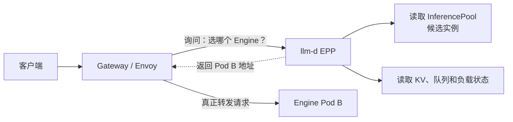
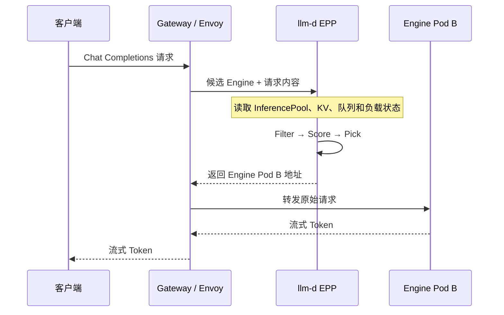
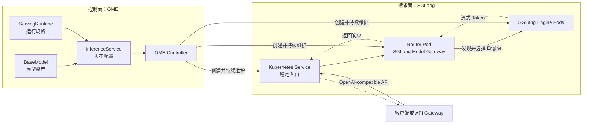
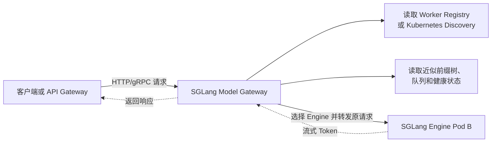
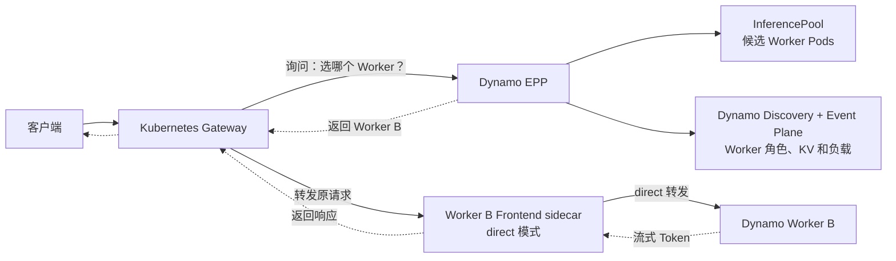
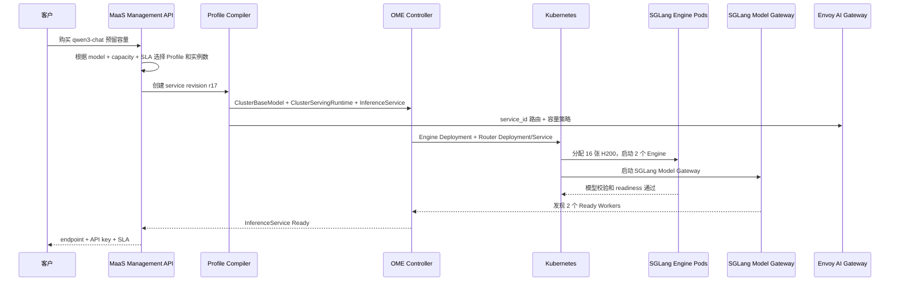
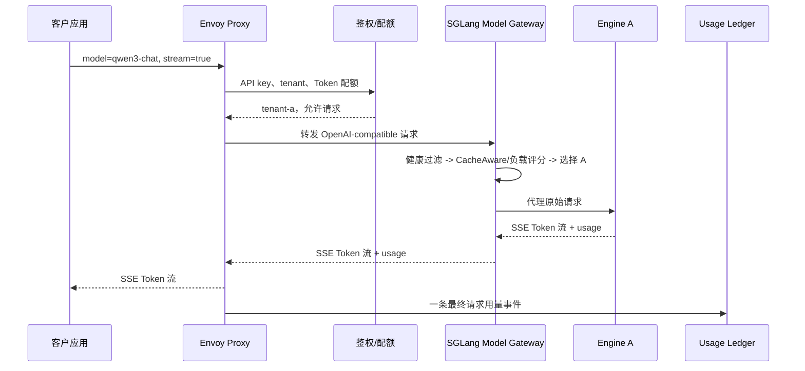
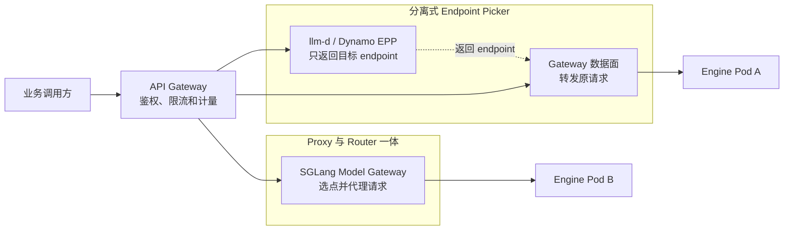
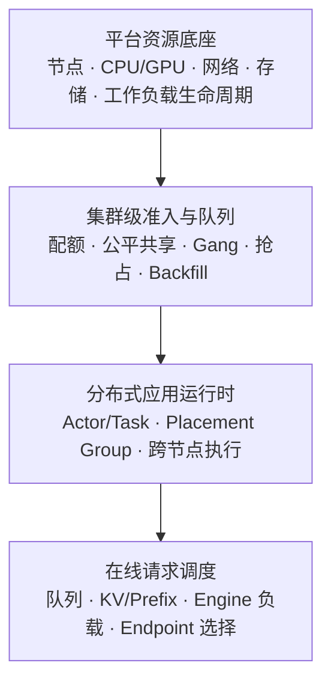

# MaaS 产品与实现调研

## 1. 调研目标

本文调研现有 MaaS 服务如何将模型、推理引擎、算力和服务等级组合为可交付产品，回答以下问题：

1. 模型部署、在线推理、资源调度和用量计量分别由谁负责；
2. 稳定服务入口与实际 Engine 实例如何解耦；
3. 平台如何为不同模型和业务负载选择 Engine、硬件、并行策略与容量模式；
4. 单机、多实例、跨节点协同和推理感知路由分别采用什么抽象；
5. 分布式资源管理有哪些主流实现，它们分别适合什么负载；
6. 各类成熟项目负责哪一层，能够怎样组合；
7. 商业公司如何在生产系统中使用 KServe、Gateway、EPP 和推理引擎；
8. 商业 MaaS 向客户承诺哪些 SLA，以及这些 SLA 如何统计和归责。

调研资料更新于 **2026-07-28**。

全文按以下逻辑展开：

```text
用户买到什么
  -> 平台主要优化什么
  -> 技术上分成哪些层
  -> KServe、OME、Dynamo 三套完整架构如何工作
  -> 每一层还有哪些同类实现
  -> 商业平台如何发布、运行并承诺 SLA
  -> 底层算力和分布式资源由谁管理
```

## 2. 从产品视角到实现结构

MaaS 平台同时包含产品体验、核心能力和技术实现。同一平台可以出现在多个类别中：从用户视角看它如何使用，从平台视角看它主要解决什么问题，从实现视角看各个项目负责哪一层。

### 2.1 按用户使用体验分类

这一视角只看用户拿到什么、需要管理到哪一层。同一平台的不同产品形态可以落在不同类别。

| 使用体验 | 代表产品 | 用户主要做什么 |
| --- | --- | --- |
| 全托管 API | [硅基流动 API](https://api-docs.siliconflow.cn/docs/userguide/introduction)、[Amazon Bedrock Invoke API](https://docs.aws.amazon.com/bedrock/latest/userguide/inference-api.html)、[Fireworks Serverless](https://docs.fireworks.ai/serverless/overview)、[Vertex AI MaaS](https://docs.cloud.google.com/vertex-ai/generative-ai/docs/open-models/use-maas) | 选择模型或服务等级，直接调用 API |
| 保证容量的 API | [硅基流动预留实例](https://siliconflow.cn/reserved)、[Bedrock Provisioned Throughput](https://docs.aws.amazon.com/bedrock/latest/userguide/prov-throughput.html)、[Vertex AI Provisioned Throughput](https://docs.cloud.google.com/vertex-ai/generative-ai/docs/resources/throughput-quota) | 确定容量和承诺周期，继续调用稳定 API |
| 托管 Deployment | [Fireworks On-Demand](https://docs.fireworks.ai/guides/ondemand-deployments)、[Vertex AI Endpoint](https://docs.cloud.google.com/vertex-ai/generative-ai/docs/open-models/deploy-custom-vllm)、[Microsoft Foundry Managed Compute（预览）](https://learn.microsoft.com/en-us/azure/foundry/concepts/managed-compute-overview)、[Azure ML](https://learn.microsoft.com/en-us/azure/machine-learning/concept-endpoints-online)、[Databricks Model Serving](https://docs.databricks.com/aws/en/machine-learning/model-serving)、[Hugging Face Inference Endpoints](https://huggingface.co/docs/inference-endpoints/about) | 创建 Deployment，选择规格和扩缩策略 |

容易混淆的边界：

- Fireworks 的 [Serverless](https://docs.fireworks.ai/serverless/overview) 是全托管 API：平台管理模型、GPU和扩缩，用户按 Token 付费；[On-Demand](https://docs.fireworks.ai/guides/ondemand-deployments) 是独占 GPU上的托管 Deployment，用户管理 Deployment、规格和副本；[Reserved Capacity](https://docs.fireworks.ai/deployments/reservations)为这些 Deployment 保证可用算力。
- Bedrock 的 [inference profile](https://docs.aws.amazon.com/bedrock/latest/userguide/inference-profiles.html)用于跨区域路由以及用量、成本归集；[Provisioned Throughput](https://docs.aws.amazon.com/bedrock/latest/userguide/prov-throughput.html)才是固定成本的专属吞吐资源，两者是不同对象。
- 硅基流动与 Bedrock 只在“全托管 API”体验上同类；两者的平台核心能力不同。

### 2.2 按平台核心能力分类

这里的“核心能力”指代平台长期优化的主要生产过程。

| 核心能力 | 本质 | 代表平台 |
| --- | --- | --- |
| 模型聚合与治理 | 让企业统一选择、调用和治理多家模型 | [Amazon Bedrock](https://docs.aws.amazon.com/bedrock/latest/userguide/what-is-bedrock.html)、[Vertex AI Model Garden](https://docs.cloud.google.com/vertex-ai/generative-ai/docs/model-garden/explore-models)、[Microsoft Foundry Models](https://learn.microsoft.com/en-us/azure/foundry/concepts/foundry-models-overview) |
| 模型服务生命周期 | 让一个模型版本持续、可控地在线 | [Azure ML Online Endpoints](https://learn.microsoft.com/en-us/azure/machine-learning/concept-endpoints-online)、[Databricks Model Serving](https://docs.databricks.com/aws/en/machine-learning/model-serving)、[Hugging Face Inference Endpoints](https://huggingface.co/docs/inference-endpoints/about) |
| 推理产能优化 | 让一份算力稳定地产生更多、更快、更便宜的 Token | [硅基流动](https://api-docs.siliconflow.cn/docs/userguide/introduction)、[Fireworks Inference](https://fireworks.ai/inference) |

可以简化为：

```text
统一管模型 -> 持续在线 -> 高效产出 Token
```

同一平台可以覆盖多个环节，分类表示其最突出的产品能力。在这个视角下，Bedrock 的重点是模型与云服务，
硅基流动的重点是推理产能。

### 2.3 按基础实现层次分类

这一层拆解 Controller、CRD、Gateway、Router、Runtime 和 KV 数据面的职责。各层实现及其
适用场景列在 2.6 的同层调研表中。

| 层次 | 这一层要决定什么 | 对应调研表 |
| --- | --- | --- |
| API Gateway | 谁提供统一模型 API、鉴权、配额、限流、流量策略和用量观测 | 2.6.1 |
| 模型服务控制面 | 谁把模型规格持续维护成工作负载、路由、扩缩和服务状态 | 2.6.2 |
| 在线请求 Router | 谁根据 Prefix/KV Cache、队列、负载、SLO 和 P/D 角色逐请求选择 Engine | 2.6.3 |
| 多节点工作负载 | 谁把多个 Pod、节点或角色作为一个整体调度、发布、扩缩和恢复 | 2.6.4 |
| Engine Runtime | 谁在 GPU 上执行 batching、prefill、decode、量化、并行和本地 KV Cache 管理 | 2.6.5 |
| 分离式推理 | 谁组织 prefill/decode、请求配对、KV 传输、发现和扩缩 | 2.6.6 |
| KV Cache 数据面 | 谁在实例、节点和存储层之间传输、共享或卸载 KV Cache | 2.6.6 |

### 2.4 三套代表性 Serving Provider

KServe、OME 和 Dynamo 位于同一比较层级：它们都接收一份模型服务声明，再持续维护工作负载、
请求入口和服务状态。区别在于控制对象与数据面边界。

#### 2.4.1 KServe + llm-d

[KServe LLMInferenceService](https://kserve.github.io/website/docs/model-serving/generative-inference/llmisvc/llmisvc-overview)
以“模型服务”为控制对象，通过 Gateway API Inference Extension 和 llm-d 组合逐请求路由：

```text
LLMInferenceService
  -> KServe Controller
  -> Deployment / LeaderWorkerSet
  -> vLLM / SGLang Engine Pods

Gateway
  -> InferencePool
  -> llm-d EPP 选择 endpoint
  -> Gateway 将原请求转发给 Engine
```

| 维度 | 实现 |
| --- | --- |
| 服务声明 | `LLMInferenceService`，通过 `LLMInferenceServiceConfig` 组合 Runtime、硬件和 Router 模板 |
| 控制面 | KServe Controller 收敛工作负载、`InferencePool`、EPP 和服务状态 |
| 请求路径 | Gateway 接收请求，llm-d EPP 执行 `Filter -> Score -> Pick`，Gateway 转发原请求 |
| 工作负载 | 单 Pod 使用 Deployment，多节点 Engine 使用 LeaderWorkerSet |
| Runtime | 通过 ServingRuntime 接入 vLLM、SGLang 等模型服务器 |
| P/D 与 KV | llm-d 组织 prefill/decode pools，并组合 Runtime KV connector、NIXL 或 LMCache |

llm-d EPP 是逐请求的 Endpoint Picker。Gateway 接收客户端请求，向 EPP 询问目标 endpoint；EPP
根据 `InferencePool` 中的候选实例以及 KV、队列和负载状态完成选点，再由 Gateway 将原请求直接转发
给选中的 Engine：



同一链路的逐步请求时序如下：



#### 2.4.2 OME + SGLang

[OME InferenceService](https://ome-projects.github.io/ome/docs/concepts/inference_service/)
同样以“模型服务”为控制对象，但把模型资产、Runtime、Engine、Decoder 和 Router 放进一套
SGLang-native 发布路径：

```text
ClusterBaseModel + ClusterServingRuntime
  -> InferenceService
  -> OME Controller
  -> Engine / Decoder / Router Workloads

Client or API Gateway
  -> SGLang Model Gateway
  -> 选择 Worker 并代理完整请求
  -> SGLang Runtime
```

| 维度 | 实现 |
| --- | --- |
| 服务声明 | `InferenceService` 引用 `BaseModel` 与 `ServingRuntime` |
| 控制面 | OME Controller 维护 Engine、Decoder、Router、Service 和服务状态；Model Agent 校验节点模型资产 |
| 请求路径 | SGLang Model Gateway 直接完成 Worker 发现、CacheAware/负载选点和请求代理 |
| 工作负载 | 支持 Raw、Serverless、Deployment、LeaderWorkerSet 和多角色 P/D |
| Runtime | 以 SGLang 为主，也可通过 ServingRuntime 描述其他执行容器 |
| P/D 与 KV | OME 声明 Engine/Decoder/Router 角色，SGLang 负责 P/D 路由与 Mooncake、NIXL 等 KV 传输 |

OME 负责把模型服务声明收敛为 Router 与 Engine 工作负载，SGLang Model Gateway 负责运行时的
Engine 发现、选点和请求代理：



SGLang Model Gateway 直接接收上游请求，在同一个组件内完成 Worker 发现、状态判断、Engine
选择和请求代理：



#### 2.4.3 NVIDIA Dynamo

[NVIDIA Dynamo](https://docs.nvidia.com/dynamo/design-docs/overall-architecture)
以“分布式推理图”为控制对象。它不只发布模型工作负载，还把 Frontend、Router、P/D Worker、
Discovery、KV 事件面和 Planner 放进同一套运行时：

```text
DynamoGraphDeployment
  -> Dynamo Operator
  -> Frontend / EPP
  -> Prefill / Decode Workers
  -> Discovery + Event Plane + Planner

Request path A: Client -> Dynamo Frontend + Router -> Worker
Request path B: Client -> Gateway -> Dynamo EPP -> Frontend sidecar -> Worker
```

| 维度 | 实现 |
| --- | --- |
| 服务声明 | `DynamoGraphDeployment` 描述 Frontend、Router、Worker 和组件依赖 |
| 控制面 | Dynamo Operator 收敛 serving graph；Discovery 和事件面维护成员及路由状态 |
| 请求路径 | Native 模式由 Frontend 内置 Router 选点并代理；GAIE 模式由 Gateway 调用 Dynamo EPP |
| 工作负载 | Operator 创建 Frontend、EPP、Worker 及 Grove/Deployment 等 Kubernetes 工作负载 |
| Runtime | 支持 vLLM、SGLang 和 TensorRT-LLM Backend |
| P/D 与 KV | serving graph 原生表达 prefill/decode 池，使用 KV events、NIXL、KVBM 和 Planner 协同路由与扩缩 |

Dynamo 支持[两种请求入口拓扑](https://docs.nvidia.com/dynamo/latest/kubernetes-deployment/request-routing/gateway-api-inference-extension/overview)：

- **Dynamo-native**：Dynamo Frontend 直接接收 HTTP 请求，内置 Router 根据 KV overlap 和负载选择
  Worker，并代理完整请求；
- **GAIE**：Kubernetes Gateway 接收请求并调用 Dynamo EPP。EPP 根据 Dynamo Discovery、Worker 角色、
  负载和事件面中的 KV 状态选点；Gateway 再将原请求发到选中 Worker 的 Frontend sidecar，sidecar
  以 `direct` 模式转发给 Worker。

GAIE 模式的请求关系如下：



Dynamo Operator 根据 `DynamoGraphDeployment` 创建 EPP、`InferencePool`、Frontend sidecar 和
Worker；Dynamo EPP 通过 NATS Core 事件面消费实时路由状态。Worker 能发布 KV events 时使用事件驱动的
KV-aware 路由；未提供这类事件时，可以显式使用
[近似 KV 状态或仅负载路由](https://docs.nvidia.com/dynamo/latest/components/router/routing-concepts)。

#### 2.4.4 三套架构的直接比较

| 维度 | KServe + llm-d | OME + SGLang | Dynamo |
| --- | --- | --- | --- |
| 核心抽象 | 模型服务 | 模型服务 | 分布式推理图 |
| 组件边界 | 标准化最强，Controller、Gateway、EPP、Runtime 相互独立 | SGLang 集成最短，Controller、Router、Runtime 紧密配合 | 覆盖最深，把路由、P/D、KV 和 Planner 纳入一套运行时 |
| 集成复杂度 | 中：需要维护 Gateway、InferencePool、EPP、Workload 和 Runtime | 低到中：主要围绕 OME 与 SGLang 组件 | 高：增加 Discovery、事件面、Planner、KV 传输和 serving graph |
| 请求 Router | llm-d EPP，只负责选点 | SGLang Model Gateway，选点并代理请求 | Frontend 内置 Router，或 Gateway 调用 Dynamo EPP |
| 多 Runtime | 通过标准 Runtime 与 EPP 边界接入 | 以 SGLang 为主 | 支持 vLLM、SGLang、TensorRT-LLM |
| Kubernetes 接口 | `LLMInferenceService`、Gateway API、`InferencePool`、LWS | OME CRD、Deployment、LWS | `DynamoGraphDeployment`、Operator、Grove、EndpointSlice、GAIE |
| P/D 分离 | llm-d 组合独立 prefill/decode pools | OME 角色声明 + SGLang-native P/D | serving graph 原生管理 prefill/decode pools |
| KV 状态 | llm-d 前缀索引或 Runtime KV events | SGLang Model Gateway 的近似前缀树及 Runtime 状态 | Worker KV events 经 Dynamo 事件面传播，也支持显式近似模式 |
| 扩缩与规划 | HPA/KEDA 与 llm-d 指标 | HPA 与 OME 工作负载控制 | Planner 根据 TTFT、ITL/TPOT 和吞吐目标计算规模 |
| 典型形态 | 多 Runtime、标准接口的 Kubernetes MaaS | SGLang-native 单节点、多节点或 P/D 服务 | 大规模 P/D、复杂 serving graph 和跨 Worker KV 协同 |

三套架构虽然内部资源不同，但都可以放在相同 MaaS 产品对象之后：

| 产品职责 | 内部实现 |
| --- | --- |
| 稳定服务身份 | `service_id` 与不可变 deployment revision |
| 工作负载和服务状态 | KServe Controller、OME Controller 或 Dynamo Operator |
| endpoint 集合 | `InferencePool`、Worker Registry 或 Dynamo Discovery |
| 逐请求选点 | llm-d EPP、SGLang Model Gateway 或 Dynamo Router/EPP |
| 多节点生命周期 | LeaderWorkerSet、Grove 或 provider 创建的等价工作负载 |
| 模型执行 | vLLM、SGLang 或 TensorRT-LLM |
| 对外身份、策略和用量 | API Gateway + Usage Ledger |

### 2.5 以 Runtime 生态为中心：SGLang

从 SGLang Runtime 向外看，同一个 Runtime 可以接入不同控制面、Router 和分布式推理框架：

| 层次 | 代表项目 | 核心作用 |
| --- | --- | --- |
| 模型服务发布 | [OME InferenceService](https://ome-projects.github.io/ome/docs/concepts/inference_service/)、[KServe LLMInferenceService](https://kserve.github.io/website/docs/model-serving/generative-inference/llmisvc/llmisvc-overview) | 将模型、Runtime 和硬件配置转换为工作负载与服务状态 |
| 在线请求调度 | [SGLang Model Gateway](https://docs.sglang.io/docs/advanced_features/sgl_model_gateway)、[llm-d EPP](https://llm-d.ai/docs/dev/architecture/core/router/epp)、[Dynamo Router](https://docs.nvidia.com/dynamo/latest/components/router/routing-concepts) | 根据 Prefix/KV、负载和 P/D 角色选择 SGLang Worker |
| Engine 服务栈 | [SGLang Runtime + Model Gateway](https://docs.sglang.io/docs/advanced_features/sgl_model_gateway) | 提供 OpenAI API、Worker 发现、路由、容错和观测 |
| 分布式 Engine 实例 | [OME Multi-Node](https://ome-projects.github.io/ome/docs/concepts/inference_service/)、[LeaderWorkerSet](https://lws.sigs.k8s.io/docs/overview/)、[Ray Serve LLM SGLang](https://docs.ray.io/en/latest/serve/llm/user-guides/sglang.html) | 将跨节点 TP、PP、DP、EP 进程组织成一个 Engine |
| 分离式推理 | [SGLang PD Disaggregation](https://docs.sglang.io/docs/advanced_features/pd_disaggregation)、[NVIDIA Dynamo SGLang Backend](https://docs.nvidia.com/dynamo/latest/backends/sg-lang) | 组织 prefill、decode、请求路由和 KV Cache 传输 |

这里的关键区别是观察方向：Serving Provider 从服务声明向下管理完整服务；Runtime 生态从执行引擎
向外连接控制面、Router、多节点工作负载和 KV 数据面。

### 2.6 同层产品调研

只在相同职责内比较产品。一个项目可以覆盖多个层次，但每个 Model Service 在每一层只设一个负责人。
候选范围以能够自托管、仍有正式文档并直接服务于 Kubernetes MaaS 的项目为主。

各表按 API Gateway、模型服务控制面、在线请求 Router、多节点工作负载、Engine Runtime、
分离式推理和 KV Cache 数据面分别比较；
“适用场景”表示该实现重点解决的问题。

#### 2.6.1 对外 API Gateway

这一层回答“用户如何统一、安全地调用平台”，不负责 GPU 上的模型执行。

| 项目 | 适用场景 | 重点能力 | 自建推理结合方式 | 开源边界 |
| --- | --- | --- | --- | --- |
| [Envoy AI Gateway](https://aigateway.envoyproxy.io/docs/concepts/architecture/system-architecture/) | 采用 KServe、GAIE 和 Envoy Gateway 标准路径 | OpenAI-compatible 路由、上游认证、Token 统计、按用量限流和多 provider 转换 | 原生组合 Gateway API、`InferencePool` 和 EPP；KServe 有完整示例 | [Apache-2.0](https://github.com/envoyproxy/ai-gateway/blob/main/LICENSE) |
| [Agentgateway](https://agentgateway.dev/docs/kubernetes/latest/) | 同时需要 LLM、MCP、A2A，并希望直接连接 GAIE | LLM、MCP、A2A、鉴权、策略、成本与可观测 | [原生支持 Gateway API Inference Extension](https://agentgateway.dev/docs/kubernetes/latest/inference/)，可直接连接 llm-d EPP | [Apache-2.0](https://github.com/agentgateway/agentgateway) |
| [Istio Gateway](https://istio.io/latest/docs/tasks/traffic-management/ingress/gateway-api-inference-extension/) | 集群已经采用 Istio，并希望复用网格和入口 | Gateway API、TLS、流量治理、服务网格策略和 GAIE | 原生支持 `HTTPRoute -> InferencePool -> EPP`，可复用已有 Istio 基础设施 | [Apache-2.0](https://github.com/istio/istio/blob/master/LICENSE) |
| [Higress AI Gateway](https://higress.ai/en/ai-gateway) | 需要 Kubernetes API 治理、Wasm 插件和一体化控制台 | 多模型协议转换、Fallback、Token 限流、语义缓存、内容安全和 MCP | 通过 Gateway API、Service 和 OpenAI-compatible endpoint 接入自建模型 | [Apache-2.0](https://github.com/higress-group/higress) |
| [Apache APISIX AI Gateway](https://apisix.apache.org/ai-gateway/) | 已有 APISIX/OpenResty 体系，需要把模型流量纳入现有 API 平台 | 多 LLM 代理、重试、Fallback、Token 限流、审计和传统 API 治理 | 通过 Route/Upstream 连接模型 Service 或 OpenAI-compatible endpoint | [Apache-2.0](https://github.com/apache/apisix)；AI 插件开源 |
| [Kong AI Gateway](https://docs.konghq.com/gateway/latest/ai-gateway/) | 已有 Kong 平台，并依赖其企业插件和治理体系 | provider 代理、凭据管理、Prompt 治理、观测和 Kong 插件生态 | 通过 Service/Route 连接自建模型或外部 provider | Kong Gateway 与基础 AI Proxy 开源；高级负载均衡、路由和重试在 AI Proxy Advanced |
| [Traefik Hub AI Gateway](https://doc.traefik.io/traefik-hub/ai-gateway/overview) | 已采用 Traefik Hub，并接受商业授权 | OpenAI-compatible 接口、Model 匹配、Token 配额、语义缓存、内容安全和 GenAI 观测 | 通过 Kubernetes Route 连接 KServe、vLLM 等本地模型服务 | 商业自托管产品 |
| [LiteLLM Proxy](https://docs.litellm.ai/docs/proxy/virtual_keys) | 优先快速统一大量云模型和自建 OpenAI-compatible endpoint | 统一 100+ provider、Virtual Key、预算、成本、限流、Fallback 和管理 UI | 将自建 OpenAI-compatible endpoint 当作一个 deployment | [开源 Proxy](https://github.com/BerriAI/litellm) + 商业增强能力 |
| [Portkey AI Gateway](https://portkey.ai/docs/product/ai-gateway) | 需要应用层多 provider、Guardrail 和完整请求观测 | 统一多 provider、Fallback、负载均衡、限流、预算、Guardrail 和可观测 | 将自建 OpenAI-compatible endpoint 配置为 provider | [MIT](https://github.com/Portkey-AI/gateway/blob/main/LICENSE) |
| [Bifrost](https://docs.getbifrost.ai/quickstart/README) | 需要轻量、高吞吐的自托管 Go LLM Proxy | 多 provider、负载均衡、Failover、语义缓存、预算和治理插件 | 通过自定义 provider 连接 OpenAI-compatible endpoint | [Apache-2.0](https://github.com/maximhq/bifrost/blob/main/LICENSE) |
| [Tyk AI Studio](https://tyk.io/docs/ai-management/ai-studio/overview) | 需要应用、RBAC、预算和 Hub-Spoke AI 管理平台 | 多 provider、应用/RBAC、预算、Token 用量、插件、审计和 Hub-Spoke 管理 | 将内部 OpenAI-compatible endpoint 注册为模型 provider | [AGPL-3.0 Community](https://github.com/TykTechnologies/ai-studio) + Enterprise |
| [Helicone AI Gateway](https://github.com/Helicone/ai-gateway) | 以请求级观测、成本和延迟分析为首要目标 | 多 provider、负载均衡、Fallback、缓存、限流和请求级成本/延迟观测 | 将自建 OpenAI-compatible endpoint 配置为目标 | 开源，可自托管 |

三类产品的重点不同：

- Envoy AI Gateway、Agentgateway 与 Istio 直接面向 Kubernetes `InferencePool + EPP`；
- Higress、APISIX、Kong 与 Traefik Hub 把 AI 能力放进 Kubernetes/API Gateway 治理体系；
- LiteLLM、Portkey、Bifrost、Tyk AI Studio 与 Helicone 以应用层 LLM Proxy、模型治理和成本观测为中心。

API Gateway 与模型服务控制面是独立组件。SGLang-native 链路可由 SGLang Model Gateway
直接提供 OpenAI-compatible API，也可以在其前面增加统一入口承接鉴权、配额、用量和多服务路由。

#### 2.6.2 模型服务控制面

这一层回答“如何把模型规格持续维护成可用服务”。

| 项目 | 核心资源 | 主要控制能力 | Runtime 关系 | 适用场景 |
| --- | --- | --- | --- | --- |
| [KServe](https://kserve.github.io/website/docs/concepts/architecture/control-plane-llmisvc) | `InferenceService`、`LLMInferenceService`、`LLMInferenceServiceConfig` | 模型发布、Deployment/LWS、Gateway、InferencePool、EPP、状态和扩缩 | 通用 ServingRuntime；LLM 路径与 vLLM、llm-d 集成完整 | 通用 Kubernetes serving provider |
| [OME](https://ome-projects.github.io/ome/docs/concepts/inference_service/) | `InferenceService`、`BaseModel`、`ServingRuntime` | 在一个资源中组合 Engine、Decoder、Router、Raw/Serverless/Multi-Node/P-D | 可配置 Runtime，模型对象和 SGLang 路径结合紧密 | SGLang-native serving provider |
| [NVIDIA Dynamo Operator](https://docs.nvidia.com/dynamo/latest/design-docs/overall-architecture) | `DynamoGraphDeployment`、`DynamoGraphDeploymentRequest` | serving graph、Router、P/D workers、发现、KV 传输、Planner 和弹性 | 支持 vLLM、SGLang、TensorRT-LLM | P/D 和大规模分布式 serving provider |
| [vLLM Production Stack](https://docs.vllm.ai/projects/production-stack/en/latest/) | `VLLMRuntime`、`VLLMRouter`、`CacheServer`、`LoraAdapter` | vLLM 部署、Router、LMCache、KEDA、监控和 Operator 生命周期 | 绑定 vLLM 与 LMCache | vLLM-only 集成栈 |
| [Ray Serve LLM + KubeRay](https://docs.ray.io/en/latest/serve/llm/architecture/overview.html) | `RayService`、Serve Deployment、Replica | Ray Cluster、Actor、Serve 应用、分布式策略、升级和恢复 | Engine 抽象可连接 vLLM、SGLang 等 | 需要 Ray 应用与 Actor 语义的服务 |
| [Seldon Core 2](https://docs.seldon.ai/seldon-core-2/v2.10/about/architecture) | `Model`、`Server`、`Pipeline` | Model/Server 解耦、多模型装载、模型调度和推理 Pipeline | 通过 Server 能力承载不同 Runtime | 高密度多模型与传统推理服务 |
| [AIBrix](https://aibrix.readthedocs.io/latest/) | `StormService`、`RoleSet`、`ModelAdapter`、Router 和 KV Cache 组件 | 模型发布、多节点工作负载、LoRA、路由、扩缩、P/D 和 KV 卸载 | 统一管理不同推理 Runtime，vLLM 集成最完整 | LLM-native 一体化 Kubernetes serving 栈 |
| [KubeAI](https://www.kubeai.org/) | `Model` CRD、Operator 和 Model Proxy | 模型部署、镜像与权重缓存、LoRA、路由、自动扩缩和 scale-to-zero | 支持 vLLM、Ollama、FasterWhisper 和 Infinity | 轻量、模型即 CRD 的 Kubernetes serving provider |
| [Kthena](https://kthena.volcano.sh/docs/intro) | `ModelBooster`、`ModelRoute`、`ModelServer`、`ModelServing` 和 `AutoScalingPolicy` | 模型发布、路由、P/D、滚动更新、LoRA、SLO/成本感知扩缩和异构调度 | 支持 vLLM、SGLang、Triton 和 TorchServe | 覆盖控制面、Router 和 P/D 的 LLM serving 栈 |
| [KAITO](https://kaito-project.github.io/kaito/docs/) | `Workspace`、`InferenceSet`、`MultiRoleInference` 和 `InferencePool` | GPU 数量估算、节点供给、多节点部署、KEDA 扩缩、LoRA、EPP 和 P/D | 当前推理路径绑定 vLLM | GPU 供给与 vLLM 服务一体化 Operator |
| [llmaz](https://llmaz.inftyai.com/docs/) | `OpenModel`、`Playground`、`Service` 和 `BackendRuntime` | 模型源、异构 Flavor、Runtime 配置、HPA、LWS 多节点和 Envoy AI Gateway 集成 | 支持 vLLM、SGLang、TensorRT-LLM、TGI、llama.cpp 和 Ollama | 轻量、可扩展的 Kubernetes LLM serving provider |
| [BentoML Yatai](https://docs.yatai.io/en/latest/) | `BentoRequest`、`Bento` 和 `BentoDeployment` | Bento 构建、注册、部署、更新、回滚、扩缩和观测 | 运行 BentoML Service 封装的任意模型代码 | 通用自定义模型服务与 GitOps 发布 |

它们的本质区别是控制对象不同：KServe 和 OME 控制“模型服务”，Dynamo 控制“分布式推理图”，
vLLM Production Stack 控制“vLLM 运行栈”，Ray Serve 控制“分布式应用”，Seldon Core 2 控制
“Model 到共享 Server 的装载与 Pipeline”；AIBrix 与 Kthena 控制“LLM 服务全栈”；KubeAI、KAITO
和 llmaz 控制“模型 CRD 到 Runtime 实例”；Yatai 控制“Bento 构建产物到 Kubernetes 服务”。

#### 2.6.3 逐请求 Router

这一层回答“已经有多个健康 Engine 时，本次请求发给哪一个”。

KServe + llm-d、OME + SGLang 和 Dynamo 的完整请求路径分别见 2.4.1、2.4.2 和 2.4.3。
这里仅比较 Router 在数据面中的位置和能力边界。

三种实现都能逐请求选择 Engine，但在请求路径中的位置不同：

| 对比项 | llm-d EPP | SGLang Model Gateway | Dynamo Frontend / EPP |
| --- | --- | --- | --- |
| 主要职责 | 选择 Engine | 选择 Engine，并代理完整请求 | Native 模式选择并代理；GAIE 模式由 EPP 选择 Worker |
| 谁接收客户请求 | Envoy/Gateway | SGLang Model Gateway | Dynamo Frontend，或 GAIE Gateway |
| 谁转发到 Engine | Envoy/Gateway | SGLang Model Gateway | Dynamo Frontend；GAIE 模式由 Gateway 经 Frontend sidecar 转发 |
| 接口方式 | Gateway 通过 `ext-proc` 调用 | 客户端直接通过 HTTP/gRPC 调用 | 客户端调用 Frontend HTTP；或 Gateway 通过 GAIE 调用 EPP |
| 候选实例来源 | `InferencePool` | Worker Registry、静态地址或 Kubernetes Discovery | Dynamo Discovery；GAIE 模式同时使用 `InferencePool` |
| 部署与控制边界 | EPP 只负责选点，工作负载由 KServe、KAITO 等控制面维护 | Model Gateway 负责 Router，工作负载可由 OME 等控制面维护 | Dynamo Operator 根据 `DynamoGraphDeployment` 维护 EPP、Frontend sidecar、Worker 和 serving graph |
| Runtime 关系 | 面向多种 Engine 的通用调度框架 | 深度结合 SGLang | 面向 vLLM、SGLang、TensorRT-LLM，并理解 Dynamo serving graph |
| KV-aware | 推测式前缀索引，或基于 `KVEvents` 的近实时事件视图 | 根据请求历史维护近似前缀树 | Worker KV events + 事件面，或显式启用近似模式 |
| P/D 关系 | 通过 Pool、scorer 和 Runtime connector 组合 | 原生识别 prefill/decode Workers | Router 原生理解 prefill/decode 角色、负载和 KV 传输链路 |

因此，llm-d EPP 是通用的外部选点服务；SGLang Model Gateway 是 SGLang-native 的
Proxy + Router；Dynamo 同时提供 Frontend 内置 Router 和可接入 GAIE 的 EPP，并把选点与 serving graph、
事件面和 P/D 角色放在同一套运行时中。

| 项目 | 候选实例来源 | 选点依据 | 请求控制 | 适用场景 |
| --- | --- | --- | --- | --- |
| [llm-d EPP](https://llm-d.ai/docs/dev/architecture/core/router/epp) | 标准 `InferencePool`、Pod 和指标 Data Layer | Prefix/KV、队列、负载、并发、LoRA 和自定义 scorer | 插件化 `Filter -> Score -> Pick`，支持优先级、公平排队与 pool saturation 控制 | 采用 KServe/GAIE，希望 Router 独立于 Runtime 并可插拔 |
| [SGLang Model Gateway](https://docs.sglang.io/docs/advanced_features/sgl_model_gateway) | Worker Registry、静态地址或 Kubernetes Discovery | cache-aware、power-of-two、负载、健康和 P/D 角色 | HTTP/gRPC、重试、熔断、限流、排队、PD 和多模型路由 | Runtime 以 SGLang 为主，并需要 SGLang-native P/D |
| [Dynamo EPP / Router](https://docs.nvidia.com/dynamo/latest/kubernetes-deployment/request-routing/gateway-api-inference-extension/overview) | Dynamo Worker Metadata、Discovery 和 EndpointSlice | KV、负载、worker 角色、拓扑和 serving graph 状态 | Dynamo-native Frontend 或 GAIE EPP；与 P/D、KV 传输和 Planner 协同 | 工作负载由 Dynamo serving graph 管理 |
| [vLLM Router](https://github.com/vllm-project/router) | 静态 endpoint 或 Kubernetes vLLM Pods | round-robin、random、consistent-hash、power-of-two、prefix/cache-aware | 健康检查、会话亲和和 vLLM Production Stack 集成 | 采用纯 vLLM + LMCache 运行栈 |
| [Ray Serve LLM Router](https://docs.ray.io/en/latest/serve/llm/architecture/overview.html) | Ray Serve Deployment Replicas | Replica 负载与 Serve 路由策略 | Serve Proxy、DeploymentHandle、应用内组合和自动扩缩 | Engine 已经运行在 Ray Serve 应用中 |
| [AIBrix Router](https://aibrix.readthedocs.io/latest/designs/aibrix-router.html) | Kubernetes Pods、指标和 Prefix/KV 状态 | Prefix Cache、负载、延迟、吞吐、SLO、公平性和 P/D 角色 | 多种内置算法，并提供会话亲和、P/D 和可扩展策略 | 采用 AIBrix 控制面、StormService 和 KV 体系 |
| [KubeAI Load Balancer](https://www.kubeai.org/concepts/load-balancing/) | `Model` 对应的 Ready replicas | Prefix Hash 和最小 in-flight 请求数 | Model Proxy 内完成发现、负载均衡和转发 | 采用 KubeAI `Model` CRD，需要简单的 Prefix-aware 路由 |
| [Kthena Router](https://kthena.volcano.sh/docs/intro) | `ModelRoute`、`ModelServer` 和 `ModelServing` endpoints | KV/Prefix Cache、LoRA、请求数、TTFT/TPOT、GPU Cache 和 P/D group | 鉴权、Token 限流、公平排队、Filter/Score 调度和 Failover | 采用 Kthena 全栈控制面和 P/D `ServingGroup` |
| [KAITO EPP](https://kaito-project.github.io/kaito/docs/gateway-api-inference-extension/) | `InferenceSet` 创建的 `InferencePool` 和 Pods | KV Cache、Prefix 和请求负载 | 复用 GAIE 与 llm-d EPP 插件，并由 KAITO 创建和维护 | 采用 KAITO `InferenceSet` 和 vLLM |

llm-d EPP 的核心优势是标准 `InferencePool`、可插拔调度和全局流控；SGLang Model Gateway 与
SGLang 协同最深；Dynamo Router 直接理解 P/D 与 serving graph；vLLM Router、Ray Serve Router、
AIBrix Router、KubeAI Load Balancer、Kthena Router 和 KAITO EPP 分别在自己的控制面生态内提供最短
集成路径。

#### 2.6.4 多节点工作负载

这一层回答“一个 Engine 由多个 Pod 或节点组成时，如何整体调度、扩缩和恢复”。

| 项目 | 管理单元 | 调度与拓扑 | 生命周期 | 适用场景 |
| --- | --- | --- | --- | --- |
| Kubernetes `Deployment` | 相互独立的 Pod replicas | 使用 Kubernetes Scheduler | 独立扩缩、更新和恢复每个 Pod | 单 Pod Engine 的水平副本 |
| [LeaderWorkerSet](https://lws.sigs.k8s.io/) | 一个 Leader + 多个 Workers 组成一个 replica group | 提供稳定身份和 group/topology 语义；Gang 可组合 Volcano 等 Scheduler | 整组创建、扩缩、滚动更新和恢复 | 通用多节点 TP/PP Engine |
| [Grove](https://github.com/NVIDIA/grove) | `PodCliqueSet`、`PodClique`、`PodCliqueScalingGroup` | 分层 Gang、拓扑感知放置、启动顺序和多级扩缩 | 将 Router、Prefill、Decode 等多个组件作为一个系统维护 | Dynamo 和复杂 P/D serving graph |
| [KubeRay RayService](https://docs.ray.io/en/latest/serve/production-guide/kubernetes.html) | Ray Cluster + Ray Serve Application + Actors | Ray Placement Group 与 Kubernetes 资源调度 | KubeRay 维护集群，Ray Serve 维护 Deployment/Replica | Ray 原生分布式 Engine 和应用 |
| [AIBrix StormService](https://aibrix.readthedocs.io/latest/designs/aibrix-stormservice.html) | `StormService` + 多个 `RoleSet` | 为 TP/PP/P-D 等角色定义副本、依赖、拓扑和调度策略 | 统一发布、更新、扩缩和恢复多角色推理服务 | AIBrix 多节点 Engine 与 P/D 服务 |

LWS 是最小、通用的多节点 Engine 抽象；Grove 面向多组件、分层 Gang 和拓扑感知系统；RayService
同时引入 Ray Cluster 与应用运行时；StormService 用 RoleSet 表达同一推理服务内的多种角色。

#### 2.6.5 Engine Runtime

这一层回答“谁在 GPU 上加载模型并真正生成 Token”。

| 项目 | 主要特点 | 硬件与生态 | 分布式与 P/D | 适用场景 |
| --- | --- | --- | --- | --- |
| [vLLM](https://docs.vllm.ai/) | PagedAttention、continuous batching、OpenAI-compatible API、广泛模型支持和成熟集成 | 多类加速器和广泛 Kubernetes/serving 生态 | TP、PP、DP，并可组合 llm-d、Dynamo、Ray、LMCache | 优先模型覆盖、社区集成和 KServe/llm-d 标准路径 |
| [SGLang](https://docs.sglang.io/) | RadixAttention、Prefix Cache、结构化生成、推理解析、MoE 与高性能 HTTP/gRPC | 支持 NVIDIA、AMD、Intel、TPU、Ascend 等硬件 | 原生 TP/DP/EP、Model Gateway 和 P/D | 大型 MoE、Prefix 复用、结构化生成或 SGLang-native P/D 更优 |
| [TensorRT-LLM](https://nvidia.github.io/TensorRT-LLM/overview.html) | NVIDIA kernel、FP8/FP4、in-flight batching、量化和最新 GPU 优化 | 聚焦 NVIDIA GPU，并与 Triton、Dynamo 集成 | 多 GPU/多节点 TP、PP、EP；支持分离式 serving | 模型和硬件长期固定，追求 NVIDIA GPU 极致性能并接受 Engine 构建成本 |
| [Hugging Face TGI](https://huggingface.co/docs/text-generation-inference/en/index) | continuous batching、SSE、量化、Prometheus/OTel 和 Hugging Face 模型体验 | NVIDIA、AMD、Gaudi、Neuron、TPU 等多 backend | Tensor Parallel 和多 backend；项目当前进入 maintenance mode | 已有 TGI 镜像、运维体系或 Hugging Face 服务需要保持兼容 |
| [LMDeploy](https://lmdeploy.readthedocs.io/en/stable/) | TurboMind/PyTorch Engine、continuous batching、量化、Prefix Cache 和 OpenAI-compatible API | NVIDIA、AMD、Ascend、Cambricon、MACA 等多种加速器 | TP、分布式 serving，并提供 Triton 后端 | 需要国产模型、国产加速器或 LMDeploy 已验证的高性能路径 |
| [llama.cpp Server](https://github.com/ggml-org/llama.cpp/tree/master/tools/server) | GGUF、低比特量化、OpenAI-compatible HTTP Server 和低依赖部署 | CPU、Metal、CUDA、ROCm、Vulkan 等广泛本地硬件 | 单机和轻量多 GPU，不承担 Kubernetes 分布式编排 | CPU、边缘、小模型或低依赖部署 |

Runtime 不能按项目名称固定。每个模型必须使用同一权重、同一硬件、同一请求集和同一 SLO，比较正确性、
吞吐、TTFT、TPOT、显存、稳定性和成本，再把结果写入版本化 Model Service Profile。

#### 2.6.6 分离式推理与 KV 数据面

这一层回答“prefill 和 decode 分开后，谁负责角色编排、请求配对和 KV 传输”。

| 项目 | 编排与路由 | KV 数据面 | Runtime | 适用场景 |
| --- | --- | --- | --- | --- |
| [NVIDIA Dynamo](https://docs.nvidia.com/dynamo/latest/user-guides/disaggregated-serving) | Frontend、Router、Prefill/Decode workers、Discovery、Planner 和 Grove | [NIXL](https://github.com/ai-dynamo/nixl) | vLLM、SGLang、TensorRT-LLM | 需要完整 serving graph、Planner、多 Runtime 和大规模 P/D |
| [llm-d P/D](https://llm-d.ai/docs/0.7/well-lit-paths/pd-disaggregation) | KServe/InferencePool + llm-d EPP 对 Prefill、Decode endpoints 进行配对 | NIXL，以及 Runtime 支持的 KV connector | vLLM、SGLang | 已采用 KServe、GAIE、InferencePool 和 llm-d EPP |
| [SGLang P/D](https://docs.sglang.io/docs/advanced_features/pd_disaggregation) | Model Gateway 管理 Prefill/Decode workers 和请求路由 | Mooncake、NIXL | SGLang | Runtime 和 Router 都采用 SGLang 生态 |
| [AIBrix P/D](https://aibrix.readthedocs.io/latest/features/pd-disaggregation.html) | StormService/RoleSet 描述角色，AIBrix Router 完成 P/D 路由 | AIBrix KV Cache 与 Engine connector | 以 vLLM 为主的多 Runtime | 已采用 AIBrix、StormService、Router 和 KV Cache |
| [Kthena P/D](https://kthena.volcano.sh/docs/intro) | `ModelServing` 的 Prefill/Decode `ServingGroup` 与 Kthena Router 配对 | LMCache、Mooncake、NIXL | vLLM、SGLang 等 Kthena Runtime | 已采用 Kthena 控制面，需要异构硬件和独立角色扩缩 |
| [KAITO MultiRoleInference](https://kaito-project.github.io/kaito/docs/prefill-decode-disaggregation/) | `MultiRoleInference` 创建 Prefill/Decode `InferenceSet`、`InferencePool` 和 llm-d EPP | NIXL | vLLM | 已采用 KAITO 管理 GPU 供给、InferenceSet 和 vLLM |
| [vLLM Disaggregated Prefilling](https://docs.vllm.ai/en/latest/features/disagg_prefill/) | 独立 Prefill 与 Decode vLLM 实例，由外部 Router 组织 | `KVConnector` 插件 | vLLM | 只需要 Runtime 级 P/D 能力，并自行提供控制面和 Router |

其中，Dynamo、llm-d、SGLang、AIBrix、Kthena 和 KAITO 负责服务编排与请求路由；NIXL、LMCache、
Mooncake 和 AIBrix KV Cache 负责 KV Cache 的传输、共享与卸载。

KV 数据面本身的区别如下：

| 项目 | 核心形态 | 数据层级 | 主要集成 | 适用场景 |
| --- | --- | --- | --- | --- |
| [NIXL](https://github.com/ai-dynamo/nixl) | 高性能点对点数据传输库 | GPU、CPU 内存和本地/远程存储 | Dynamo、vLLM、SGLang、TensorRT-LLM | 重点是 P/D 或跨节点传输，缓存目录和生命周期由上层管理 |
| [LMCache](https://docs.lmcache.ai/) | Runtime 外部 KV Cache 层 | GPU、CPU、磁盘和远端 Cache backend | vLLM、llm-d、vLLM Production Stack | vLLM 为主，需要跨请求/实例复用、分层缓存和卸载 |
| [Mooncake](https://github.com/kvcache-ai/Mooncake) | Transfer Engine + 分布式 KV Cache Store | GPU、CPU、NVMe 和远端存储 | SGLang、vLLM | 需要同时建设高速传输与分布式 KV Cache Store |
| [AIBrix KV Cache](https://aibrix.readthedocs.io/latest/designs/aibrix-kvcache-offloading-framework.html) | Engine Adapter + Cache Manager + 可插拔 backend | GPU、CPU 和远端 Cache backend | AIBrix 管理的推理 Runtime | KV Cache 生命周期由 AIBrix 控制面统一管理 |

## 3. 商业 MaaS 如何构建并交付服务

### 3.1 共同的服务构建流程

两家公司都不是为整个产品选择一套固定的“模型 + Engine + GPU”组合，而是先确定业务目标，再为每个模型和
workload 固化一组经过验证的服务规格：

```text
业务场景与 SLO
  -> 模型与版本
  -> 容量模式
  -> Engine 配置、硬件、并行与缓存候选
  -> 正确性、性能、稳定性和成本验证
  -> 发布经过验证的服务规格
  -> 通过稳定 API 提供服务
```

差别在于：硅基流动公开呈现的是面向客户的规格设计与交付服务；Fireworks 进一步把规格设计产品化为
`Deployment Shape`。两家都没有在调用 API 中让用户直接选择某个 Pod、GPU 或底层调度实现。

### 3.2 硅基流动：针对 workload 组合最优部署方案

公开资料能确认以下服务构建逻辑：

| 维度 | 公开做法 |
| --- | --- |
| 推理引擎 | [自研推理引擎](https://api-docs.siliconflow.cn/docs/userguide/introduction)通过算子、动态批处理、KV Cache 和 GPU 调度提升 Token 产出 |
| 异构算力 | [适配 NVIDIA 与国产芯片](https://www.siliconflow.cn/news/pr1mj5zuhb7ocbxjs4pjx71s)，按模型和任务选择算力组合 |
| 部署方案 | 按场景组合[卡数、并发、PD 分离和缓存](https://siliconflow.cn/news/ox6pedntik67v34bchq7sdud) |
| 容量产品 | 早期和波动负载使用按量 API；稳定高负载使用[预留实例](https://siliconflow.cn/reserved) |
| 上线门槛 | 预留实例要求模型精度一致，并由平台完成[部署和性能验证](https://siliconflow.cn/reserved) |
| API 契约 | 按量与预留实例使用[相同云服务 API](https://siliconflow.cn/news/ox6pedntik67v34bchq7sdud) |

[预留实例案例](https://siliconflow.cn/news/ox6pedntik67v34bchq7sdud)明确把实例规格、并发、缓存、PD
分离和模型版本列为同一组工程决策；[预留实例规格页](https://siliconflow.cn/reserved)则按模型给出 TPM、
TTFT 和 TPS，并明确测试的输入长度、输出长度和缓存命中率。这说明“容量”是特定 workload 下的测试结果，
不是由 GPU 数量直接换算出来的常数。

根据这些公开行为，可以推断其交付流程是：

1. 收集模型、上下文长度、输入输出分布、并发、SLO、峰谷和成本目标；
2. 在异构硬件、卡数、并发、PD 分离和缓存策略之间形成候选组合；
3. 验证输出正确性、TTFT、TPS/TPOT、TPM、稳定性和单位 Token 成本；
4. 对早期或波动负载使用共享按量池，对稳定大流量使用预留实例；
5. 以同一标准 API 交付，内部继续调整部署实现。

硅基流动没有公开完整内部调度拓扑或规格选择算法，因此不能据此断言其采用了某个特定编排系统。

### 3.3 Fireworks：将服务规格固化为 Deployment Shape

Fireworks 的公开设计更接近一个可直接参考的产品模型：

| 层次 | 公开做法 |
| --- | --- |
| 推理引擎 | [自研分离式推理栈](https://fireworks.ai/inference)，覆盖 Kernel、量化、推测解码、KV Cache、PD 分离和多机 Expert Parallel |
| 容量产品 | [Serverless](https://docs.fireworks.ai/serverless/overview) 按 Token；[On-Demand](https://docs.fireworks.ai/guides/ondemand-deployments) 按 GPU 时间；[Reserved Capacity](https://docs.fireworks.ai/deployments/reservations) 保证算力 |
| Serverless 等级 | [Standard、Priority、Fast](https://docs.fireworks.ai/serverless/serving-paths)分别面向默认流量、拥塞时优先准入和低延迟 |
| 部署规格 | [Deployment Shape](https://docs.fireworks.ai/guides/ondemand-deployments)用 `Fast`、`Throughput`、`Minimal` 表达低延迟、高吞吐和低成本目标 |
| 规格内容 | [Shape API](https://docs.fireworks.ai/api-reference/get-deployment-shape)公开硬件、精度、推测解码、会话亲和、LoRA Cache 和最大上下文 |
| 规格治理 | [Shape Version API](https://docs.fireworks.ai/api-reference/get-deployment-shape-version)提供版本快照以及 `validated`、`latestValidated` 状态 |

Fireworks 将规格目标直接定义为：

- `Fast`：优先交互延迟；
- `Throughput`：优先规模化场景的单位 Token 成本；
- `Minimal`：优先测试和轻负载的最低资源成本。

其 [3D FireOptimizer](https://fireworks.ai/blog/3d-fireoptimizer)会读取 workload 与 SLA，在模型、
硬件、量化、并行和推测解码等组合中搜索满足质量、延迟和成本目标的配置。
[Deployment Shape API](https://docs.fireworks.ai/api-reference/get-deployment-shape)表明硬件、精度、推测解码、
上下文和亲和路由属于同一个规格；[Shape Version API](https://docs.fireworks.ai/api-reference/get-deployment-shape-version)
表明规格必须经过验证后才能成为最新可用版本。

Fireworks 也没有把性能测试当作唯一门槛。其
[DeepSeek V4 上线复盘](https://fireworks.ai/blog/deepseek-v4-pro-validating-frontier-models-for-production)
显示，平台在发现长推理输出损坏后，跨 SGLang、vLLM 和模型实现复现问题，直到生产服务路径不再复现才上线。
这说明模型服务上线首先要通过正确性验证，其次才比较吞吐和成本。

Fireworks 的公开 Deployment 接口暴露模型、Shape、硬件和扩缩配置，不把 Runtime 作为推理调用方的选择。
Runtime 由平台通过验证流程固化在 Deployment Shape 中，不进入最终推理 API 契约。

### 3.4 从公开产品抽象出的服务规格方法

硅基流动和 Fireworks 的共同产品逻辑可以概括为：

> 将异构算力转化为稳定、可调用、可计量的模型服务。

这类平台通常用 Model Service Profile 或 Deployment Shape 固化服务配置：

| 对象 | 需要固化的信息 |
| --- | --- |
| Model Service Profile | model revision、内部 Runtime、硬件、执行策略和单个 Engine 实例资源 |
| Benchmark 输入 | 输入/输出长度分布、并发、缓存命中假设、流量形态和性能门槛 |
| Benchmark 结果 | Profile 的正确性、稳定性、吞吐、延迟、资源占用和单位成本 |

公开流程反映出以下发布规则：

1. 正确性、稳定性和 SLO 任一不合格，候选配置直接淘汰；
2. 合格配置按 `workload + SLO` 分组，比较合格 Token/GPU-hour、TTFT、TPOT 和单位成本；
3. 每组保留 Top 3 供回归和替代，但只发布一个默认 Profile；
4. Profile 采用不可变版本，benchmark 结果引用精确 Profile；
5. benchmark 结果是离线验证依据，不进入推理请求，也不成为 Controller 或 Kubernetes 管理的对象；
6. 上层只选择模型服务，不直接选择 Pod、Runtime 类型或零散 Engine 参数。

### 3.5 商业公司如何使用这些组件

公开生产案例反映出一条稳定边界：

> 模型服务控制面、Gateway、Router 和 Runtime 是 MaaS 的内部实现；客户最终看到的是稳定 API、容量等级和 SLA。

| 公司或产品 | 公开使用方式 | 组件在产品中的位置 |
| --- | --- | --- |
| [Tesla](https://llm-d.ai/blog/production-grade-llm-inference-at-scale-kserve-llm-d-vllm) | 在生产环境使用 KServe + llm-d + vLLM；Envoy AI Gateway 与 EPP 做 prefix-cache-aware 路由 | KServe 管服务，Gateway 接流量，EPP 选实例，vLLM 执行推理 |
| [SAP AI Core](https://github.com/cncf/toc/blob/main/projects/kserve/kserve-adopter-interview-sap.md) | 自 2021 年在多云生产环境使用 KServe `InferenceService`，为数千租户管理部署、扩缩和网络 | KServe 是托管 AI 平台内部的模型服务控制面 |
| [SAP Cloud](https://gateway.envoyproxy.io/news/case-studies/sap/sap/) | Envoy Gateway 运行在多个云提供商的数百个集群中，统一管理多个云产品的 HTTPS 流量和企业策略 | Gateway 是跨产品共享的流量基础设施 |
| [Bloomberg](https://kserve.github.io/website/docs/community/adopters) | KServe 用于 Bloomberg Inference Platform；同时参与 [Envoy AI Gateway](https://aigateway.envoyproxy.io/blog/mcp-implementation/) 的生产需求设计 | 分别验证模型服务控制面和 AI Gateway 的企业生产价值 |
| [Red Hat OpenShift AI](https://developers.redhat.com/articles/2024/03/15/empower-conversational-ai-scale-kserve) | 将 KServe 作为商业产品的核心模型服务组件，提供部署、扩缩、版本和标准协议 | 商业平台直接产品化上游 Controller |
| [Hugging Face Inference Endpoints](https://huggingface.co/docs/inference-endpoints/about) | 将 vLLM、TGI、SGLang 等 Runtime 与模型封装为托管容器，负责启动、停止、扩缩和健康监控 | Runtime 是可选择的执行后端，Endpoint 是客户看到的产品对象 |

把公开信息还原成实际操作链路后，区别会更清楚：

| 商业案例 | 谁执行什么操作 | 实际链路 | 最终交付 |
| --- | --- | --- | --- |
| Tesla | 平台 SRE 提交 `LLMInferenceService` / `LLMInferenceConfig` | KServe 发布 vLLM -> Envoy 接收请求 -> Inference Extension 调用 EPP -> prefix-aware 选择 vLLM Pod | 内部稳定 LLM API；公开案例中单个部署 Output TPS 提升 3 倍、TTFT 降低 2 倍 |
| SAP AI Core | 数据科学家通过 AI Core 提交模型部署 | AI Core -> KServe `InferenceService` -> 模型生命周期、扩缩和网络 -> 多云 Kubernetes | 面向内部和外部数千租户的托管 Endpoint |
| SAP Cloud Gateway | 产品团队声明 Gateway API 路由和企业策略 | Envoy Gateway Controller -> xDS -> Envoy Proxy -> 各云产品后端 | 数百个集群共享的 HTTPS 流量入口 |
| Hugging Face Inference Endpoints | 用户选择模型、vLLM/SGLang 等 Engine 和硬件 | 平台封装模型与 Engine 容器 -> 启动 -> 健康检查 -> 扩缩 | 用户只调用托管 Endpoint |

这四条链路分别说明：KServe 由平台发布系统调用，Gateway 由流量平台配置，EPP 由 Gateway 逐请求调用，
Runtime 只接收已经选定的推理请求。

[KServe adopter list](https://kserve.github.io/website/docs/community/adopters)还将 AWS、Google Cloud、NVIDIA、
IBM 等列为生产使用者。该证据只说明这些组织在部分生产系统中采用 KServe，不能据此判断 Bedrock、
Vertex AI 或其他具体 MaaS 产品的内部实现。

商业公司的共同用法可以简化为：

```text
产品 API
  -> Gateway：鉴权、限流、计量和流量策略
  -> EPP / Router：为每个请求选择 Engine
  -> vLLM / SGLang：执行推理

KServe：在请求路径之外发布、扩缩和恢复上述服务
```

Gateway 还有一种常见商业用法：由企业部署在多个外部 MaaS 之前，统一凭证、配额、成本和路由。
[Envoy AI Gateway](https://aigateway.envoyproxy.io/docs/capabilities/llm-integrations/supported-providers/)
已经支持 OpenAI、Bedrock、Azure OpenAI 和 Vertex AI 等上游。这属于客户侧的多模型入口，
不改变 MaaS 提供方内部的模型服务实现。

这些案例共同表明：模型服务控制面、Gateway、Router 和 Runtime 可以作为平台内部组件复用；
商业 MaaS 在其上提供服务目录、规格、租户容量、计量计费和 SLA 管理。

### 3.6 商业 MaaS 如何定义客户 SLA

首先要区分四类经常被混写的数字：

| 名称 | 回答的问题 | 是否包含赔付 |
| --- | --- | --- |
| SLA | 平台向客户保证什么，未达到如何补偿 | 是 |
| SLO | 平台希望达到的可用性或性能目标 | 不一定 |
| 容量 | 客户最多或至少可以使用多少 RPM、TPM、并发 | 否 |
| Benchmark | 某个固定负载下实测有多快 | 否 |

一份完整 SLA 至少包含：适用服务、目标值、统计周期、有效请求、计算公式、排除项和服务抵扣。

| 平台 | 可用性承诺 | 性能与容量承诺 | 计算口径 |
| --- | --- | --- | --- |
| [Amazon Bedrock](https://aws.amazon.com/bedrock/sla/) | 每个账号、Region 月可用性 99.9% | [Provisioned Throughput](https://docs.aws.amazon.com/bedrock/latest/userguide/prov-throughput.html)用 Model Unit 表达输入/输出 TPM；公开 SLA 不承诺延迟 | 每 5 分钟计算一次，仅 HTTP 500 算 Error；未达标抵扣 10% / 25% / 100% |
| [Google Gemini Online Inference](https://cloud.google.com/vertex-ai/generative-ai/sla) | 月可用性 99.5%；部分短可用期模型为 95% | Provisioned Throughput 额外承诺 99% 月度延迟达标率；按模型规定 TPS | 连续至少 5 分钟且 5xx 比例大于 5%算停机；性能按每 5 分钟的 p50 TPS 统计 |
| [Azure Machine Learning](https://azure.microsoft.com/en-us/products/machine-learning/) | 公布 99.9% uptime SLA | 未公布覆盖所有 Online Endpoint 的统一推理延迟 SLA | 可用性细则以 [Microsoft Online Services SLA](https://www.microsoft.com/licensing/docs/view/Service-Level-Agreements-SLA-for-Online-Services)为准 |
| [Microsoft Foundry Models](https://learn.microsoft.com/en-us/azure/foundry/openai/concepts/provisioned-throughput) | 可用性按具体服务和 Microsoft Online Services 合同确定 | Standard、Batch 无延迟 SLA；Priority、Provisioned 按模型承诺延迟目标 | 新模型常以每 5 分钟 p50 TPS 统计，例如 [99% 请求高于指定 TPS](https://learn.microsoft.com/en-us/azure/foundry/openai/how-to/provisioned-throughput-sizing)；模型版本不同，口径也不同 |
| [Databricks Model Serving](https://docs.databricks.com/aws/en/machine-learning/model-serving/migrate-model-serving) | 产品声明由 Databricks SLA 覆盖，数值以客户合同为准 | [QPS、并发和网关开销](https://docs.databricks.com/aws/en/machine-learning/model-serving/model-serving-limits)是产品限制或性能规格 | `300,000 QPS`、`1024` 并发、`<20 ms` 路由开销不能直接当作 SLA |
| [Hugging Face Inference Endpoints](https://huggingface.co/docs/inference-endpoints/guides/access) | Enterprise 合同提供 24/7 SLA 和 uptime guarantee，数值按合同定制 | PAYG 文档没有公开统一延迟或吞吐承诺 | 按年度合同和用量承诺确定 |
| [Fireworks](https://docs.fireworks.ai/faq/deployment/serverless/service-levels) | 多租户 Serverless 当前没有可用性 SLA；部分 Fireworks 托管模型公开宣传 [99.9% uptime SLA](https://fireworks.ai/blog/qwen-3p7-plus) | Serverless 没有延迟保证；专属部署提供可预测性能，具体承诺按产品和合同确定 | 不能把 99.9% 宣传扩展到所有 Serverless 模型和服务等级 |
| [硅基流动预留实例](https://siliconflow.cn/reserved) | 宣布提供企业级 SLA，公开页面未列统一可用性数值和抵扣公式 | 按规格给出参考 TPM、TTFT、TPS | 参考性能基于输入 24k、输出 1k、缓存命中率 80%的测试条件，不等同于合同 SLA |

行业做法有三个本质特征：

1. 共享服务主要承诺可用性，延迟和吞吐通常按 best effort 提供；
2. 性能 SLA 与预留容量绑定，并进一步绑定模型、版本、Endpoint 和请求形态；
3. 预留额度以内的容量错误应计入 SLA，超出额度的流量按共享服务处理。Google 的
   [429 规则](https://cloud.google.com/vertex-ai/generative-ai/docs/error-code-429)就是这一边界：
   标准 Provisioned Throughput 额度以内的容量错误按 5xx 计入 SLA，额度以外按 PayGo 处理。

### 3.7 参考 SLA 合同结构

从上述公开规则可以抽象出共享容量和预留容量两类合同结构。下表是用于解释字段和计算方式的示例，
不是任何平台已经公布的统一承诺：

| SLA 项 | 共享容量 | 预留容量 |
| --- | --- | --- |
| 月可用性 | `>= 99.9%` | `>= 99.9%` |
| 容量 | 公布 RPM、TPM 和并发上限，不保证独占容量 | 承诺 `input_tpm`、`output_tpm` 和 `max_concurrency` |
| 延迟 | 公布观测值，不作为合同承诺 | `>= 99%` 的有效 5 分钟窗口达到 Profile 的 TTFT 和 TPS 目标 |
| 容量错误 | 客户触发限额的 429 不计入 SLA；平台 5xx 计入可用性 | 约定容量以内由平台容量不足产生的 429、503 计入可用性 |
| 服务抵扣 | 按月可用性计算 | 分别按可用性和性能达标率计算 |

性能条款通常不使用覆盖所有模型的固定延迟，而是随 Model Service Profile 单独列出：

```text
model_id + model_revision + region
capacity_mode
input_tpm + output_tpm + max_concurrency
p95_ttft_target
p50_output_tps_target
max_input_tokens + min_output_tokens
min_interval_requests
```

指标按以下统一口径计算：

- **可用性**：每 5 分钟统计有效可用性请求的平台错误率；错误率大于 5%的窗口记为不可用，
  月可用性为可用窗口占比；没有请求的窗口以平台探针结果判断；
- **平台错误**：平台产生的 5xx，以及预留容量以内由平台容量不足产生的 429；
- **TTFT**：流式请求从平台收到完整请求到返回第一个客户端可见 Token 的时间；
- **Output TPS**：从第一个到最后一个客户端可见 Token 的生成速度；
- **性能达标率**：一个月内同时满足 `p95 TTFT` 和 `p50 Output TPS` 目标的性能窗口占比；
- **有效可用性请求**：协议正确、鉴权成功，且处于适用限额或预留容量以内的请求；
- **有效性能请求**：成功的流式请求，且输入/输出 Token 处于 Profile 约定范围内；
- **性能窗口**：一个 5 分钟窗口内的有效性能请求数达到 `min_interval_requests`；
- **统计维度**：按 `tenant + service_id + region + Profile revision` 分开统计，不跨模型或版本平均。

常见 SLA 排除项包括客户网络或配置错误、超出约定容量、Preview 功能、不可抗力和双方约定的维护窗口。
Runtime 故障、Pod 或节点故障、错误扩缩和内部路由错误均属于平台责任。

Gateway 请求日志通常作为 SLA 统计的事实来源；Controller、Kubernetes 和 Runtime 指标用于定位故障原因，
不能用 Pod Ready 或 Controller 健康状态替代客户实际请求结果。

一个可计算的服务抵扣阶梯示例如下：

| 未达标项 | 月度结果 | 抵扣受影响服务月费 |
| --- | --- | --- |
| 可用性 | `99.0% <= x < 99.9%` / `95.0% <= x < 99.0%` / `x < 95.0%` | `10%` / `25%` / `50%` |
| 性能达标率 | `95.0% <= x < 99.0%` / `90.0% <= x < 95.0%` / `x < 90.0%` | `10%` / `25%` / `50%` |

同一服务同一月份的抵扣合计上限为受影响服务月费的 `50%`。

这类 SLA 的产品语义可以简化为：

> 共享容量保证服务可用；预留容量进一步保证约定负载以内的 Token 产能和生成速度。

### 3.8 一个服务如何跑完整链路

下面使用 OME + SGLang-native 作为具体例子串起各条链路，重点解释对象和请求如何流转。客户购买一个
预留容量服务：

```yaml
tenant_id: tenant-a
service_id: qwen3-chat
model_id: qwen3-235b
region: cn-east-1
capacity_mode: reserved
capacity:
  input_tpm: 800000
  output_tpm: 100000
  max_concurrency: 64
sla:
  monthly_availability: 99.9%
  monthly_performance_attainment: 99%
```

平台已经通过 benchmark 发布 Profile `qwen3-235b-h200-v1`：每个 Engine 实例使用 8 张 H200，
满足该 workload 下的 TTFT、Output TPS 和单位成本要求。以下容量值用于说明合同和运行链路，
正式数值由该 Profile 的 benchmark 结果确定。

#### 3.8.1 发布链路：从客户订单到 Ready API

客户提交的是模型、区域和容量，不接触 OME 或 Kubernetes。产品控制面完成容量规划后，形成内部发布请求：

```yaml
service_id: qwen3-chat
profile_ref: qwen3-235b-h200-v1
engine_instances: 2
```



内部对象的对应关系是：

| 操作 | 创建或更新的对象 | 结果 |
| --- | --- | --- |
| 固化模型资产 | `ClusterBaseModel/qwen3-235b` | 固定模型 revision 与存储位置 |
| 固化 Runtime | `ClusterServingRuntime/sglang-qwen3-235b-h200-v1` | 固定 SGLang 镜像、启动参数、GPU 和 probe |
| 发布 revision | `InferenceService/qwen3-chat-r17` | 声明模型、Runtime、2 个 Engine 副本和 1 个 Router 副本 |
| OME 收敛 | Engine/Router `Deployment`、`Service`、HPA 和 PDB | Engine 与 SGLang Model Gateway 开始运行 |
| 接入共享入口 | `service_id=qwen3-chat` 的入口路由 | 将逻辑模型名映射到 SGLang Model Gateway Service |
| 配置租户容量 | 租户配额与容量策略 | 对 `tenant-a + qwen3-chat` 执行 Token 和并发限制 |

服务只有同时满足以下条件才对客户显示 `ready`：

1. 两个 Engine 都完成模型 revision 校验并通过 readiness；
2. SGLang Model Gateway 已发现两个 Ready Workers；
3. OME `InferenceService.status` 已收敛为 `Ready=True`；
4. 产品入口已经接受 `service_id` 路由；
5. 从 Gateway 发出的合成请求成功返回。

#### 3.8.2 请求链路：一次 Chat 请求如何选中 Engine

客户始终调用逻辑 `service_id`：

```bash
curl https://api.maas.example/v1/chat/completions \
  -H "Authorization: Bearer ${MAAS_API_KEY}" \
  -H 'Content-Type: application/json' \
  -d '{
    "model": "qwen3-chat",
    "stream": true,
    "stream_options": {"include_usage": true},
    "messages": [{"role": "user", "content": "总结这份合同"}]
  }'
```



假设 SGLang Model Gateway 看到的状态如下：

| 候选 Engine | Ready | 当前队列 | 已有相同前缀 | 处理结果 |
| --- | --- | --- | --- | --- |
| Engine A | 是 | 2 | 20 / 24 个 prefix blocks | 保留并获得更高缓存亲和度 |
| Engine B | 是 | 0 | 0 / 24 个 prefix blocks | 保留，但需要重新 prefill |
| Engine C | 否 | 0 | 24 / 24 个 prefix blocks | Filter 阶段剔除 |

在这个路由策略配置下，SGLang Model Gateway 最终选择 Engine A：近似前缀树显示 A 具有更高的
缓存亲和度。若 A 不健康或负载超过阈值，Router 转而选择 Engine B。该前缀状态是路由器根据请求历史
维护的近似视图，不等同于对每个 Engine KV Cache 的逐块强一致记录。

流开始后，请求固定在 Engine A 上执行。Gateway 负责维护连接并记录：

```json
{
  "request_id": "req-123",
  "tenant_id": "tenant-a",
  "service_id": "qwen3-chat",
  "deployment_revision": "r17",
  "engine_endpoint": "engine-a",
  "status": 200,
  "ttft_ms": 820,
  "input_tokens": 24576,
  "output_tokens_generated": 612,
  "output_tokens_delivered": 612,
  "attempt_count": 1
}
```

#### 3.8.3 配额链路：为什么同样是 429，SLA 归责不同

Envoy AI Gateway 可以从 OpenAI-compatible 响应提取 input、cached input、output 和 total tokens，
并按租户与模型执行[基于 Token 的限流](https://aigateway.envoyproxy.io/docs/capabilities/traffic/usage-based-ratelimiting/)。

一次请求到达时：

1. Gateway 从 API key 得到可信 `tenant_id=tenant-a`；
2. 从请求正文得到 `service_id=qwen3-chat`；
3. 查询该租户的 RPM、TPM、并发和预算计数器；
4. 额度足够则放行；达到客户购买上限则返回 429；
5. 请求完成后，从响应提取实际 Token 并更新计数器；
6. Gateway 将用量事件写入 Usage Ledger，账单系统不直接读取 Engine 指标。

| 场景 | 返回 | 原因码 | 是否计入可用性 SLA |
| --- | --- | --- | --- |
| 客户已经用满 `output_tpm=100000` | 429 | `customer_quota_exceeded` | 否 |
| 客户在预留额度内，但平台没有可用 GPU 容量 | 429 或 503 | `platform_capacity_exhausted` | 是 |
| Engine 执行失败 | 500 | `inference_failed` | 是 |
| 请求格式错误 | 400 | `invalid_request` | 否 |

因此 Gateway 必须输出稳定的内部原因码，不能只保存 HTTP 状态码；否则月末无法判断 429 属于客户超额还是平台违约。

#### 3.8.4 故障链路：Engine A 突然退出

分两种时刻处理：

**第一个 Token 返回前失败：**

```text
req-123
  attempt 1 -> Engine A -> 连接失败，尚未返回 Token
  attempt 2 -> SGLang Model Gateway 选择 Engine B -> 成功
```

入口沿用 `request_id=req-123`，在首个 Token 返回前按幂等重试策略重新请求 SGLang Model Gateway。
客户只收到一份响应，Usage Ledger 只产生一条最终用量，内部成本记录保留两次 attempt。

**已经返回 Token 后失败：**

Engine B 没有 Engine A 的 decoder state，Gateway 不能无损续接生成。本次流以平台错误结束并计入 SLA，
客户端使用相同业务幂等键决定是否重新发起一条新请求。

同时，基础设施异步恢复：

1. readiness 失败后，Engine A 从 SGLang Model Gateway 的健康 Worker 集合移除；
2. MaaS 服务状态从 `ready` 变为 `degraded`，但 Engine B 继续服务；
3. Kubernetes 重建 Pod 并重新分配 GPU；
4. 新 Pod 校验模型并通过 readiness 后重新注册为健康 Worker；
5. OME `InferenceService.status` 恢复为 `Ready=True`。

SGLang Model Gateway 由 Kubernetes Deployment 维护；Router Pod 失败时由 Kubernetes 重建，产品入口
只向 Ready Router endpoint 转发。

#### 3.8.5 扩容链路：从 2 个 Engine 扩到 4 个

平台容量控制器发现持续排队和性能窗口逼近 SLO 后，将：

```yaml
engine_instances: 2 -> 4
```

转换为 `InferenceService.spec.engine.minReplicas/maxReplicas: 2 -> 4`。随后：

1. OME 更新 Engine Deployment 的期望副本数；
2. Kubernetes 为两个新 Engine 再分配 16 张 H200；
3. 新 Engine 加载完全相同的 model revision 和 Profile revision；
4. readiness 通过后被 SGLang Model Gateway 发现；
5. Router 在后续请求中从四个健康 Engine 中选点；
6. Management API 显示 `engine_instances=4, ready_instances=4`。

缩容时顺序相反：先将目标 Engine 标为 `draining`，Router 停止分配新请求，等待在途请求归零，再减少副本。
预留服务不能缩到合同要求的最小 ready 容量以下。

#### 3.8.6 升级链路：从 Profile v1 灰度到 v2

客户继续使用 `model=qwen3-chat`，不更换 endpoint。平台内部并行运行两个 revision：

```text
qwen3-chat-v1 -> profile qwen3-235b-h200-v1 -> weight 9
qwen3-chat-v2 -> profile qwen3-235b-h200-v2 -> weight 1
```

平台为 v1、v2 创建两个独立的 OME `InferenceService`，并在共享入口按 revision 配置比例权重：

1. 创建 v2，等待模型校验、readiness 和合成请求通过；
2. 设置 v1:v2=`9:1`，约 10%真实流量验证完整 Gateway、SGLang Model Gateway 和 Runtime；
3. 指标正常后改为 `1:1`，再改为 `1:9`；
4. v2 全量后让 v1 进入 stopped/draining，保留快速恢复能力；
5. 观察期结束后删除 v1 工作负载。

如果 v2 的正确性、错误率或性能窗口不合格，路由权重恢复为 `9:1`，客户 API 和 `service_id` 均不改变。

#### 3.8.7 SLA 链路：从 Gateway 日志到月末抵扣

以一个 5 分钟窗口为例：

| 数据 | 数值 |
| --- | --- |
| 协议正确且处于约定容量内的请求 | 20,000 |
| 平台 5xx 和预留容量内的平台 429 | 1,100 |
| 客户超额 429 | 200 |
| 请求格式错误 4xx | 20 |

客户超额和格式错误不进入分母。该窗口的平台错误率为：

```text
1,100 / 20,000 = 5.5%
```

因为超过 5%，整个 5 分钟窗口记为不可用。

同一窗口的性能统计为：

| Profile 目标 | 实测 | 结果 |
| --- | --- | --- |
| `p95 TTFT <= 1,000 ms` | `850 ms` | 达标 |
| `p50 Output TPS >= 50` | `58` | 达标 |

该窗口虽然记为不可用，但成功请求的性能仍达标；可用性与性能分别累计。

假设一个 30 天月份共有 `8,640` 个 5 分钟窗口，其中 `12` 个不可用：

```text
月可用性 = (8,640 - 12) / 8,640 = 99.8611%
```

结果低于 99.9%，进入 10%服务抵扣档。如果当月有 `8,000` 个满足最小样本量的性能窗口，
其中 `100` 个没有同时达到 TTFT 和 TPS：

```text
月性能达标率 = (8,000 - 100) / 8,000 = 98.75%
```

预留容量的性能 SLA 同样进入 10%抵扣档；两项合计仍受影响服务月费 50%的总上限约束。

这条链路中的事实来源是：

| 事实 | 来源 |
| --- | --- |
| 客户身份、状态码、原因码、TTFT、交付 Token | Gateway 请求日志 |
| 实际模型、生成 Token、Engine attempt | Runtime 返回值与 Gateway 汇总 |
| 最终逻辑请求和去重 | Usage Ledger |
| Profile 目标、适用容量和请求范围 | SLA 合同快照 |
| Pod、节点和 Controller 故障原因 | Kubernetes、OME 和 Runtime 指标 |

#### 3.8.8 外部 MaaS 链路：Gateway 代理 Bedrock

当 `service_id` 对应外部模型时，不创建自建 Engine 工作负载：

```text
客户 OpenAI-compatible 请求
  -> Envoy AI Gateway
  -> AIGatewayRoute 匹配 service_id
  -> BackendSecurityPolicy 注入 AWS 凭证并签名
  -> 请求转换为 Bedrock API
  -> Bedrock
  -> 响应转换回统一格式
  -> Gateway 计量、SLA 归因和返回客户
```

这条链路中 Gateway 仍负责统一 API、鉴权、配额和用量；OME、SGLang Model Gateway 和自建 Runtime
只属于自建模型链路。客户调用方式保持一致，平台根据 `service_id` 选择自建 Router Service 或外部
模型后端。

## 4. 现有实现的共同规律

### 4.1 稳定 Endpoint 与 Deployment 分离

托管 MaaS 普遍让客户端调用稳定 endpoint 或 model ID，模型 revision、实例数和硬件部署留在平台内部。
一个 endpoint 可以关联多个 deployment，并通过权重完成 canary、blue/green 和回滚。

因此 MaaS 产品通常区分：

- `service_id`：上层长期使用的逻辑服务标识；
- `deployment_revision`：一次可发布、切流和回滚的部署；
- `model_revision`：不可变模型版本；
- `runtime_revision`：平台内部 Runtime 镜像与运行配置版本，不进入上层服务契约。

### 4.2 控制面不进入在线请求路径

Serving provider Controller 负责将服务资源收敛为工作负载、endpoint 集合和路由；Gateway 使用已经
发布的服务视图转发请求。Provider Controller 或 Management API 暂时不可用时，已经运行的模型服务
仍可继续提供推理。

### 4.3 Kubernetes 管资源，provider Controller 管服务发布

Kubernetes 负责 Node、GPU、调度、Pod 生命周期、Service 和健康实例集合。模型服务 Controller 只负责把
模型规格转化为 Kubernetes 工作负载。KServe Controller、OME Controller 和 Dynamo Operator 分别
使用自己的资源模型完成这项工作。节点成员、存活状态和 Pod 恢复以 Kubernetes Node、Lease 和工作负载
Controller 为准。

### 4.4 推理感知 Router 进入核心请求路径

LLM 请求持续时间、KV Cache、上下文长度和队列差异会让普通 Service 分发产生热点。生产实现通常在
Engine 前增加能够感知 Prefix/KV、队列、负载和 P/D 角色的 Router。该 Router 有两种主要形态：



llm-d EPP 和 Dynamo EPP 只执行选点，由 Gateway 数据面转发原请求；SGLang Model Gateway 同时完成
Worker 发现、选点和请求代理。Controller 不在请求路径中，只负责事先维护 Router 和 Engine 工作负载。

### 4.5 用量事实形成于请求入口

托管平台和 AI Gateway 都在统一入口记录调用身份、实际模型、输入/输出 Token、状态和延迟。例如 Amazon
Bedrock 的[调用日志](https://docs.aws.amazon.com/bedrock/latest/userguide/model-invocation-logging.html)
记录 request ID、identity、model ID 和 Token；Envoy AI Gateway 支持从 OpenAI-compatible 响应中提取
[Token 用量](https://aigateway.envoyproxy.io/docs/next/capabilities/traffic/usage-based-ratelimiting/)。

Inference Engine 只知道一次物理执行，Gateway 才能看到租户上下文、内部 retry、failover、
流式交付和客户端中断。因此最终用量事件通常由 Gateway 形成，Inference Engine 向 Gateway 提供每次
实际执行的 Token 和模型事实。

### 4.6 容量是服务事实，不是空闲 GPU 数

[Amazon Bedrock](https://docs.aws.amazon.com/bedrock/latest/userguide/prov-throughput.html)、
[Vertex AI](https://docs.cloud.google.com/vertex-ai/generative-ai/docs/resources/throughput-quota)、
[Microsoft Foundry](https://learn.microsoft.com/en-us/azure/foundry/foundry-models/concepts/deployment-types) 和
[Databricks](https://docs.databricks.com/aws/en/machine-learning/model-serving) 都区分按量共享容量与预留吞吐。
吞吐能力与模型、workload、SLO 和部署规模相关，无法由 GPU 数量直接推导。

商业 MaaS 通常区分离线测试结果、部署规模和实时运行状态：

- benchmark 结果：固定模型、runtime、硬件和 workload 下的实测吞吐与延迟；
- `engine_instances`：当前模型服务期望运行的 Engine Pod 数量；
- 运行指标：队列、Token 速率、延迟和健康实例数。

这三类事实由 benchmark 存储、服务控制面和监控系统分别维护。

## 5. 分布式资源管理底座调研

### 5.1 先区分四个调度层

“分布式资源管理”至少包含四个不同问题，不能只按项目名称横向比较：



| 层次 | 主要候选 | 负责什么 |
| --- | --- | --- |
| 平台资源底座 | Kubernetes、Slurm/PBS/LSF、Nomad | 发现节点和设备，分配资源，放置并维护工作负载 |
| 集群级准入与队列 | Kubernetes Scheduler、Kueue、Volcano、Slurm Scheduler | 在多个工作负载之间处理配额、优先级、Gang、抢占和公平性 |
| 分布式应用运行时 | Ray、MPI、Engine 自身的分布式 Runtime | 组织一个应用内部跨进程、跨 GPU 和跨节点执行 |
| 在线请求调度 | llm-d EPP / SGLang Model Gateway / Dynamo EPP | 在已经运行的 Engine endpoints 之间逐请求选点 |

因此，Ray 不能直接替代节点、网络、存储和通用服务生命周期管理；Kueue、Volcano 也不是 Kubernetes
替代品。它们分别解决应用内部调度和 Kubernetes 之上的集群级批任务调度。

### 5.2 底座候选

#### Kubernetes：面向长期在线服务的通用资源底座

Kubernetes 的优势不只在容器调度，而在于统一提供 API、期望态控制器、工作负载更新、自愈、Service、
存储和扩展机制。官方[自愈机制](https://kubernetes.io/docs/concepts/architecture/self-healing/)覆盖容器重启、
副本补齐、节点故障后的重新调度和健康 Service endpoints；Kubernetes 1.34 已将 DRA 核心 API
[升级为稳定的 `resource.k8s.io/v1`](https://kubernetes.io/blog/2025/09/01/kubernetes-v1-34-dra-updates/)，
可以通过 `DeviceClass`、`ResourceSlice` 和 `ResourceClaim` 表达 GPU 等设备的属性与分配。

在 Kubernetes-native MaaS 中，Kubernetes 可以承载 KServe、OME、Gateway API、`InferencePool`、
llm-d、NVIDIA DRA Driver、AI Gateway、Metering 和 Engine 的同一套期望态。它的主要补强点是批任务准入、公平队列、
Gang scheduling 和更精确的拓扑策略，这些能力可以在保持资源底座不变的情况下按需增加。当前 DRA
[不支持抢占已分配设备](https://kubernetes.io/docs/concepts/scheduling-eviction/dynamic-resource-allocation/#limitations)，
因此在线服务的保底 GPU 通常通过准入、配额和预留保证，不能只依赖 `PriorityClass` 临时回收低优先级
`ResourceClaim`。

#### Slurm / PBS / LSF：面向 HPC 与批任务的资源管理器

[Slurm](https://slurm.schedmd.com/overview.html)的核心语义是为作业分配一段时间内独占或共享的节点资源，
启动和监控并行作业，并通过待运行队列仲裁资源竞争。它在大规模训练、MPI、预约、作业优先级、Backfill
和拓扑放置上成熟；[GRES](https://slurm.schedmd.com/gres.html)支持 GPU、MIG、MPS 和 GPU sharing，
并可根据 GPU 型号、数量、socket affinity 和拓扑分配设备。`slurmrestd` 提供
[版本化 OpenAPI 接口](https://slurm.schedmd.com/rest.html)，可供外部控制面提交和查询作业。

[OpenPBS](https://www.openpbs.org/) 与 [IBM LSF](https://www.ibm.com/docs/en/spectrum-lsf/10.1.0?topic=lsf-gpus)
属于同一类 HPC 工作负载管理器。已有 HPC 机房通常通过适配器复用现有资源权威，而不是迁移整个集群。

这类系统的服务模型仍以有开始和结束的 Job/Allocation 为中心。Slurm 虽然支持
[OCI 容器](https://slurm.schedmd.com/containers.html)，但其原生容器模式使用 host network，镜像 bundle
需要预先存在于执行节点；稳定服务入口、健康 endpoint 集合、滚动发布和请求调度需要由 MaaS 控制面另行提供。
因此它更常用于批量 benchmark、训练、MPI 或已有 HPC 集群接入，而不是单独承担完整在线服务控制面。

#### Nomad：轻量通用工作负载编排

[Nomad](https://developer.hashicorp.com/nomad/docs/what-is-nomad)以单一二进制提供高可用资源管理与调度，
原生区分长期 `service`、短时 `batch` 和逐节点 `system`
[工作负载](https://developer.hashicorp.com/nomad/docs/concepts/scheduling/schedulers)。它通过
[device block](https://developer.hashicorp.com/nomad/docs/job-specification/device)按设备类型、厂商、型号、
显存属性和设备 ID 申请资源；官方 [NVIDIA device plugin](https://developer.hashicorp.com/nomad/plugins/devices/nvidia)
通过 NVML 发现 GPU 和 MIG，并向任务注入分配的 GPU；该插件当前明确验证的是 Docker task driver。

Nomad 具备期望态、故障重调度、[CNI](https://developer.hashicorp.com/nomad/docs/networking) 和
[CSI](https://developer.hashicorp.com/nomad/docs/architecture/storage/csi)，适合同时运行容器、虚拟机
和未容器化程序的环境。生产级服务发现、健康过滤和跨服务连接通常与 Consul 组合；Nomad 官方也明确建议
复杂生产环境使用
[Consul service discovery](https://developer.hashicorp.com/nomad/docs/networking/service-discovery)。若以
Nomad 承载 MaaS，仍需补齐 DRA 等精细设备接口、模型服务 Controller、AI Gateway 和推理感知 Router，
平台组件总量不会只剩一个 Nomad 二进制。

#### Ray：分布式应用运行时

Ray 能在裸机、虚拟机或 Kubernetes 上运行。它以 task、actor 和逻辑资源组织分布式应用；
[Placement Group](https://docs.ray.io/en/latest/ray-core/scheduling/placement-group.html)可原子预留跨节点
资源并提供 `PACK`、`SPREAD` 等 Gang scheduling 策略；[Ray Serve](https://docs.ray.io/en/latest/serve/architecture.html)
提供 Controller、Proxy、Replica、请求队列和按负载扩副本，适合模型组合和跨节点推理。

Ray 的调度对象是 Ray task、actor 和 replica，不覆盖平台其余组件的通用资源契约。在裸机环境中，Ray
官方方案需要手工安装并连接 head/worker，或由 SSH cluster launcher 管理
[已知节点](https://docs.ray.io/en/latest/cluster/vms/user-guides/launching-clusters/on-premises.html)；
Ray Serve 文档也说明，不使用 KubeRay 时，Ray cluster 故障后 Serve 本身无法恢复整个集群。因此 Ray
常作为特定服务的跨节点运行时，由 Kubernetes 或既有 HPC 资源管理器提供节点和进程生命周期。

### 5.3 Kubernetes 上的调度增强

以下方案保留 Kubernetes 作为唯一资源权威：

| 方案 | 核心能力 | 适用场景 |
| --- | --- | --- |
| [Kueue](https://kueue.sigs.k8s.io/docs/overview/) | 在 Pod 创建和节点放置之前完成 Job 准入、配额、优先级、公平共享、资源 flavor、抢占和多集群派发；不替换 kube-scheduler 或工作负载 Controller | 多团队 benchmark、评测、训练与在线推理共享 GPU，出现明确的配额和排队需求 |
| [Volcano](https://volcano.sh/docs/scheduler/overview/) | 提供 Queue、Gang、DRF、抢占、回收、Backfill、Binpack 和拓扑相关插件；[Gang](https://volcano.sh/docs/scheduler/plugins/gang/)保证一组 Pod 满足最小规模后共同调度 | 一个 Engine 实例跨多个 Pod，或大量 MPI/训练任务需要 All-or-Nothing 和拓扑感知放置 |
| [Kubernetes Scheduler Framework](https://kubernetes.io/docs/concepts/scheduling-eviction/scheduling-framework/) | 通过 Filter、Score、Reserve 等扩展点定制 Pod 放置 | 已有调度器只缺少少量、稳定且平台特有的节点评分规则 |

Kueue 负责“工作负载何时获准占用配额”，kube-scheduler 继续负责“Pod 最终落在哪个 Node”。Volcano
同时接管选定工作负载的 Pod 调度。两者都不参与请求级 KV/Prefix-aware endpoint 选择。

### 5.4 方案对比

以下对比覆盖长期在线推理、benchmark、质量验证和分布式计算等典型 MaaS 负载。

| 方案 | 在线服务生命周期 | GPU/拓扑与 Gang | 服务发现与数据面 | API 与 Controller 扩展 | 批任务队列与公平性 | MaaS 集成复杂度 |
| --- | --- | --- | --- | --- | --- | --- |
| Kubernetes | 强：Deployment/StatefulSet、probe、rollout、自愈 | 中到强：DRA 稳定；高级 Gang/队列按需扩展 | 强：Service、Gateway API、InferencePool/EPP | 强：声明式 API、Controller、CRD | 中：Priority/Quota 基础能力，Kueue/Volcano 可增强 | 低 |
| Slurm / PBS / LSF | 中：可运行长期 Job，服务发布需平台补齐 | 强：GPU GRES、并行作业、预约、拓扑和 Backfill | 弱：需要另建入口、健康 endpoint 和请求路由 | 中：CLI/REST 与插件可集成，核心对象是 Job | 强 | 高 |
| Nomad | 强：service job、更新、重调度 | 中：设备约束清晰，高级 AI 拓扑生态较少 | 中：复杂生产环境通常增加 Consul | 强：Jobspec、API、task/device/CSI 插件 | 中 | 高 |
| Ray | 强：限于 Ray Serve 应用与 replica | 中到强：Placement Group 提供 Gang，硬件拓扑仍依赖标签与底座 | 中：提供 Serve Proxy，平台通用网络能力仍需底座 | 中：围绕 Ray task/actor/Serve API | 中：主要面向 Ray 应用 | 高 |
| Kubernetes + Slurm | 强：Kubernetes 管在线服务 | 强：Slurm 管 HPC/批任务 | 强：在线入口留在 Kubernetes | 中：需要统一两个系统的状态和身份 | 强 | 很高 |

### 5.5 典型组合方式

资源底座、批任务调度器和分布式运行时可以组合使用。公开生态中的常见组合如下：

| 负载特征 | 常见组合 | 资源权威 |
| --- | --- | --- |
| benchmark、评测和训练任务需要租户配额、公平共享与排队 | 在 Kubernetes 上增加 Kueue | Kubernetes |
| 跨 Pod Engine 或 MPI 任务需要 Gang、Backfill、DRF 和拓扑调度 | 对这些工作负载使用 Volcano | Kubernetes |
| 某个模型必须使用 Ray actor/placement group 才能高效跨节点执行 | 将 Ray 作为该 Profile 的运行后端，优先由 KubeRay 管理 | Kubernetes |
| 接入已有 Slurm/PBS/LSF GPU 集群 | 通过 HPC Resource Adapter 提交作业并映射状态与 endpoint | 外部 HPC Scheduler |
| 同一物理集群必须同时承载 Kubernetes 在线服务和 Slurm 批任务 | 评估 [Slinky](https://slinky.schedmd.com/docs/) 的 Slurm Operator 或 Bridge，并为每个设备分配指定唯一调度权威 | Kubernetes 或 Slurm，按 workload 划分 |
| 环境以通用 service/batch 和非容器任务为主 | Nomad + Consul + CSI/CNI | Nomad |

接入外部 HPC 集群时，Model Service Profile 保持平台级语义，HPC Resource Adapter 将其转换为 Job、
GRES、镜像、网络和存储参数。Slurm/PBS/LSF 负责节点和 GPU 分配；MaaS 控制面继续负责模型服务状态、
稳定入口、请求调度和用量。一个物理 GPU 在同一时刻只由一个底座分配，避免 Kubernetes 与 HPC Scheduler
形成两份可用资源视图。

### 5.6 底座对比的验证维度

不同候选方案需要使用同一模型、同一硬件和同一 Model Service Profile 比较以下维度：

1. 能按 GPU 型号、数量、UUID 和拓扑重复得到正确设备；
2. 多卡或跨节点实例以原子方式获得完整资源，失败时不长期占用部分 GPU；
3. Engine 冷启动、readiness、发布、drain、回滚和 Node 故障恢复可自动收敛；
4. 健康 Engine endpoint 能及时加入和移出请求路径；
5. 在线推理与 benchmark 并发时，优先级、公平性和资源隔离满足 SLO；
6. Controller 重试不会重复创建实例或同时分配同一设备；
7. 节点、设备、工作负载、endpoint、指标和审计记录可以通过稳定 API 关联；
8. 运维复杂度、故障面和升级成本可以由现有团队长期承担。

这组维度同时适用于 Kubernetes 调度增强、外部 HPC 适配和独立 Nomad 部署。

## 6. 调研结论

现有 MaaS 产品和开源实现呈现出以下共同规律：

1. 客户看到的是稳定 API、模型目录、容量等级和 SLA，Deployment、Runtime、GPU 与路由组件留在平台内部；
2. 商业平台把模型、Runtime、硬件、并行、缓存和 workload 固化为经过验证的 Profile 或 Deployment Shape；
3. 模型服务 Controller、API Gateway、逐请求 Router、Engine Runtime 和 KV 数据面是不同职责，可以独立演进；
4. llm-d EPP、SGLang Model Gateway 和 Dynamo Router 都进行推理感知选点，但分别采用“外部 Picker”“一体化 Proxy + Router”和“serving graph Router”三种形态；
5. KServe + llm-d 强调标准化与可替换边界，OME + SGLang 强调 SGLang-native 集成，Dynamo 强调 P/D、KV 传输和分布式推理闭环；
6. 共享容量主要承诺可用性，性能承诺通常与预留容量、模型版本、请求形态和统计窗口绑定；
7. Kubernetes、HPC Scheduler、Nomad 和 Ray 解决的层次不同，实际系统常把资源底座、集群准入和分布式运行时组合使用；
8. benchmark、部署副本数和实时运行指标是三类独立事实，分别回答“规格能做到什么”“部署了多少”和“此刻运行得怎样”。
